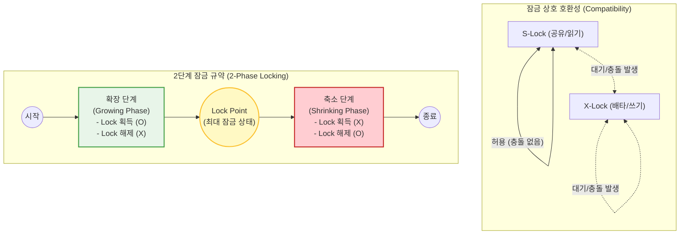

# Locking (데이터베이스 락/잠금)

---

## I. 데이터 무결성과 동시성 제어의 핵심 메커니즘, Locking의 개요

* **정의**: 다중 [[트랜잭션]] 환경에서 특정 데이터에 대한 동시 접근을 제어하여 데이터의 일관성(Consistency)과 [[무결성]](Integrity)을 보장하기 위해 상호 배타적으로 자원을 점유하는 직렬화 제어 기법
* **필요성**: 다중 사용자 환경에서 발생할 수 있는 갱신 손실(Lost Update), 모순성(Inconsistency), 연쇄 복귀(Cascading Rollback) 등의 3대 동시성 이상 현상 원천 차단
* **특징**: 잠금 단위(Granularity)의 크기에 따라 동시성(Concurrency)과 시스템 오버헤드의 명확한 상충 관계(Trade-off)가 존재하며, 무한 대기로 인한 [[교착상태]](Deadlock) 위험이 내재됨

---

## II. Locking의 동작 개념도 및 핵심 기술 요소

### 가. Locking 메커니즘 및 2단계 잠금 규약(2PL) 개념도

* 직렬가능성(Serializability)을 보장하기 위해 모든 트랜잭션은 획득(Growing)과 해제(Shrinking) 단계를 엄격히 분리하여 수행하며, S-Lock 간에만 상호 공유를 허용함

### 나. Locking의 핵심 기술 및 구성 요소

| 구분 | 요소기술(키워드) | 세부 설명 |
| --- | --- | --- |
| **잠금 모드** | S-Lock (공유 잠금) | 특정 데이터에 대해 읽기(Read) 연산을 수행할 때 설정하며, 다른 S-Lock과 병행 접근을 허용함 |
| **잠금 모드** | X-Lock (배타 잠금) | 데이터에 대해 쓰기(Write/Update) 연산을 수행할 때 설정하며, 다른 모든 잠금(S, X)의 접근을 전면 차단함 |
| **잠금 모드** | I-Lock (의도 잠금) | 계층적 잠금 구조에서 하위 노드에 대한 잠금 의도를 상위 노드에 명시(IS, IX, SIX)하여 탐색 효율성을 극대화 |
| **잠금 단위** | Granularity (크기) | DB, 테이블, 페이지, 블록, 로우(Row) 등 잠금 대상의 크기로, 단위가 작을수록 동시성은 향상되나 오버헤드는 증가함 |
| **제어 규약** | 2PLP (2-Phase Locking) | 트랜잭션의 완벽한 직렬성을 수학적으로 보장하기 위한 통신 규약 (확장 단계와 축소 단계를 교차하지 않음) |
| **문제점** | Deadlock (교착상태) | 두 개 이상의 트랜잭션이 이미 확보한 잠금을 유지한 채 서로의 잠금이 해제되기를 무한히 대기하는 논리적 마비 상태 |
| **해결 기법** | Wait-Die / Wound-Wait | 타임스탬프를 기준으로 트랜잭션을 대기시키거나(Wait-Die) 우선순위로 강제 취소(Wound-Wait)하여 교착상태 선제적 회피 |
| **최신 확장** | Distributed Lock (분산 락) | 분산 DB 또는 [[MSA (Micro Service Architecture)|MSA]] 환경에서 Redis(Redlock)나 ZooKeeper를 통해 여러 서버 [[인스턴스]] 간 단일 자원에 대한 정합성 통제 |

---

## III. 유사 동시성 제어 기법과의 비교 및 최신 동향

### 가. 전통적 비관적 락(Locking)과 최신 동시성 제어 기법 비교

| 비교 항목 | Pessimistic Lock (비관적 잠금) | Optimistic Lock (낙관적 잠금) | MVCC (다중 버전 동시성 제어) |
| --- | --- | --- | --- |
| **제어 사상** | 충돌이 빈번할 것이라 가정 (선 잠금) | 충돌이 없을 것이라 가정 (후 검증) | 물리적 Lock 없이 다중 버전(Snapshot) 유지 |
| **핵심 메커니즘** | S-Lock, X-Lock 등 물리적 DB 수준 통제 | 데이터 수정 시 Version, Timestamp 검증 (애플리케이션 수준) | Undo(Rollback) 세그먼트를 통한 과거 데이터 제공 |
| **주요 장점** | 데이터 무결성 및 정합성 완벽 보장 | 잠금 대기 시간이 없어 단순 읽기 성능 우수 | **읽기와 쓰기가 서로를 차단(대기)하지 않아 동시성 극대화** |
| **적합한 환경** | 금융결제 등 데이터 경합이 심하고 민감한 환경 | 재고 조회 등 읽기 비중이 압도적으로 높은 환경 | **최신 RDBMS (Oracle, MySQL InnoDB, PostgreSQL) 기본 적용** |

### 나. Locking 기술의 최신 적용 트렌드

* **분산 환경의 정합성 통제 (Distributed Lock)**: [[클라우드 네이티브]] 및 마이크로서비스 아키텍처(MSA)가 보편화되면서, 단일 DB의 Lock 메커니즘을 넘어 인메모리 데이터 그리드(Redis, Hazelcast)를 활용한 '분산 락(Distributed Lock)' 설계가 대용량 트래픽 제어의 필수 아키텍처 패턴으로 자리 잡고 있음.
* **Lock-Free 아키텍처 도입**: 성능 병목의 주원인인 물리적 잠금을 최소화하기 위해 이벤트 소싱(Event Sourcing)이나 메시지 큐(Kafka)를 결합한 비동기 순차 처리(Lock-Free) 구조로 데이터 제어 패러다임이 전환되는 추세임.

---

### 🔗 연관 토픽

- **소속 도메인**: [[00_데이터베이스_MOC|🗄️ 데이터베이스]]
- **세부 분류**: `2. 트랜잭션 & 동시성 제어 (Concurrency)`
- **핵심 연관 토픽**:
  - [[트랜잭션]]
  - [[무결성]]
  - [[OLTP]]
  - [[Timestamp Ordering]]
  - [[DB 동시성제어]]
