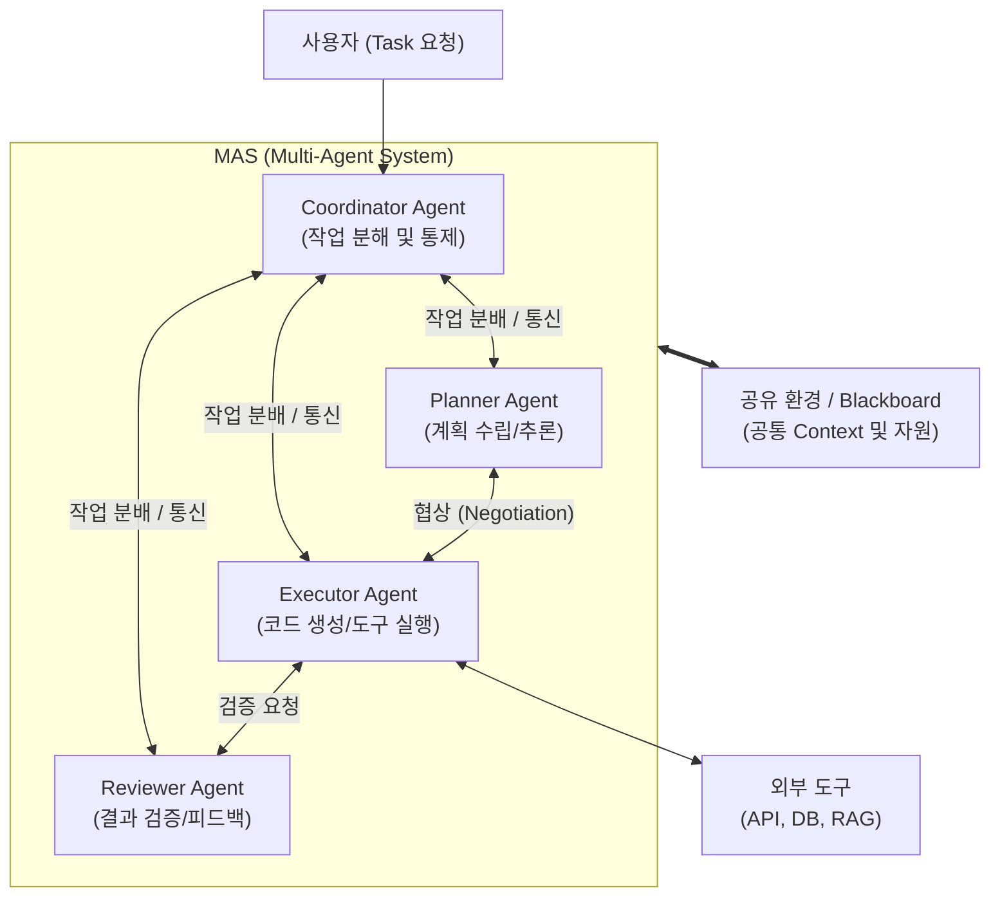

# MAS (Multi Agent System)

---

## I. 복잡한 문제 해결을 위한 분산 협력 AI, MAS의 개요

* **정의**: 단일 에이전트가 처리하기 어려운 복잡한 문제를 해결하기 위해, 분산된 여러 지능형 에이전트(Agent)가 상호작용(협력, 경쟁, 협상)하여 목표를 달성하는 분산 [[인공지능]] 시스템
* 최근 대형 언어 모델([[초거대 언어 모델|LLM]])을 두뇌로 활용하는 다중 에이전트 [[프레임워크]](AutoGen, CrewAI 등)가 부상하며 고도화된 자율 워크플로우 자동화 구조로 진화 중임
* 특징: 자율성(Autonomy), 분산 제어(Distributed Control), 상호작용(Interaction), 적응성(Adaptability)

---

## II. MAS의 아키텍처 및 핵심 구성요소

### 가. MAS의 아키텍처 및 동작 원리

* 사용자의 복잡한 Task를 Coordinator가 하위 작업으로 분해하여 각 전문 에이전트에 할당함
* 에이전트 간 통신(ACL)과 공유 메모리를 통해 계획 수립, 실행, 검증을 반복하며 단일 실패점(SPOF) 없이 자율적으로 연산을 수행하는 구조임

### 나. MAS의 핵심 기술 요소

| 구분 | 요소기술(키워드) | 세부 설명 |
| --- | --- | --- |
| 에이전트 구조 | BDI 모델 | Belief(신념), Desire(열망), Intention(의도) 기반의 논리적/자율적 의사결정 아키텍처 |
| 에이전트 구조 | LLM Agent | 대형 언어 모델을 두뇌로 활용하여 프롬프트 기반의 추론, 기억, 도구 사용을 수행 |
| 통신 및 상호작용 | FIPA-ACL | 에이전트 간 명확한 메시지 및 지식 교환을 위한 국제 표준 통신 언어 규약 |
| 통신 및 상호작용 | KQML | 지식 및 정보의 교환을 위해 설계된 지식 질의 및 조작 언어 |
| 조율 메커니즘 | Blackboard System | 중앙 공유 데이터 저장소를 통해 에이전트들이 간접적으로 정보를 교환하고 협업하는 방식 |
| 조율 메커니즘 | Contract Net | 옥션(입찰) 기반 프로토콜을 활용하여 에이전트 간 자원 및 작업을 효율적으로 분배 |
| 응용 프레임워크 | AutoGen / CrewAI | 개발자가 쉽게 다중 에이전트의 역할(Role)을 정의하고 워크플로우를 구성할 수 있는 최신 오픈소스 |
| 인프라/지식 환경 | Shared Memory | 에이전트들이 공통의 컨텍스트를 유지하고 환각(Hallucination)을 줄이기 위한 공유 기억 장치 |

---

## III. MAS vs 단일 에이전트(Single Agent) 비교 및 발전 전망

### 가. MAS와 단일 에이전트 비교

| 비교 항목 | 단일 에이전트 (Single Agent) | MAS (Multi Agent System) |
| --- | --- | --- |
| **시스템 목표** | 단순하고 명확한 단일 목표 달성 | 복잡하고 다원적인 다중 목표 달성 |
| **제어 및 구조** | 중앙 집중형 제어 (Centralized) | 분산 협력형 제어 (Decentralized) |
| **안정성/[[신뢰성]]** | 단일 고장점(SPOF) 존재, 고장 시 전체 마비 | 일부 에이전트 장애 시에도 서비스 유지 (결함 허용) |
| **통신 및 협상** | 내부 모듈 간 직접 호출 (통신 [[프로토콜]] 불필요) | 에이전트 간 표준 언어(ACL) 기반의 협상 및 지식 교환 필수 |
| **주요 활용 분야** | 챗봇, 단순 자동화 봇, 개인 비서 | [[Smart Car(자율주행)|자율주행]] 교차로 제어, 스마트 시티, 고도화된 SW 개발 자동화 |

### 나. MAS의 발전 전망 및 고려사항

* **환각(Hallucination) 억제**: 다중 에이전트 간 상호 교차 검증(Critic/Reviewer 패턴)을 통해 단일 LLM의 환각 문제를 완화하는 핵심 아키텍처로 자리매김 중임
* **보안 및 윤리 가이드라인**: 에이전트 간 자율 통신 중 민감 정보 유출 방지 및 비정상 행동을 통제하기 위한 Guardrails(안전망) 구현이 필수적인 과제로 대두됨

---

### 🔗 연관 토픽

- **소속 도메인**: [[00_인공지능_MOC|🤖 인공지능]]
- **세부 분류**: `4. 거대언어모델 (LLM) & 생성형 AI`
- **핵심 연관 토픽**:
  - [[인공지능]]
  - [[에이전틱 AI|에이전틱 AI(Agentic AI)]]
  - [[AGI|AGI (Artificial General Intelligence)]]
  - [[AI 윤리]]
  - [[AI Agent]]
