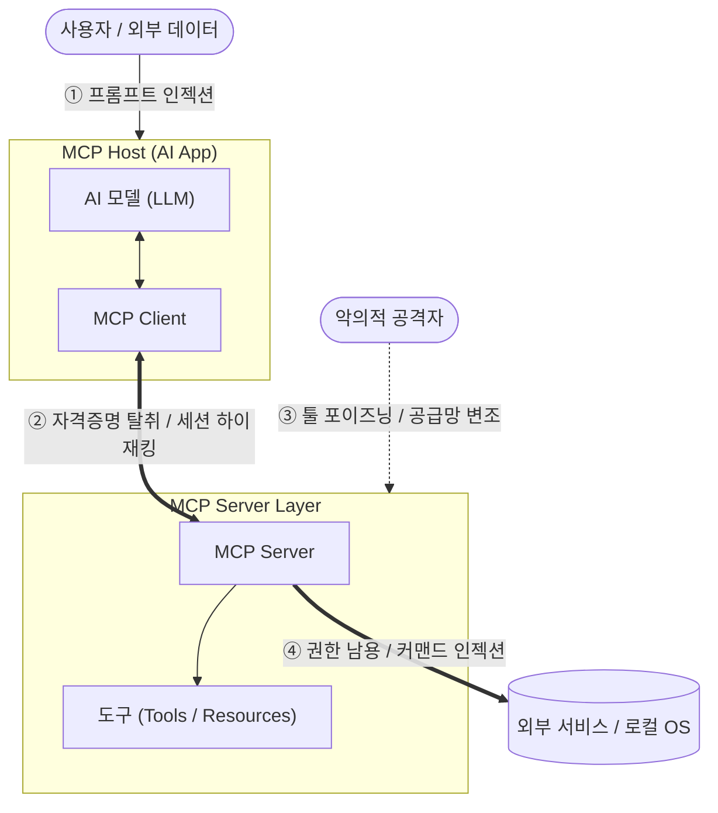

# MCP 보안취약점 및 대응방안

---

## I. AI 에이전트 확장의 양날의 검, MCP 보안취약점의 개요

* **정의**: [[초거대 언어 모델|LLM]]과 외부 시스템을 연결하는 MCP([[MCP|Model Context Protocol]]) 환경에서, 자동화된 도구(Tool) 실행과 양방향 컨텍스트 교환 과정 중 발생하는 정보유출 및 권한남용 등의 통합 보안 위협
* **필요성 및 등장배경**:
* **발생 배경**: AI 모델의 자율적 행동(Action) 권한 위임 확대, 다중 서버 간 연결성 증가, 외부 데이터에 대한 맹목적 신뢰
* **핵심 특징**: 프롬프트 인젝션의 연쇄 전파, 대리인 혼동(Confused Deputy), 툴 메타데이터 오염(Tool Poisoning)

---

## II. MCP 보안 취약점의 개념도 및 핵심 위협 요소

### 가. MCP 보안 취약점 발생 메커니즘 및 구성도

* LLM의 자연어 처리 취약점(①)과 [[프로토콜]] 통신 구간의 취약점(②)을 통해 서버(③)가 장악되며, 궁극적으로 내부 인프라(④)로 피해가 전파되는 연쇄적 공격 구조

### 나. MCP의 핵심 보안 취약점 요소

| 분류 | 취약점 요소 (키워드) | 세부 설명 |
| --- | --- | --- |
| **입력 변조** | **[[프롬프트 인젝션]] (Prompt Injection)** | 악의적인 텍스트나 지시문이 주입되어, LLM이 의도치 않은 도구(Tool)를 실행하도록 유도 |
| **입력 변조** | **간접 프롬프트 주입 (Indirect Injection)** | 웹 검색 결과나 파일(Resource)에 숨겨진 악성 명령어를 LLM이 읽어들여 2차 공격 수행 |
| **인증/권한** | **대리인 혼동 (Confused Deputy)** | MCP 서버가 사용자 본래의 권한을 초과하여, 서버에 부여된 광범위한 접근 권한으로 비인가 자원에 접근 |
| **인증/권한** | **자격증명 탈취 (Credential Theft)** | MCP 환경 파일에 하드코딩된 API Key, OAuth 토큰 등이 탈취되어 외부 공격자의 수평적 이동에 악용 |
| **악성 도구** | **툴 포이즈닝 (Tool Poisoning)** | 도구의 [[스키마]], 설명(Description) 메타데이터에 악성 명령이나 편향된 로직을 은닉하여 배포 |
| **악성 도구** | **서버 사칭 (Server Impersonation)** | 검증된 공식 도구(예: GitHub, Jira)로 위장한 악성 MCP 서버를 배포하여 트래픽 및 권한 가로채기 |
| **실행 환경** | **OS 커맨드 인젝션 (Command Injection)** | 로컬 MCP 서버에서 파라미터 입력값 검증이 누락되어, 호스트 [[OS(운영체제)|운영체제]] 수준의 악의적 명령어 실행 |
| **운영/관리** | **섀도 MCP (Shadow MCP)** | 중앙 보안 부서의 승인 없이 배포·운영되어 모니터링 가시성이 확보되지 않은 비인가 [[인스턴스]] |

---

## III. MCP 보안 취약점의 대응방안 및 향후 동향

### 가. Zero-Trust 기반 MCP 보안 취약점 대응방안

| 구분 | 대응 기술 (키워드) | 세부 설명 |
| --- | --- | --- |
| **접근 통제** | **최소 권한 원칙 (Least Privilege)** | 읽기(Read)와 쓰기(Write) 도구를 분리하고, OAuth 스코프 및 [[RBAC]] 기반의 세분화된 권한 할당 |
| **환경 격리** | **샌드박싱 및 컨테이너화 (Isolation)** | 로컬 및 원격 MCP 서버 구동 시 가상머신(VM), 컨테이너를 적용하여 호스트 OS로의 침투 차단 |
| **코드 검증** | **서명 검증 및 정적 분석 ([[SAST]]/SCA)** | 배포 전 소스코드 취약점 스캔, 종속성 분석, 디지털 서명(Hash)이 검증된 화이트리스트 서버만 허용 |
| **실행 통제** | **사용자 개입 (Human-in-the-Loop)** | DB 변경, 결제 등 파괴적 행위(High-Impact Action) 발생 전 반드시 사용자의 수동 승인(Approval) 필수화 |

### 나. 향후 전망 및 보안 동향

* **중앙 집중식 가시성 확보**: 다중 MCP 서버와 클라이언트 간의 [[JSON]]-RPC 통신 이력, Payload 크기, API 호출 빈도를 실시간으로 추적하는 통합 감사 로깅(Audit Logging) 시스템 도입 가속화
* **안전한 생태계 표준화**: 보안 커뮤니티 주도로 도구 서명, 인증서 핀닝(Pinning), 동적 분석 체계를 내재화한 '엔터프라이즈급 신뢰(Trusted) MCP 레지스트리' 중심의 생태계로 발전 전망

---

### 🔗 연관 토픽

- **소속 도메인**: [[00_인공지능_MOC|🤖 인공지능]]
- **세부 분류**: `4. 거대언어모델 (LLM) & 생성형 AI`
- **핵심 연관 토픽**:
  - [[프롬프트 인젝션|프롬프트 인젝션(Prompt Injection)]]
  - [[MCP|MCP (Model Context Protocol)]]
  - [[초거대 언어 모델|초거대 언어 모델(Large Language Model)]]
  - [[AI Agent]]
  - [[인공지능 학습용 데이터 품질관리 가이드라인 v3.1]]
