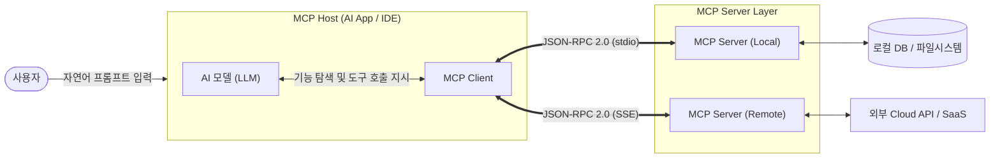

# MCP (Model Context Protocol)

---

## I. AI 에이전트 통합의 표준, MCP의 개요

* **정의**: AI 애플리케이션(Host)과 외부 데이터 소스 및 도구(Server) 간의 연결을 표준화하여, 단일 인터페이스로 안전하게 통신하고 컨텍스트를 교환하는 [[JSON]]-RPC 기반 개방형 [[프로토콜]]
* **등장배경**: AI 모델과 외부 시스템 연동 시 커스텀 API 코드를 매번 작성해야 하는 N:M 통합의 복잡성 심화, 실시간 데이터 기반의 동적 행동(Action) 제어 필요성 대두
* **특징**:
* **단일 표준 프로토콜**: AI 기기 확장을 위한 'USB-C 포트'와 같은 범용 인터페이스 제공
* **양방향 통신 및 상태 유지**: 단방향 조회를 넘어선 상태 기반(Stateful) 연결 및 다단계 도구(Tool) 연계 체계 지원
* **보안 및 샌드박싱**: 명확한 사용자 동의(Consent) 모델 및 도구 실행 제어를 통한 공급망 보안성 강화

---

## II. MCP의 아키텍처 및 핵심 구성요소

### 가. MCP의 아키텍처 및 동작 원리

* **초기화 및 발견**: Client가 Server에 연결하여 프로토콜 버전을 교섭하고 사용 가능한 도구/리소스 목록을 획득
* **동적 호출 및 실행**: [[초거대 언어 모델|LLM]]이 작업에 필요한 Tool을 결정하면, Client가 JSON-RPC 형태로 Server에 호출(Call)을 라우팅하여 외부 기능 수행 후 결과 반환

### 나. MCP의 핵심 기술 요소

| 구분 | 핵심 기술 (키워드) | 세부 설명 |
| --- | --- | --- |
| **주요 객체** | **MCP Host** | 사용자 요청을 조율하고 다수의 Client 인스턴스를 관리하는 AI 애플리케이션 (예: Claude Desktop) |
| **주요 객체** | **MCP Client** | Host 내부에 위치하며 특정 Server와 1:1 연결을 유지하고 프로토콜 메시지를 라우팅 |
| **주요 객체** | **MCP Server** | 외부 시스템과 직접 연동하여 Context(기능, 데이터)를 표준 규격으로 추상화하여 제공하는 주체 |
| **기본 요소 (Primitive)** | **Tools** | 외부 API 호출, 파일 쓰기 등 AI가 부작용(Side Effect)을 포함하여 실행 가능한 함수(액션) 집합 |
| **기본 요소 (Primitive)** | **Resources** | DB [[스키마]], 텍스트 문서 등 AI가 읽기 전용(Read-only)으로 참고할 수 있는 정적 컨텍스트 데이터 |
| **기본 요소 (Primitive)** | **Prompts** | 시스템 프롬프트 구조화 및 맥락 주입을 위해 사전에 정의된 [[재사용]] 가능한 템플릿 |
| **통신 표준** | **JSON-RPC 2.0** | Request, Response, Notification 구조를 통한 양방향 비동기 통신 규격 |
| **[[전송 계층]]** | **stdio / SSE** | 로컬 환경의 표준 입출력(stdio) 또는 원격 환경의 Server-Sent Events(SSE) 스트리밍 기반 데이터 전송 |

---

## III. MCP vs RAG 비교 및 향후 전망

### 가. MCP와 RAG의 핵심 기능 비교

| 비교 항목 | MCP (Model Context Protocol) | RAG (Retrieval-Augmented Generation) |
| --- | --- | --- |
| **핵심 목적** | 표준화된 도구 실행 및 양방향 컨텍스트 제어 | 지식 베이스 검색을 통한 문맥 증강 기반의 답변 생성 |
| **통신 방식** | JSON-RPC 기반 상태 유지(Stateful) 및 실시간 행동 통제 | 단방향(Stateless) 질의 기반의 [[벡터 데이터베이스]] 검색 |
| **제어 범위** | 외부 시스템 데이터 조회(Read) 및 상태 변경(Write/Execute) | 텍스트 생성 전 외부 문서 단순 조회(Read) 위주 |
| **연결 구조** | 1:N 표준 포맷 (개방형 프로토콜 및 플러그인 생태계 중심) | N:M 커스텀 연결 (개별 데이터 소스별 전용 API 통합 필요) |
| **주요 활용 분야** | 자율형 Agent, 실시간 API 연동, [[CRM]]/DB 자동화 작업 처리 | 사내 지식 기반 Q&A 챗봇, 문서 요약, [[할루시네이션]] 완화 |

### 나. 보안 고려사항 및 향후 전망

* **강력한 접근 제어 및 감사(Audit) 체계**: 실행 가능한 Tools의 파괴적 행위(예: DROP TABLE) 방지를 위해 도구 단위의 최소 권한 부여 기법과 Human-in-the-loop(사용자 승인) 절차 도입 필수
* **범용 생태계 확장**: 특정 모델 종속성을 탈피하여 AgentOps, Smithery 등 오픈소스 레지스트리 기반으로 텍스트, 음성, 비전 모달리티를 포괄하는 차세대 에이전트 통합 인프라로 발전 전망

---

### 🔗 연관 토픽

- **소속 도메인**: [[00_인공지능_MOC|🤖 인공지능]]
- **세부 분류**: `5. 컴퓨터 비전 · 음성 & 에이전트`
- **핵심 연관 토픽**:
  - [[MCP 보안취약점 및 대응방안]]
  - [[재사용]]
  - [[할루시네이션|할루시네이션(Hallucination)]]
  - [[에이전틱 AI|에이전틱 AI(Agentic AI)]]
  - [[벡터 데이터베이스|벡터 데이터베이스(Vector Database)]]
