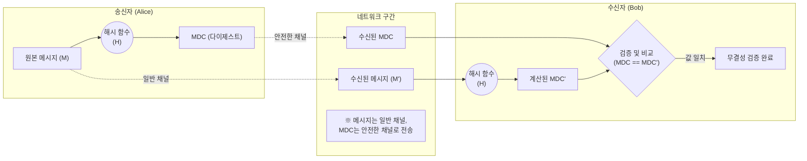

# MDC (Modification Detection Code)

---

## I. 무결성 검증을 위한 일방향 암호화 기술, MDC의 개요

* **정의**: 데이터 전송 및 저장 과정에서 메시지의 [[무결성]](Integrity)을 확인하기 위해, 임의의 길이의 메시지를 고정된 길이의 해시값(다이제스트)으로 변환하는 키가 없는(Keyless) 해시 함수 기반의 [[암호화]] 기법.
* **MDC의 필요성 및 특징**:
* **무결성 보장**: 전송 중인 데이터의 의도적 위조, 변조 또는 통신 오류로 인한 비의도적 훼손 여부 탐지.
* **비밀키 미사용**: 송수신자 간 별도의 대칭키(비밀키) 공유 과정이 불필요함.
* **안전한 채널(Secure Channel) 요구**: 비밀키가 없으므로 공격자가 메시지를 변조한 후 새로운 MDC를 재계산하여 전송하는 것을 막기 위해, MDC 값 자체는 변조가 불가능한 독립된 안전 채널을 통해 전송되어야 함.

---

## II. MDC의 아키텍처 및 핵심 기술 요소

### 가. MDC의 개념도 및 동작 원리

* 송신자는 평문에 대해 해시 함수를 적용하여 MDC를 생성 후 안전한 채널로 전송하며, 수신자는 수신된 평문을 동일한 해시 함수로 연산한 결과값(MDC')을 원본 MDC와 비교하여 변조 여부를 확인함.

### 나. MDC의 핵심 기술 및 구성 요소

| 구분 | 요소기술(키워드) | 세부 설명 |
| --- | --- | --- |
| **기반 [[알고리즘]]** | **일방향 해시 함수** | MD5, SHA-1, SHA-256 등 수학적으로 역방향 연산이 불가능한 단방향 암호화 알고리즘 적용 |
| **입출력 요소** | **다이제스트 (Digest)** | 가변 길이의 원본 메시지를 입력받아 해시 함수를 거쳐 출력되는 고정된 길이의 해시 결과값 |
| **전송 환경** | **안전한 채널 (Secure Channel)** | 메시지 변조 후 공격자의 MDC 임의 재계산 및 훼손을 차단하기 위해 MDC를 별도로 전달하는 보호된 경로 |
| **핵심 보안성** | **눈사태 효과 (Avalanche Effect)** | 원본 메시지가 단 1비트만 변경되어도 완전히 다른 MDC 값이 출력되어 변조 식별이 용이한 특성 |
| **핵심 보안성** | **역상 저항성 (Pre-image Resistance)** | 주어진 MDC 결과값(다이제스트)만으로는 원본 메시지(평문)를 유추하거나 복원할 수 없는 암호학적 특성 |
| **핵심 보안성** | **충돌 저항성 (Collision Resistance)** | 동일한 MDC 값을 생성하는 서로 다른 두 개의 원본 메시지를 임의로 찾아내기 어려운 특성 |
| **응용 분야** | **소프트웨어 무결성 검증** | PGP, GPG 등에서 파일 암호화 및 전송 시 데이터 변조 탐지를 위해 MDC 필드를 기본적으로 포함하여 확인 |

---

## III. MDC의 비교 및 한계점 극복 방안

### 가. MDC, MAC, 전자서명의 핵심 비교

| 비교 항목 | MDC (변경 감지 코드) | [[MAC]] (메시지 인증 코드) | Digital Signature (전자서명) |
| --- | --- | --- | --- |
| **핵심 목적** | 데이터 **무결성** 보장 | 무결성 + **송신자 인증** | 무결성 + 인증 + **부인방지** |
| **사용 키(Key)** | 비밀키 미사용 (Keyless) | 대칭키 (송·수신자 간 사전 공유) | 비대칭키 (개인키 서명, 공개키 검증) |
| **안전한 채널** | MDC 전송을 위해 필수적으로 요구됨 | 불필요 (메시지와 함께 전송 가능) | 불필요 (메시지와 함께 전송 가능) |
| **보안 취약점** | 능동적 공격자(MITM)의 위조에 취약 | 송신자 부인 방지 불가 | 키 관리 및 연산 오버헤드 높음 |

### 나. MDC의 한계점 및 향후 활용 전망

* **MDC의 한계점 (대리인 위조 공격)**: 비밀키가 없으므로 공격자가 중간에 메시지를 가로채어 내용을 변조한 뒤, 누구나 접근 가능한 해시 함수로 새로운 MDC를 생성해 수신자에게 보내면 무결성 훼손을 탐지할 수 없음.
* **진화 방향 (MAC으로의 발전)**: MDC의 데이터 출처 인증(Data Origin Authentication) 부재를 해결하기 위해, 데이터와 함께 송수신자가 비밀리에 공유하는 '비밀키(Secret Key)'를 연산에 포함하는 형태인 **MAC([[HMAC]], CMAC 등)으로 발전**하여 무결성과 인증을 동시에 보장하는 구조로 널리 활용되고 있음.

---

### 🔗 연관 토픽

- **소속 도메인**: [[00_보안_MOC|🛡️ 보안]]
- **세부 분류**: `1. 정보보안 원칙 & 거버넌스 · 인증`
- **핵심 연관 토픽**:
  - [[암호화|암호화 (Encryption)]]
  - [[HMAC|HMAC (Hash-based Message Authentication Code)]]
  - [[MAC]]
  - [[무결성]]
  - [[기밀성]]
