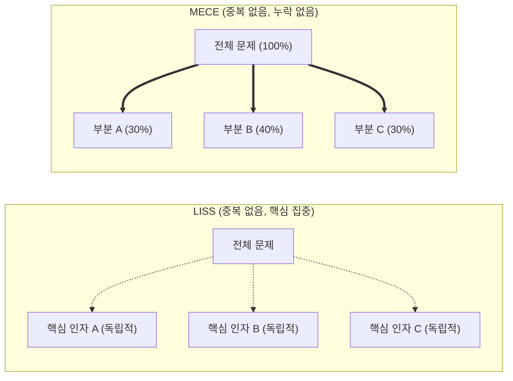

# MECE와 LISS

---

## I. 전략적 문제해결의 핵심 프레임워크, MECE와 LISS의 개요

* **정의**
* **MECE (Mutually Exclusive Collectively Exhaustive)**: 문제 전체를 파악하기 위해 각 항목들이 상호 배타적(중복 없음)이며, 합쳤을 때 누락 없이 전체 집합을 구성하게 하는 전략적 분류 기법
* **[[LISS (Linearly Independent Spanning Set)]]**: 항목 간 상호 중복은 없으나, 합이 전체가 되지는 않더라도 문제 해결의 핵심(중요 부분집합)을 명확히 도출하는 논리적 사고 기법

* **필요성 및 특징**
* **근본 원인 파악**: 제한된 시간과 자원 내에서 문제의 Root Cause 도출 및 중복 투자 방지 필요
* **[[프레임워크]] 기반 구조화**: 논리적 분해(Logic Tree)를 통한 하향식(Top-Down) 문제 분할 및 3C, 4P 등 다양한 경영 전략의 뼈대로 작용

---

## II. MECE와 LISS의 개념도 및 핵심 구성 요소

### 가. MECE와 LISS의 개념도 및 동작 원리

* **MECE 동작**: 퍼즐 조각처럼 각 하위 노드가 중복 없이 전체 면적(100%)을 완벽히 채우도록 분할
* **LISS 동작**: 전체를 포괄하지 않더라도, 파레토 법칙에 기반하여 상호 독립적인 소수의 핵심 과제만을 선별하여 집중

### 나. MECE와 LISS의 핵심 원리 및 적용 기법

| 구분 | 요소기술(키워드) | 세부 설명 |
| --- | --- | --- |
| 기본 원칙 

 (MECE) | **Mutually Exclusive** | 상호 배타성, 분류된 각 세부 항목 간에 교집합이나 중복이 완벽히 배제된 상태 |
| 기본 원칙 

 (MECE) | **Collectively Exhaustive** | 완전 포괄성, 분할된 모든 항목의 합이 누락 없이 전체 집합(100%)을 구성함 |
| 기본 원칙 

 (LISS) | **Linearly Independent** | 선형 독립성, 추출된 핵심 변수나 과제 간에 상호 의존성 및 간섭 현상 배제 |
| 기본 원칙 

 (LISS) | **Spanning Set** | 전체 영역을 다루지 않아도 문제 해결에 직결되는 대표적 핵심 집합 도출 |
| **분석 도구** | **Logic Tree (로직 트리)** | MECE 원칙에 따라 주요 과제를 하위 단위로 분해하여 근본 원인을 파악하는 구조도 |
| **분석 도구** | **Issue Tree (이슈 트리)** | 가설(Hypothesis)을 설정하고 이를 검증하기 위해 세부 이슈 단위로 분할해가는 기법 |
| 응용 모델 

 (MECE) | **3C, 4P, 7S 프레임워크** | 고객/경쟁/자사(3C) 등 전체 비즈니스 내/외부 환경을 누락 없이 진단하는 기반 도구 |
| 응용 모델 

 (LISS) | **2x2 Matrix, CSF 도출** | 시급성-중요도 등 핵심 2개 축을 기반으로 전략적 우선순위와 중요 과제를 도출하는 도구 |

---

## III. MECE와 LISS의 비교 및 IT 전략 활용 방안

### 가. MECE와 LISS의 상세 비교

| 비교 항목 | MECE (Mutually Exclusive Collectively Exhaustive) | LISS (Linearly Independent Spanning Set) |
| --- | --- | --- |
| **핵심 목적** | 완전한 현상 파악 및 전체 시스템 진단 | 핵심 요인 도출 및 가설 집중 검증 |
| **전략 관점** | [[무결성]] 중심 (누락 방지 및 리스크 최소화) | 효율성 중심 (선택과 집중, 신속한 의사결정) |
| **제약 조건** | 중복 없음(O), **누락 없음(O)** | 중복 없음(O), **누락 허용(전체 집합 아님)** |
| **적용 상황** | 초기 문제 정의, [[ISP (Information Strategy Plan)|ISP]]/EA의 현행(As-Is) 분석 시 | 일정/자원 제약 시, 이행과제(To-Be) 우선순위 할당 시 |

### 나. 최신 IT 비즈니스 환경에서의 활용 방안 및 향후 전망

* **ISP 및 전사 아키텍처(EA) 연계**: 정보화 전략 계획 수립 시 전체 업무 프로세스와 자산은 MECE 원칙으로 매핑(분류 체계화)하고, 단기 이행 과제(Quick-Win)는 LISS 기반으로 선정하여 민첩한 실행력 제고
* **데이터 분석 및 머신러닝 최적화 적용**: 빅데이터 환경에서 데이터 풀(Pool)은 MECE하게 수집하되, 머신러닝 학습 모델 구축 시 차원의 저주를 방지하기 위해 LISS 관점의 주성분 분석([[PCA(Principal Component Analysis)|PCA]]) 등 독립 변수 추출 기법을 결합하여 분석 성능 극대화 추세

---

### 🔗 연관 토픽

- **소속 도메인**: [[00_경영전략_MOC|📈 경영전략]]
- **세부 분류**: `1. 경영 환경 분석 & 전략 수립 프레임워크`
- **핵심 연관 토픽**:
  - [[ISP (Information Strategy Plan)]]
  - [[LISS (Linearly Independent Spanning Set)]]
  - [[Ansoff Matrix]]
  - [[무결성]]
  - [[프레임워크]]
