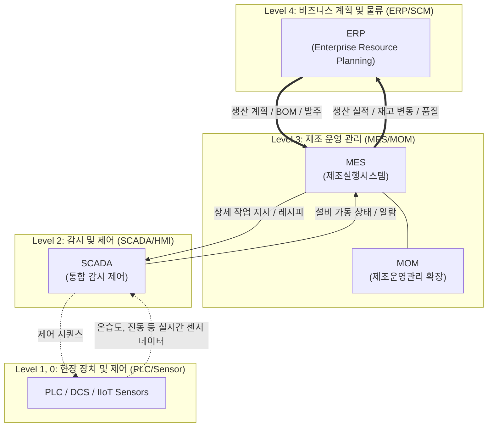

# MES (Manufacturing Execution System)

---

## I. 스마트팩토리의 핵심 두뇌, MES의 개요

* **정의**: 최상위 비즈니스 시스템(ERP)과 하위 제어설비([[SCADA (Supervisory Control and Data Acquisition)|SCADA]]/PLC) 사이에서, 원자재 투입부터 완제품 생산까지의 전 공정을 실시간 모니터링, 제어, 추적하는 제조실행시스템
* **등장배경**: 다품종 소량생산 체제로의 전환, 실시간 공정 가시성 확보 필요, 품질 이력 추적(Traceability) 및 규제 대응 강화
* **특징**: 무결점(Zero-Defect) 지향, 실시간 자원 할당 및 상태 관리, 단방향 생산지시를 넘어선 실시간 양방향 데이터 동기화 구현

---

## II. MES의 개념도 및 핵심 기술 요소

### 가. MES의 개념도 및 동작 원리 (ISA-95 참조 모델 기반)

* **핵심 동작 흐름**: 상위 계층(ERP)의 거시적 생산 계획을 수신하여 하위 설비(PLC/IIoT)로 세부 작업 지시를 하달하고, 현장의 실시간 데이터를 수집/분석하여 즉각적인 공정 제어 및 실적을 보고함

### 나. MES의 핵심 기술/구성 요소

| 분류 | 요소기술(키워드) | 세부 설명 |
| --- | --- | --- |
| **아키텍처** | **Cloud-native MES (SaaS)** | 클라우드 환경 배포를 통한 유연한 확장성(Scalability) 및 글로벌 다중 공장(Multi-site)의 데이터 통합 관리 |
| **데이터 수집** | **IIoT & [[EDGE|Edge]] Computing** | OPC-UA, [[MQTT (Message Queuing Telemetry Transport)|MQTT]] 프로토콜을 활용한 이기종 설비 센서 데이터의 실시간 수집 및 엣지단 병목 전처리 |
| **통합 표준** | **ISA-95 모델** | 기업 비즈니스 시스템(L4)과 현장 제어 시스템(L1~L2) 간의 정보 통합을 위한 국제 아키텍처 표준 |
| **추적/관리** | **WIP & Lot Genealogy** | 공정 내 재공품(Work-In-Process) 실시간 현황 관리 및 원자재 단위의 양방향 이력(로트) 정밀 추적 |
| **품질 제어** | **SPC / SQC** | 통계적 공정 관리(SPC) 및 품질 관리(SQC)를 통한 실시간 수율 모니터링, 공정 편차 자동 제어 |
| **지능화** | **AI 기반 예지보전 (PdM)** | 머신러닝 [[알고리즘]] 및 진동/소음 데이터를 분석하여 설비 고장 사전 예측 및 다운타임 최소화 |
| **시각화** | **Vision AI & Digital Twin** | [[딥러닝]](YOLO 등) 기반 실시간 외관 불량 검출 및 가상 공간에 물리 공정을 동기화한 3D 시뮬레이션 |
| **확장 영역** | **MOM (제조운영관리)** | 단순 생산(MES)을 넘어 품질, [[유지보수]], 재고 관리까지 포괄하는 ISA-95 기반의 상위 운영 관리 체계 |

---

## III. MES와 유관 시스템의 비교 및 최신 동향

### 가. 제조 관점의 주요 IT 시스템 비교 (ERP vs MES vs SCADA)

| 비교 항목 | ERP (기업 자원 관리) | MES (제조 실행 시스템) | SCADA (집중 원격감시 제어) |
| --- | --- | --- | --- |
| **핵심 목적** | 전사 경영 자원의 효율적 배분 | 제조 현장의 실시간 실행 및 최적화 | 개별 설비의 원격 제어 및 데이터 취득 |
| **데이터 시야** | 거시적 (기업 전체, 재무/공급망) | 미시적 (단일 공장 내 공정 단위) | 초미시적 (개별 모터, 밸브, 센서 단위) |
| **시간 관점** | 장기 / 중기 (월, 주, 일 단위) | 단기 / 실시간 (시간, 분, 교대 단위) | 초실시간 (초, 밀리초 단위) |
| **주요 사용자** | 경영진, 재무/영업/생산 관리자 | 공장장, 생산/품질 관리자, 현장 작업자 | 설비 엔지니어, 오퍼레이터 |

### 나. MES의 최근 트렌드 및 산업 적용 방향

* **자율생산 공장(Autonomous Factory)으로의 진화**: 기존 수동 [[스케줄링]] 중심에서 AI 에이전트 기반 자율 생산 계획 및 동적 자원 재할당(Dynamic Routing)으로 발전
* **탄소 중립(Net-Zero) 및 ESG 연계 강화**: 설비별 에너지 사용량(EMS 연동) 측정 및 탄소 배출량의 정량적 추적 기능을 MES에 통합하여 글로벌 환경 규제 적극 대응 추세

---

### 🔗 연관 토픽

- **소속 도메인**: [[00_경영전략_MOC|📈 경영전략]]
- **세부 분류**: `2. IT 거버넌스 & 엔터프라이즈 아키텍처 (EA/ISP)`
- **핵심 연관 토픽**:
  - [[Smart Factory|Smart Factory/스마트 팩토리(공장)]]
  - [[알고리즘]]
  - [[딥러닝]]
  - [[스케줄링]]
  - [[MQTT (Message Queuing Telemetry Transport)]]
