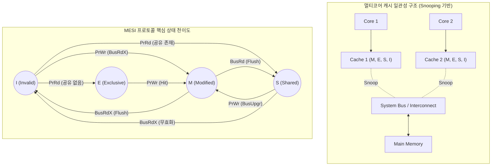

# MESI 프로토콜

---

## I. 멀티코어 환경의 캐시 일관성 유지, MESI 프로토콜의 개요

### 가. MESI 프로토콜의 정의

* 멀티 프로세서 시스템에서 [[캐시 메모리]] 간 데이터 불일치 문제를 해결하기 위해, 각 캐시 라인의 상태를 4가지(M, E, S, I)로 정의하여 일관성을 제어하는 하드웨어 기반 [[캐시 일관성]] [[프로토콜]]

### 나. MESI 프로토콜의 등장배경 및 특징

* **MSI 프로토콜의 한계 극복**: 데이터를 읽은 후 쓰기를 수행할 때 발생하는 불필요한 무효화(Invalidate) 트랜잭션을 제거하기 위해 Exclusive(단독 소유) 상태 도입
* **Snooping 기반 모니터링**: 버스 트래픽을 지속적으로 감시하여 상태를 동적으로 천이시킴
* **트래픽 및 대역폭 최적화**: Write-Back(메모리 지연 기록) 정책과 결합하여 메인 메모리 접근을 최소화하고 시스템 버스 대역폭 효율 확보

---

## II. MESI 프로토콜의 개념도 및 핵심 기술 요소

### 가. MESI 프로토콜의 구성도 및 동작원리

* 스누핑(Snooping) 제어기가 시스템 버스를 감시하여 타 프로세서의 읽기(PrRd)/쓰기(PrWr) 및 버스 트랜잭션에 따라 캐시 상태를 독립적으로 천이함
* 'E(Exclusive)' 상태에서는 다른 캐시에 데이터가 없음을 보장하므로, 쓰기 동작 시 무효화 브로드캐스팅(BusUpgr) 없이 'M' 상태로 즉시 천이하여 성능을 극대화함

### 나. MESI 프로토콜의 핵심 기술 요소

| 구분 | 요소기술(키워드) | 세부 설명 |
| --- | --- | --- |
| **상태 구조** | Modified (M) | - 캐시 데이터가 수정되었으며 메모리와 불일치(Dirty)한 상태 

 - 해당 캐시만 유일하게 최신 데이터를 소유함 |
| (States) | Exclusive (E) | - 데이터가 수정되지 않아 메모리와 일치(Clean)하는 상태 

 - 다른 캐시에는 복사본이 없는 단독 소유 상태 |
|  | Shared (S) | - 데이터가 수정되지 않아 메모리와 일치(Clean)하는 상태 

 - 2개 이상의 캐시에 복사본이 존재하는 공유 상태 |
|  | Invalid (I) | - 유효하지 않은 데이터 상태 

 - 해당 라인 접근 시 Cache Miss가 발생하며 데이터 갱신 필요 |
| **버스 이벤트** | BusRd / BusRdX | - **BusRd**: Cache Miss 시 데이터 읽기 요청 (S 상태 유도) 

 - **BusRdX**: 데이터 쓰기를 위한 읽기 요청 (타 캐시 무효화) |
| (Transactions) | BusUpgr (Upgrade) | - S 상태에서 쓰기 동작 시 발생하는 버스 무효화 이벤트 

 - 다른 공유 캐시들의 상태를 I(Invalid) 상태로 강제 천이 |
| **일관성 제어** | Snooping (스누핑) | - 각 캐시 제어기가 공유 버스의 주소 및 제어 신호를 모니터링 

 - 주소 태그를 비교하여 자신의 캐시 라인 상태를 갱신 |
| (Mechanisms) | Write-Back 정책 | - 데이터 수정 시 즉시 메모리에 기록하지 않고 캐시에만 갱신 

 - M 상태에서 교체 발생 시 또는 타 캐시 요청(Flush) 시 메모리 기록 |

---

## III. 캐시 일관성 프로토콜의 비교 및 향후 발전 동향

### 가. MESI 유사 확장 프로토콜 비교 (MOESI vs MESIF)

| 비교 항목 | MESI (표준) | MOESI (AMD 확장) | MESIF (Intel 확장) |
| --- | --- | --- | --- |
| **주요 목적** | 무효화 트래픽 감소 | Write-back 오버헤드 최소화 | 다중 응답 병목 및 충돌 해결 |
| **추가 상태** | E (Exclusive) 상태 | O (Owned) 상태 추가 | F (Forward) 상태 추가 |
| **Dirty 공유** | 미지원 (메모리 기록 후 S 천이) | 지원 (메모리 기록 없이 캐시 간 전달) | 미지원 (Clean 상태만 전송) |
| **응답 주체** | 메인 메모리 또는 모든 S 캐시 | O 상태를 보유한 캐시가 전담 응답 | F 상태를 보유한 단일 캐시만 응답 |
| **적용 사례** | 범용 멀티코어 프로세서 | AMD Opteron, ARM Cortex | Intel QPI, NUMA 아키텍처 |

### 나. 캐시 일관성 유지 기술의 전망 및 동향

* **Directory 기반 하이브리드 확장**: 클라우드 서버와 같이 수백 개의 코어가 탑재된 ccNUMA 환경에서는 버스 병목(Snooping 한계)을 해결하기 위해, 디렉토리(Directory) 구조와 MESI/MOESI를 결합한 하이브리드 프로토콜 활용 증가
* **보안 및 [[신뢰성]] 최적화**: Cache Coherence 트래픽을 악용한 Coherence-Induced Hammering (보안 취약점) 차단 및 메모리 전력 감소를 위한 지능형 디렉토리 프로토콜 설계가 최신 학계 및 인텔/AMD 엔터프라이즈 칩셋의 핵심 화두로 대두됨

---

### 🔗 연관 토픽

- **소속 도메인**: [[00_컴퓨터구조_MOC|💻 컴퓨터구조]]
- **세부 분류**: `1. CPU 프로세서 & 마이크로아키텍처`
- **핵심 연관 토픽**:
  - [[캐시 메모리]]
  - [[캐시 일관성 유지 기법|캐시 일관성(Cache Coherence) 유지 기법]]
  - [[캐시 일관성|캐시 일관성(Cache Coherence)]]
  - [[중앙처리장치|중앙처리장치 (CPU Central Processing Unit)]]
  - [[프로토콜]]
