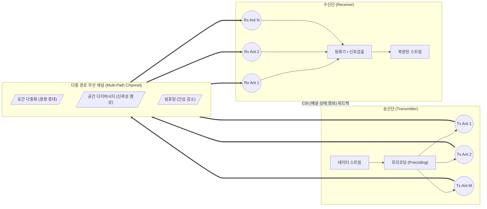

# MIMO (Multiple-Input Multiple-Output)

---

## I. 주파수 효율성 극대화 및 고속 데이터 전송 기술, MIMO의 개요

* **정의**: 기지국(송신단)과 단말기(수신단)에 각각 2개 이상의 다수 안테나를 사용하여 동일 주파수 대역에서 다중 경로로 데이터를 동시 송수신하는 무선 통신 기술
* **필요성 및 특징**:
* **용량 증대**: 주파수 대역폭이나 송신 전력의 증가 없이 공간 다중화를 통해 데이터 전송 용량(Capacity) 극대화
* **[[신뢰성]] 향상**: 공간 다이버시티 기법을 활용하여 다중 경로 페이딩(Fading) 극복 및 통신 품질 개선
* **주파수 효율성(Spectral Efficiency)**: 제한된 주파수 자원의 한계 돌파를 위한 4G/5G/6G 네트워크의 핵심 기반 기술

---

## II. MIMO의 개념도 및 핵심 기술 요소

### 가. MIMO의 개념도 및 동작 원리

* 송신단에서 전송 데이터를 병렬 스트림으로 분할(Precoding)하여 다중 안테나로 전송하고, 수신단에서 수신된 혼합 신호를 분리하여 원래 데이터를 복원하는 구조
* 수신단은 채널 상태 정보(CSI)를 추정하여 송신단으로 피드백함으로써 최적의 송신 가중치 적용

### 나. MIMO의 핵심 기술 요소
|**구분**|**요소기술(키워드)**|**세부 설명**|
|---|---|---|
|**신호 처리**|공간 [[다중화]] (Spatial Multiplexing)|- 서로 다른 데이터 스트림을 동일 주파수/시간에 전송      - 안테나 수에 비례하여 데이터 전송 속도 및 시스템 용량 선형적 증가|
|**신호 처리**|공간 다이버시티 (Spatial Diversity)|- 동일한 데이터를 여러 안테나를 통해 다중 경로로 전송      - 페이딩 환경에서 수신 신호의 신뢰성(SNR) 및 통신 품질 향상|
|**지향성 제어**|빔포밍 (Beamforming)|- 안테나 배열의 위상과 진폭을 제어하여 특정 방향으로 전파 집중      - 셀 가장자리 사용자의 수신률 향상 및 타 사용자 간섭(Interference) 감소|
|**채널 적응**|채널 상태 정보 (CSI)|- 송수신단 간의 무선 채널 환경(감쇠, 위상 변화 등) 정보      - 최적의 프리코딩 및 빔포밍 행렬 계산을 위한 필수 데이터|
|**송신 제어**|프리코딩 (Precoding)|- 송신단에서 피드백 받은 CSI를 기반으로 전송 신호를 사전에 조작      - 채널 왜곡을 사전 보상하고 다중 사용자 간 간섭 최소화|
|**다중 접속**|SDMA (Spatial Division Multiple Access)|- 공간 자원을 분할하여 동일한 주파수/시간에 다수의 사용자 접속 지원      - MU-MIMO 시스템에서 사용자별 독립적 공간 채널 형성|
|**진화 형태**|MU-MIMO (Multi-User)|- 단일 기지국이 여러 사용자의 단말과 동시에 통신하는 기술      - 전체 네트워크의 Throughput 향상 (Wi-Fi 5/6, LTE-A 적용)|
|**진화 형태**|Massive MIMO (대규모)|- 기지국에 수십~수백 개(64T64R 이상)의 안테나 소자를 장착      - 5G의 핵심 기술로, 3D 빔포밍 및 초고주파(mmWave) 대역 손실 보상|

---

## III. MIMO 기술의 진화 단계 비교 및 향후 6G 발전 동향

### 가. MIMO 기술의 진화 단계 비교

| 비교 항목 | SU-MIMO (Single-User) | MU-MIMO (Multi-User) | Massive MIMO |
| --- | --- | --- | --- |
| **개념** | 1개 기지국 ↔ 1개 단말 동시 통신 | 1개 기지국 ↔ 다수 단말 동시 통신 | 기지국에 수백 개 안테나 배열 적용 |
| **안테나 수** | 소규모 (2x2, 4x4) | 중규모 (4x4, 8x8) | 대규모 (64~256개 이상) |
| **주요 목적** | 단일 사용자의 최대 전송률 향상 | 셀 전체의 용량(Throughput) 증대 | 3D 빔포밍, mmWave 경로 손실 극복 |
| **적용 세대** | 3G, 4G 초기 / Wi-Fi 4 | 4G LTE-A / Wi-Fi 5, 6 | 5G NR, [[Wi-Fi 7]] |

### 나. 6G 시대를 위한 MIMO 기술의 향후 전망 및 동향

* **Cell-Free Massive MIMO**: 기지국(Cell)의 경계를 허물고 다수의 분산 안테나(AP)들이 협력하여 사용자에게 간섭 없는 일관된 통신 품질을 제공하는 분산형 아키텍처로 진화
* **RIS (Reconfigurable Intelligent Surface) 결합**: 전파의 반사와 굴절을 능동적으로 제어하는 지능형 반사 표면(RIS) 기술과 결합하여, 도심지 음영 구역(NLOS)의 통신 커버리지 및 전력 효율성 극대화
* **AI/ML 기반 CSI 추정**: 수백 개의 안테나 사용으로 인한 막대한 CSI 피드백 오버헤드를 줄이기 위해, [[딥러닝]] 기반 채널 예측 및 압축 기술을 도입하여 신호 처리 지연시간 최소화 추진

---

### 🔗 연관 토픽

- **소속 도메인**: [[00_네트워크_MOC|🌐 네트워크]]
- **세부 분류**: `2. 네트워크 계층 & 라우팅 프로토콜 (L3)`
- **핵심 연관 토픽**:
  - [[다중화|다중화(Multiplexing)]]
  - [[CSMA CA|CSMA/CA]]
  - [[6G]]
  - [[Mobile Edge Computing|Mobile Edge Computing (MEC)]]
  - [[Wi-Fi 7|WI-FI 7 (IEEE 802.11be)]]
