요청하신 조건에 따라, 최신 사실 관계를 기반으로 검증(MITRE ATT&CK 최신 동향 및 [[프레임워크]] 구조)한 후 정보관리기술사 1교시형 모범답안 형식에 맞추어 답변을 작성했습니다.

# MITRE ATT&CK

---

## I. 실효적 사이버 위협 방어체계, MITRE ATT&CK의 개요

### 가. MITRE ATT&CK의 정의

* 사이버 공격자의 전술(Tactics), 기술(Techniques), 절차(Procedures)를 기반으로 위협 행위를 분석하고 범주화한 글로벌 보안 표준 지식 베이스(Framework)

### 나. MITRE ATT&CK의 필요성 및 특징

* **행위(Behavior) 중심 방어**: 단편적인 침해지표(IoC, IP/Hash 등)가 아닌 공격자의 실제 의도와 행동 패턴(TTPs)에 집중하여 우회 공격 사전 탐지
* **공통 언어 제공**: 레드팀(공격 훈련)과 블루팀(방어) 간의 표준화된 위협 커뮤니케이션 체계 지원 및 협업 가속화
* **능동적 방어 체계 구축**: 조직의 방어 커버리지(Coverage)를 정량적으로 평가하고 [[SIEM]]/[[SOAR (Security Orchestration, Automation and Response)|SOAR]] 탐지 룰 최적화 및 Threat Hunting 수행에 직접 활용

---

## II. MITRE ATT&CK의 개념도 및 핵심 기술 요소

### 가. MITRE ATT&CK의 개념도 및 동작 원리

```mermaid
flowchart LR
    subgraph "ATT&CK Core Data Model (TTPs)"
        direction TB
        Tactics["Tactics (전술)<br/>공격의 목적 (Why)"] 
        Techniques["Techniques (기술)<br/>공격의 방법 (How)"] 
        SubTech["Sub-Techniques (하위 기술)<br/>세분화된 동작 방식"] 
        Procedures["Procedures (절차)<br/>APT 그룹의 실제 사례"] 
        
        Tactics -->|달성 수단| Techniques
        Techniques -->|상세화| SubTech
        SubTech -->|실제 공격| Procedures
    end

    subgraph "SecOps Application"
        direction TB
        CTI["CTI (위협 인텔리전스)"]
        Nav["ATT&CK Navigator<br/>(커버리지 시각화)"]
        SIEM["SIEM/SOAR<br/>(상관분석 및 탐지 룰)"]
        Response["Threat Hunting & 능동 대응"]
        
        CTI --> Nav
        Nav --> SIEM
        SIEM --> Response
    end

    Procedures -. "공격자 행위 패턴 추출" .-> CTI

```

* 공격자의 거시적 목적(Tactics)부터 실제 악성코드 구동 방식(Procedures)까지 계층화하여 [[위협 모델링]] 수행
* 추출된 TTPs 지표를 ATT&CK Navigator를 통해 시각화하고, 보안 관제 센터(SOC)의 자동화된 탐지 및 [[위협 헌팅]] 체계에 연동함

### 나. MITRE ATT&CK의 핵심 기술 및 구성 요소

| 구분 | 요소기술(키워드) | 세부 설명 |
| --- | --- | --- |
| **운영 환경 매트릭스** | Enterprise | - Windows, macOS, Linux, Cloud 환경에 대한 14개 전술 기반 위협 행위 분석 매트릭스 |
| **운영 환경 매트릭스** | Mobile / ICS | - 모바일 기기(iOS, Android) 및 산업제어시스템(ICS/OT) 인프라 환경에 특화된 공격 기법 정의 |
| **지식 구조 (TTPs)** | Tactics (전술) | - Initial Access, Execution 등 공격자가 최종적으로 달성하려는 궁극적인 목표(Why) |
| **지식 구조 (TTPs)** | Techniques (기술) | - 전술을 달성하기 위해 사용하는 구체적 공격 방법(How) (예: Phishing, Credential Dumping) |
| **지식 구조 (TTPs)** | Sub-Techniques | - 특정 기술(Technique)을 더 세분화한 형태 (예: Phishing 기술 내 Spearphishing Attachment 등) |
| **지식 구조 (TTPs)** | Procedures (절차) | - 위협 행위자(예: APT 그룹)가 기술을 실행하기 위해 사용한 실제 악성코드 도구나 구체적 침해 사례 |
| **분석 도구** | ATT&CK Navigator | - 조직의 보안 통제 상태와 탐지 역량을 매트릭스에 매핑하여 가시화 및 갭(Gap) 분석을 수행하는 오픈소스 도구 |
| **대응 체계** | Mitigations & Detections | - 개별 공격 기법을 방어하기 위한 완화 방안(보안 통제) 및 데이터 소스 기반의 식별 지표 제공 |

---

## III. Cyber Kill Chain과 비교 및 향후 도입 전망

### 가. 기존 방어 프레임워크(Cyber Kill Chain)와의 비교

| 비교 항목 | Cyber Kill Chain | MITRE ATT&CK |
| --- | --- | --- |
| **제안 기관** | 록히드마틴 (Lockheed Martin) | 마이터 코퍼레이션 (MITRE Corp.) |
| **분석 관점** | 공격의 단계적 진행 흐름 (선형적 / Linear) | 공격자의 전술 및 세부 기법 (비선형적 매트릭스) |
| **방어 초점** | 외부 침투 차단 및 거부 (경계 보안 중심) | 내부망 이동(Lateral Movement) 등 침해 후 행위 중심 방어 |
| **구성 요소** | 정형화된 7단계 공격 라이프사이클 | 14개 전술과 수백 개의 기술(TTPs) 기반 지식 베이스 |
| **주요 활용** | 거시적 방어 전략 수립 및 보안 아키텍처 설계 | 실무적 탐지 룰 적용, 레드/블루팀 모의해킹 훈련 기반 |

### 나. 실무 적용 시 고려사항 및 최신 기술 동향

* **보안 커버리지 자동 검증**: BAS (Breach and Attack Simulation) 솔루션과 ATT&CK 매트릭스를 결합하여 조직의 방어 및 탐지 역량을 상시 자동 평가하는 체계로 고도화 중
* **클라우드 위협 모델링 확대**: [[클라우드 네이티브]] 환경(SaaS, IaaS) 및 최신 소프트웨어 [[공급망 공격]] 패턴이 매트릭스에 지속 반영되고 있어, 기업의 제로 트러스트([[제로 트러스트 보안모델|Zero Trust]]) 아키텍처 수립을 위한 핵심 레퍼런스로 자리매김함

---

### 🔗 연관 토픽

- **소속 도메인**: [[00_보안_MOC|🛡️ 보안]]
- **세부 분류**: `2. 현대 암호학 & 키 관리 · 전자서명`
- **핵심 연관 토픽**:
  - [[위협 헌팅|위협 헌팅(Threat Hunting)]]
  - [[제로 트러스트 보안모델|제로 트러스트 (Zero Trust) 보안모델]]
  - [[CTI]]
  - [[SIEM]]
  - [[공급망 공격|공급망 공격(Supply Chain Attack)]]
