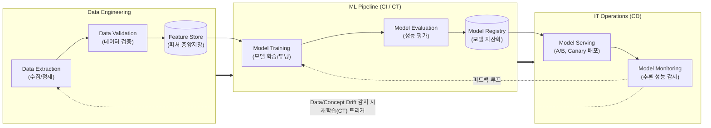

조사 및 검증 결과, 최신 MLOps 프랙티스(Feature Store, Model Registry, Continuous Training 등)와 초거대 AI 시대를 맞이하여 부상하는 [[LLMOps]] 트렌드 등의 사실관계를 확인했습니다. 이를 바탕으로 정보관리기술사 1교시형 모범답안 형식에 맞추어 작성한 답안입니다.

# MLOps (Machine Learning Operations)

---

## I. 신뢰성 있는 AI 서비스 라이프사이클 관리, MLOps의 개요

* **정의**: 기계학습(ML) 모델의 개발(가설 수립, 학습)과 IT 운영(배포, 서비스)의 사일로(Silo)를 제거하고, 데이터 수집부터 배포, 모니터링까지 전 과정을 자동화하는 하이브리드 운영 체계
* **등장배경 및 특징**:
* **운영 환경의 동적 변화**: Data Drift 및 Concept Drift로 인한 모델 성능 저하 극복 필요
* **핵심 특징**: 재현성(Reproducibility) 확보, 지속적 학습(Continuous Training, CT), 데이터/모델/코드의 통합 버전 관리

---

## II. MLOps의 개념도 및 핵심 기술 요소

### 가. MLOps의 파이프라인 개념도 및 동작 원리

* 신규 데이터 유입 또는 성능 저하 감지 시, 수동 개입 없이 자동화된 파이프라인을 통해 재학습(CT) 및 재배포 수행
* 모델 추론 결과와 실시간 데이터를 지속적으로 모니터링하여 피드백 루프(Feedback Loop) 형성

### 나. MLOps의 핵심 기술 요소
|**구분**|**요소기술(키워드)**|**세부 설명**|
|---|---|---|
|**자동화 파이프라인**|Continuous Training (CT)|- 신규 데이터 추가 및 [[스키마]] 변경 시 모델 자동 재학습 수행      - [[DevOps]]에는 없는 MLOps만의 고유한 지속적 학습 체계|
|**자동화 파이프라인**|ML CI/CD|- ML 코드, 데이터, 모델 스키마를 통합하여 [[컨테이너]] 이미지 자동 빌드 및 배포|
|**데이터 관리**|Feature Store|- 기계학습에 사용되는 피처(Feature)를 재사용할 수 있도록 저장하는 중앙 저장소      - 오프라인(학습용) 및 온라인(실시간 추론용) 서빙 동시 지원|
|**모델 자산화**|Model Registry|- 검증된 모델 아티팩트 및 메타데이터(파라미터, 하이퍼파라미터 등) 버전 관리      - 배포 승인 체계 및 이력 추적(Traceability) 제공|
|**인프라 환경**|Container Orchestration|- Kubernetes 기반으로 ML 워크로드를 분산하고 [[GPU]] 등 리소스 자동 할당      - Kubeflow 플랫폼 등을 통한 워크플로우 제어|
|**모델 배포**|Serving [[Strategy (알고리즘 교체)|Strategy]]|- 섀도우(Shadow), 카나리(Canary), A/B 테스트 기반 무중단 안정적 배포 수행|
|**모니터링**|Drift Detection|- 데이터 분포 변화(Data Drift) 및 통계적 특성 변화(Concept Drift) 탐지|
|**거버넌스**|ML Metadata Logging|- 모델 훈련 시점의 실행 환경, 코드 버전, 평가지표를 기록하여 재현성 완벽 보장|

---

## III. DevOps와 MLOps 비교 및 향후 발전 동향

### 가. 전통적 DevOps와 MLOps의 핵심 비교

| 비교 항목 | DevOps | MLOps |
| --- | --- | --- |
| **관리 대상 (자산)** | 소프트웨어 코드(Code) | **코드(Code) + 데이터(Data) + 모델(Model)** |
| **자동화의 핵심** | CI (지속적 통합) / CD (지속적 배포) | CI / CD + **CT (Continuous Training, 지속적 학습)** |
| **테스트 관점** | 단위/[[통합 테스트]], 정적 코드 분석 | 데이터 검증, 모델 성능 지표 평가, 공정성 테스트 |
| **운영 모니터링** | 서버 리소스([[CPU]]/Mem), 응답 속도 | 리소스 + **모델 성능 저하(Drift), 편향성(Bias) 모니터링** |
| **버전 관리 기준** | 소스코드 [[형상 관리]] (Git) | 데이터 셋, 하이퍼파라미터, 모델 가중치(Weight)의 형상 관리 |

### 나. MLOps의 최신 트렌드 및 향후 전망

* **LLMOps (Large Language Model Ops)로의 진화**: 초거대 AI 모델의 등장으로 인해, [[프롬프트 엔지니어링]] 버전 관리(Prompt Registry), RAG(검색 증강 생성) 파이프라인 연동, 미세조정([[Fine-Tuning]]) 파이프라인 관리를 포괄하는 LLMOps/FMOps로 패러다임 확장
* **[[AI 거버넌스]] 및 규제 준수(Trustworthy AI)**: EU AI Act 등 [[인공지능]] 규제 강화에 따라, 모델의 설명 가능성([[XAI]]), 공정성 평가, 데이터 프라이버시(Privacy-Preserving ML)를 파이프라인 내에 자동화된 검증 단계로 필수 통합하는 추세

---

### 🔗 연관 토픽

- **소속 도메인**: [[00_인공지능_MOC|🤖 인공지능]]
- **세부 분류**: `1. 수학 · 통계학 & 데이터 전처리`
- **핵심 연관 토픽**:
  - [[LLMOps]]
  - [[AI 거버넌스|AI 거버넌스 (AI Governance)]]
  - [[AI 시스템 테스트]]
  - [[다중공선성|다중공선성 (Multicolinearity)]]
  - [[기술 통계|기술 통계(Descriptive statistics)]]
