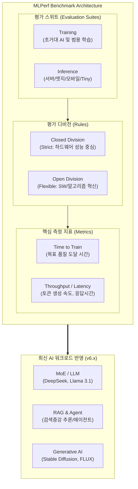

요청하신 조건에 따라 최신 기술 동향(2026년 기준 하반기 MLPerf v6.x 최신 업데이트 반영)을 사전 조사 및 두 차례 검증한 후, 정보관리기술사 1교시형 모범답안 형식으로 작성했습니다.

# MLPerf

---

## I. 글로벌 AI 시스템 성능 평가 표준, MLPerf의 개요

* **정의**: MLCommons가 주도하여 다양한 하드웨어 및 소프트웨어 환경에서 [[인공지능]](AI) 모델의 학습(Training)과 추론(Inference) 성능을 공정하고 투명하게 평가하기 위한 벤치마크 표준
* **필요성/특징**:
* **객관적 지표 제공**: 벤더 종속적 성능 과장을 방지하고 합의된 규정에 따라 하드웨어 성능을 직접 비교 가능
* **Closed / Open Division**: 동일 모델/조건에서 하드웨어 성능을 겨루는 통제된 부문과 자유로운 소프트웨어/[[알고리즘]] 혁신을 허용하는 개방형 부문 병행
* **생태계 확장**: 데이터센터부터 모바일, TinyML까지 전 영역의 AI 인프라 커버

---

## II. MLPerf의 측정 구조 및 핵심 기술 요소

### 가. MLPerf의 측정 체계 및 동작 원리

* MLPerf는 벤치마크 스위트(학습/추론), 디비전(Closed/Open)으로 체계화되어 있으며, 결과는 훈련 시간(Time to Train)이나 [[처리량]](Throughput) 등의 정량적 지표로 도출됨
* 최신 버전에서는 실제 산업 트렌드를 반영하여 RAG 파이프라인 및 [[MOE(Mixture of Experts)|MoE]](Mixture-of-Expert) 모델의 평가 비중이 대폭 확대됨

### 나. MLPerf의 핵심 기술 및 구성 요소

| 구분 | 요소기술(키워드) | 세부 설명 |
| --- | --- | --- |
| **핵심 스위트** | Training Benchmark | - 데이터셋을 사용하여 모델을 훈련시키고 사전에 정의된 '목표 품질'에 도달하는 데 걸리는 시간(Time to Train)을 측정 |
| **핵심 스위트** | Inference Benchmark | - 훈련된 모델을 사용하여 새로운 데이터를 처리하는 속도(Throughput)와 지연 시간(Latency) 측정 |
| **평가 규칙** | Closed Division | - [[모델 구조]], 데이터셋, 하이퍼파라미터를 엄격히 고정하여 순수 하드웨어 및 시스템 아키텍처의 성능을 비교 |
| **평가 규칙** | Open Division | - 알고리즘, 모델 아키텍처, 양자화 기법 등 전반적인 소프트웨어 및 인프라 스택의 자유로운 혁신 허용 |
| **추론 시나리오** | Server / Offline | - **Server**: 실시간 챗봇 등 예측 불가능한 요청에 대한 지연 시간 측정 

 - **Offline**: 대용량 배치 처리에 대한 처리량 중심 측정 |
| **대상 환경** | Datacenter / [[EDGE|Edge]] | - 클라우드 및 데이터센터용 대형 시스템부터 엣지 디바이스([[Smart Car(자율주행)|자율주행]] 등)까지 환경별 규격 세분화 |
| **대상 환경** | Mobile / Tiny | - 스마트폰 기반 AI 처리(Mobile) 및 초저전력 IoT 칩셋(TinyML)의 성능과 전력 효율성 평가 |
| **부가 지표** | Power Measurement | - 모델 구동 시의 에너지 효율성(Performance/Watt)을 함께 측정하여 지속 가능한 AI 인프라 평가 기준 제시 |

---

## III. MLPerf의 평가 워크로드 진화 및 최신 동향

### 가. 전통적 워크로드와 최신 워크로드(v6.x)의 비교

| 비교 항목 | 기존 MLPerf (v2.x ~ v4.x) | 최신 MLPerf (v6.x 이후) |
| --- | --- | --- |
| **대표 모델** | ResNet, [[BERT]], GPT-3, DLRM | DeepSeek-V3/R1, Qwen3-VL, Llama 3.1 405B |
| **Language 모델링** | Dense 모델 위주의 단일 평가 | MoE (Mixture-of-Expert) 아키텍처 기반 거대 모델 중심 |
| **Generative AI** | 초기 이미지 생성 (Stable Diffusion) | 텍스트-비디오(Text-to-Video), 고해상도 생성(FLUX.1) 모델 도입 |
| **실무 적용성** | 단일 모델 단위의 입출력 평가 | RAG (Retrieval-Augmented Generation) 및 에이전트(Agentic) 기반의 [[End-to-End]] 파이프라인 평가 |

### 나. MLPerf 향후 전망 및 최신 동향

* **아키텍처 혁신의 전초기지**: 2026년 기준 MLPerf v6.1 Inference 등에서 NVIDIA의 차세대 아키텍처(Vera Rubin NVL72)와 AMD 거대 클러스터(MI355X 512 [[GPU]])가 경쟁하며 차세대 AI 칩셋 벤더 간의 가장 강력한 실증 지표(Scoreboard)로 활용됨
* **AI ROI 및 전력 효율성에 집중**: 단순히 빠른 속도뿐만 아니라 '스케일링 효율성(Scaling Efficiency)' 및 전력 소비 대비 토큰 생성 효율이 AI 데이터센터 설계의 핵심 지표로 부상함

---

### 🔗 연관 토픽

- **소속 도메인**: [[00_인공지능_MOC|🤖 인공지능]]
- **세부 분류**: `6. 설명가능한 AI (XAI) & AI 윤리 · 거버넌스`
- **핵심 연관 토픽**:
  - [[인공지능]]
  - [[MOE(Mixture of Experts)]]
  - [[XAI]]
  - [[End-to-End]]
  - [[모델 구조]]
