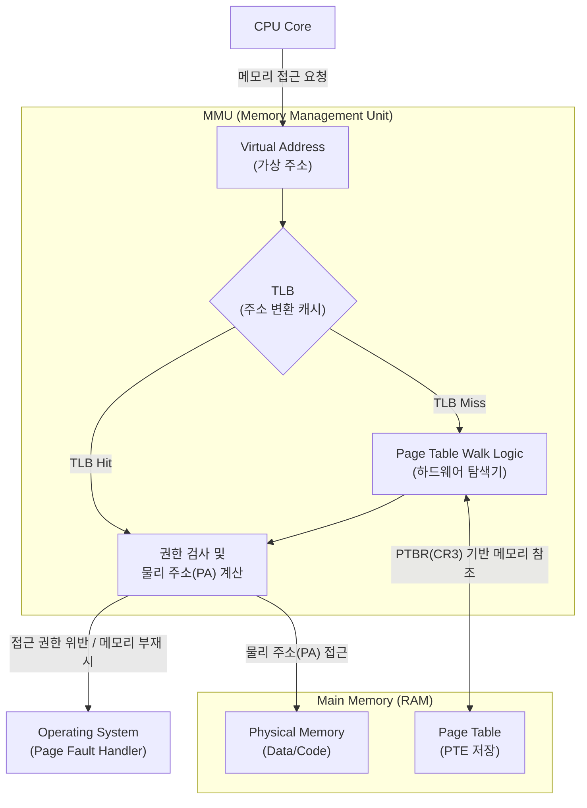

# MMU(Memory Management Unit)

---

## I. 가상 메모리 시스템의 핵심 하드웨어, MMU의 개요

### 가. MMU의 정의

* [[CPU]]와 메인 메모리 사이에서 프로세스가 참조하는 논리적 가상 주소(Virtual Address)를 실제 [[물리 주소]](Physical Address)로 변환하는 하드웨어 장치

### 나. MMU의 필요성 및 특징

* **물리 메모리 한계 극복**: 요구 페이징(Demand Paging) 기법을 통해 실제 장착된 물리 메모리보다 큰 가상 주소 공간 제공
* **[[프로세스]] 격리 및 보호**: 권한 비트 검사를 통해 프로세스 간 메모리 침범을 방지하고 커널 영역을 보호
* **고속 주소 변환**: 내부에 TLB(Translation Lookaside Buffer) 캐시를 탑재하여 페이지 테이블 탐색에 따른 지연 시간 최소화

---

## II. MMU의 개념도 및 핵심 기술 요소

### 가. MMU의 개념도 및 동작 원리

* CPU가 가상 주소를 요청하면 MMU 내부의 TLB를 우선 조회하며, TLB Miss 발생 시 메인 메모리의 페이지 테이블을 다단계 탐색(Page Table Walk)함
* 접근 권한 위반이나 물리 메모리 부재(Invalid) 상태인 경우, 예외(Exception)를 발생시켜 OS의 Page Fault 핸들러가 디스크에서 데이터를 적재하도록 유도함

### 나. MMU의 핵심 기술 및 구성 요소

|**구분**|**요소기술(키워드)**|**세부 설명**|
|---|---|---|
|**고속 캐시**|TLB (Translation Lookaside Buffer)|- 최근 사용된 가상-물리 주소 변환 정보(PTE)를 저장하는 고속 SRAM 캐시      - 메모리 접근 속도를 비약적으로 향상시킴|
|**기준 레지스터**|PTBR (Page Table Base Register)|- 현재 실행 중인 프로세스의 최상위 페이지 테이블 시작 물리 주소를 가리킴      - x86 아키텍처의 CR3 레지스터가 해당 역할 수행|
|**테이블 탐색**|Page Table Walk (PTW)|- TLB Miss 발생 시 메모리의 다단계 페이지 테이블을 하드웨어적으로 탐색하는 로직|
|**[[문맥 교환]] 최적화**|ASID / PCID (Address Space ID)|- 프로세스 식별 번호를 TLB 태그에 포함하여 문맥 교환 시 TLB 전체 플러시 방지|
|**메모리 보호**|Permission Bits (권한 검사)|- PTE에 명시된 읽기/쓰기/실행(R/W/X) 권한 및 유저/커널 모드 접근 허용 여부 검사|
|**예외 처리**|Page Fault Exception|- 권한 위반 또는 매핑되지 않은 메모리 접근 시 CPU에 인터럽트를 발생시켜 OS로 제어권 전환|
|**성능 튜닝**|Huge Page (대용량 페이지)|- 2MB, 1GB 등 큰 단위의 페이지를 매핑하여 단일 TLB 엔트리가 커버하는 메모리 영역 극대화|
|**[[가상화]] 인프라**|EPT / NPT (2단계 주소 변환)|- 하이퍼바이저(VM) 환경에서 Guest VA → Guest PA → Host PA로 이어지는 중첩 변환 하드웨어 지원|

---

## III. 주변기기 가상화를 위한 IOMMU와의 비교 및 최신 동향

### 가. MMU와 IOMMU(Input/Output MMU)의 비교

| 비교 항목 | MMU (Memory Management Unit) | IOMMU (Input/Output MMU) |
| --- | --- | --- |
| **동작 주체** | **CPU Core** | **I/O 디바이스** ([[GPU]], NIC, NVMe 등) |
| **핵심 목적** | CPU가 요청한 가상 주소를 물리 주소로 변환 | 주변기기가 요청한 [[DMA(Direct Memory Access)|DMA]] 가상 주소를 물리 주소로 변환 |
| **보안 대상** | 프로세스 간 메모리 침범 방지 및 커널 격리 | 악의적인 디바이스의 잘못된 DMA 메모리 접근(공격) 방지 |
| **가상화 활용** | 프로세스별 독립된 가상 주소 공간 할당 | 가상 머신(VM)에 물리적 PCI-e 디바이스를 직접 할당(Passthrough) |

### 나. MMU 관련 최신 기술 동향

* **[[부채널 공격]] 방어 체계 내재화**: Meltdown, Spectre 등 하드웨어 취약점으로 인한 커널 메모리 유출을 방지하기 위해 유저/커널 페이지 테이블을 완전히 분리하는 KPTI([[커널|Kernel]] Page Table Isolation) 기법 도입 및 적용
* **이기종 통합 메모리 아키텍처(UMA)**: [[CXL]](Compute Express Link) 등 고속 인터커넥트 기술의 발전에 따라, CPU의 MMU와 GPU/[[NPU]]의 주소 변환 로직이 일관성을 유지하며 거대한 통합 메모리 풀(Unified Memory Pool)을 공유하는 형태로 진화 중

---

### 🔗 연관 토픽

- **소속 도메인**: [[00_컴퓨터구조_MOC|💻 컴퓨터구조]]
- **세부 분류**: `1. CPU 프로세서 & 마이크로아키텍처`
- **핵심 연관 토픽**:
  - [[문맥 교환|문맥 교환 (Context Switching)]]
  - [[물리 주소]]
  - [[DMA(Direct Memory Access)]]
  - [[CPU]]
  - [[GPU]]
