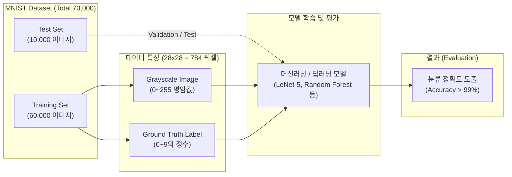

# MNIST

---

## I. 머신러닝의 "Hello World" 벤치마크, MNIST의 개요

### 가. MNIST의 정의

* 기계학습(ML) 및 컴퓨터 비전 모델의 이미지 분류 성능을 평가하기 위해 고안된, 0부터 9까지의 수기(Handwritten) 숫자 7만 장으로 구성된 표준 벤치마크 데이터셋
* 얀 르쿤(Yann LeCun) 등이 NIST 원본 데이터를 재가공하여 제안한 [[지도학습]](Supervised Learning) 기반의 사실상 표준(De facto standard)

### 나. MNIST의 등장 배경 및 특징

* **[[알고리즘]] 객관적 평가**: 동일한 학습/테스트 분할 데이터와 10개의 명확한 클래스를 제공하여 다양한 알고리즘([[CNN]], [[서포트 벡터 머신|SVM]], MLP 등) 간 공정한 성능 비교 체계 마련
* **최적화된 전처리**: 이미지 크기를 28x28 픽셀 단위로 정규화하고 중앙 정렬하여 연구자의 [[데이터 전처리]] 부담 최소화
* **빠른 프로토타이핑**: 데이터 용량이 작고 흑백(Grayscale)으로 구성되어 컴퓨팅 자원이 부족한 환경에서도 빠른 모델 테스트 및 교육용으로 적합

---

## II. MNIST 기반 분류 프로세스 및 핵심 요소

### 가. MNIST 기반 이미지 분류 프로세스 개념도

* 제공되는 784차원(28x28)의 피처 벡터와 정답 레이블을 모델에 주입하여 학습시키고, 분리된 Test Set을 통해 [[일반화]] 성능(Accuracy)을 도출함

### 나. MNIST의 핵심 구성 요소 및 데이터 특성

| 구분 | 요소기술(키워드) | 세부 설명 |
| --- | --- | --- |
| **데이터 구성** | Training Set | - 모델의 가중치를 업데이트하고 학습시키기 위해 고정 할당된 60,000장의 숫자 이미지 |
| **데이터 구성** | Test Set | - 학습된 모델의 실질적인 예측 성능을 평가(검증)하기 위한 10,000장의 독립된 세트 |
| **이미지 특성** | 28x28 Resolution | - 모든 이미지는 가로 28픽셀, 세로 28픽셀 크기로 이루어져 총 784개의 변수(피처) 제공 |
| **이미지 특성** | Grayscale | - 컬러 채널(RGB) 없이 0(흰색)부터 255(검은색)까지의 단일 흑백 명암값으로 픽셀을 표현함 |
| **이미지 전처리** | Size-normalized | - 다양한 필체의 크기를 20x20 박스 내에 맞도록 정규화하고 안티앨리어싱을 적용함 |
| **이미지 전처리** | Centered | - 질량 중심(Center of mass) 기법을 사용하여 정규화된 숫자를 28x28 프레임의 중앙에 위치시킴 |
| **정답 구조** | 10 Classes (0~9) | - 각 이미지가 의미하는 0부터 9까지의 정수를 라벨로 보유하며, 클래스별 분포가 균등함 |
| **대표 모델** | LeNet-5 | - MNIST 데이터셋을 활용해 손글씨 인식 분야에서 합성곱 신경망(CNN)의 우수성을 입증한 초기 모델 |

---

## III. 유사 벤치마크 데이터셋 비교 및 최신 동향

### 가. MNIST 및 주요 이미지 벤치마크 데이터셋 비교

| 비교 항목 | MNIST | Fashion-MNIST | CIFAR-10 |
| --- | --- | --- | --- |
| **주요 대상** | 0~9 수기 숫자 | 의류, 신발, 가방 등 10종 | 비행기, 자동차, 개, 고양이 등 10종 |
| **이미지 특성** | 28x28 (흑백) | 28x28 (흑백) | 32x32 (RGB 컬러) |
| **데이터 복잡도** | 매우 낮음 | 보통 (MNIST의 직접적 대안) | 높음 (배경 및 형태 변형 다양) |
| **도입 목적** | 알고리즘의 기초 검증 | 단순 숫자 분류 한계 극복 | 실세계 객체(Object) 인식률 평가 |
| **활용 현황** | 초학습(Tutorial) 및 기본 성능 기준점 | 현대 ML 알고리즘의 1차 성능 벤치마킹용 | 경량 [[딥러닝]] 모델의 범용 평가 지표 |

### 나. MNIST 데이터셋의 한계점 및 향후 활용 동향

* **성능 변별력 상실 (Solved Dataset)**: 현대의 딥러닝(CNN 등) 모델들이 MNIST 분류에서 인간 수준 이상의 99.7% 정확도를 쉽게 달성하게 되어 최신 알고리즘 평가 지표로서의 변별력을 상실함
* **새로운 활용성의 대두**: 단순 성능 경쟁에서는 Fashion-MNIST나 ImageNet 등으로 주도권이 넘어갔으나, 경량화 기법(TinyML) 테스트, 설명 가능한 AI([[XAI]])의 특징맵 시각화, 새로운 최적화 함수([[OPTIMIZER|Optimizer]])의 초기 디버깅 도구로 그 역할이 전환 및 유지되고 있음

---

### 🔗 연관 토픽

- **소속 도메인**: [[00_인공지능_MOC|🤖 인공지능]]
- **세부 분류**: `2. 머신러닝 기초 & 핵심 알고리즘`
- **핵심 연관 토픽**:
  - [[지도학습]]
  - [[딥러닝]]
  - [[XAI]]
  - [[서포트 벡터 머신|서포트 벡터 머신 SVM(Support Vector Machine)]]
  - [[알고리즘]]
