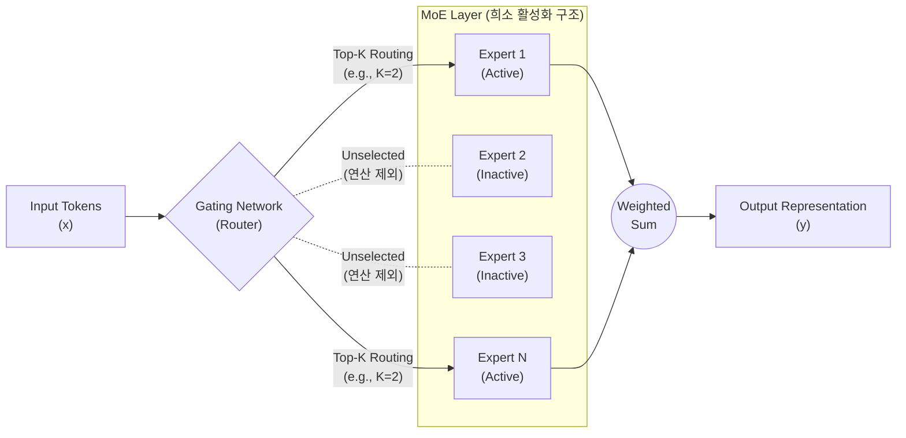

# MOE (Mixture of Experts)

---

## I. 초거대 AI 연산 효율성 극대화의 핵심, MOE의 개요

### 가. MOE(Mixture of Experts)의 정의

* 입력 데이터(토큰)마다 전체 신경망이 아닌 최적화된 소수의 하위 신경망(Expert) 그룹만 선택적으로 활성화하여, 추론 연산량(FLOPs)은 통제하면서 전체 매개변수(Parameter)를 확장하는 희소(Sparse) 기반 [[인공지능]] 아키텍처

### 나. MOE의 필요성 및 특징

* **Dense 모델의 한계 극복**: 매개변수 확장에 비례하여 기하급수적으로 증가하는 연산 비용 및 전력 소모 문제 해결
* **주요 특징**: 희소 활성화(Sparse Activation), 동적 라우팅(Dynamic Gating), 부하 분산(Load Balancing)을 통한 추론 지연시간(Latency) 최소화

---

## II. MOE의 개념도 및 핵심 기술 요소

### 가. MOE의 개념도 및 동작 원리

* [[라우터]](Gating Network)가 입력 토큰의 특성을 분석하여 가장 적합한 Top-K 개의 Expert 모델로 분배 및 연산함
* 비활성화된 Expert는 연산(행렬 곱)에서 배제되므로 전체 컴퓨팅 리소스 사용량을 극적으로 절감함

### 나. MOE의 핵심 기술 및 구성 요소

| 구분 | 요소기술(키워드) | 세부 설명 |
| --- | --- | --- |
| **핵심 구조** | Sparse Activation (희소 활성화) | - 전체 파라미터 중 소수(예: 8개의 Expert 중 2개)만 활성화하여 연산에 참여시키는 아키텍처 설계 |
| **데이터 분배** | Gating Network (라우터) | - 입력 토큰과 각 Expert 간의 적합도(확률)를 계산하여 최적의 경로를 동적 할당하는 소프트맥스(Softmax) 기반 층 |
| **데이터 분배** | Top-K Routing | - 계산된 확률 분포를 기반으로 상위 K개의 Expert에만 토큰을 전달하고 결과를 가중합(Weighted Sum)하여 출력 |
| **성능 최적화** | Load Balancing Loss | - 특정 소수의 Expert에만 토큰 처리가 집중되는 병목(Routing Collapse)을 방지하기 위해 부여하는 보조 손실 함수 |
| **성능 최적화** | Capacity Factor (용량 계수) | - 단일 Expert가 한 번에 처리할 수 있는 최대 토큰 수를 제한하여 메모리 초과(OOM) 방지 및 처리 지연 시간 보장 |
| **학습/분산** | Expert Parallelism (EP) | - 다수의 [[GPU]] 또는 노드에 여러 Expert를 분산 배치하여 통신 오버헤드를 완화하고 거대 모델의 확장성 확보 |
| **오류 처리** | Token Dropping | - 할당된 버퍼 용량을 초과하여 라우팅된 토큰을 버리거나(Drop) 다음 레이어로 우회시켜 전체 시스템 장애 방지 |
| **최신 기법** | Shared Expert (공유 전문가) | - 모든 토큰이 기본적으로 참조하는 공통 Expert를 배치하여 일반 지식(General Knowledge) 유지 (DeepSeek 등 적용) |

---

## III. MOE 아키텍처 비교 및 향후 기술 동향

### 가. Dense 아키텍처와 Sparse(MOE) 아키텍처 비교

| 비교 항목 | Dense (밀집형) 아키텍처 | Sparse (MOE) 아키텍처 |
| --- | --- | --- |
| **활성화 비율** | 100% (모든 토큰이 전체 파라미터 통과) | 10~25% 수준 (선택된 Expert만 연산) |
| **추론 연산량 (FLOPs)** | 총 매개변수(Parameter) 크기에 정비례 | **활성화된 파라미터 크기**에 비례 (연산량 극소화) |
| **메모리(VRAM) 요구량** | 총 매개변수 크기에 비례 | **총 매개변수 크기에 비례 (비활성화 Expert도 적재 필수)** |
| **장점** | 학습 안정성 높음, 범용적 성능 우수 | 훈련/추론 속도 획기적 향상, 모델 스케일업 용이 |
| **대표 모델 적용 사례** | Llama 3 70B, GPT-3 | GPT-4, Mixtral 8x7B, DeepSeek-V3/R1 |

### 나. MOE 도입의 한계점 극복 및 최신 동향

* **메모리 병목(Memory Wall) 완화**: MOE는 연산량은 줄여주지만 전체 모델을 VRAM에 올려야 하므로, 양자화(Quantization, FP8/FP4 등) 기법과 GPU-[[CPU]] 간 고속 오프로딩 기술의 결합이 필수적으로 요구됨
* **All-to-All 통신 최적화**: Expert Parallelism(EP) 환경에서 칩 간, 노드 간 토큰을 교환하는 과정의 네트워크 대역폭(Bandwidth) 병목 현상을 타개하기 위해, NVLink 및 InfiniBand 기반의 커스텀 [[라우팅 알고리즘]] 연구 활발

---

### 🔗 연관 토픽

- **소속 도메인**: [[00_인공지능_MOC|🤖 인공지능]]
- **세부 분류**: `3. 딥러닝 핵심 아키텍처 & 신경망`
- **핵심 연관 토픽**:
  - [[인공지능]]
  - [[모델 구조]]
  - [[라우팅 알고리즘|라우팅 알고리즘(Routing Protocol, 거리벡터, 링크상태)]]
  - [[MLPerf]]
  - [[CPU]]
