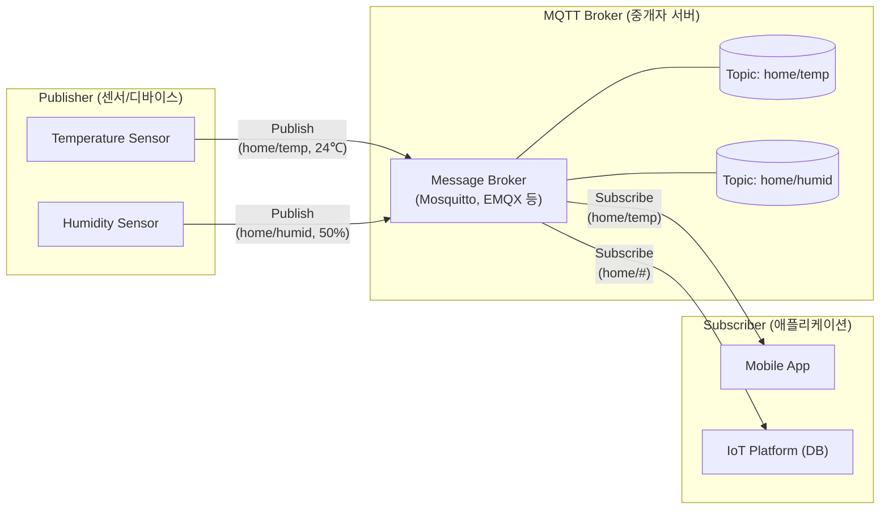

# MQTT (Message Queuing Telemetry Transport)

---

## I. 초경량 IoT 메시징 프로토콜, MQTT의 개요

* **정의**: 제한된 대역폭 및 불안정한 네트워크 환경에서 사물인터넷(IoT) 디바이스 간 효율적인 데이터 전송을 위해 발행-구독(Publish-Subscribe) 모델을 사용하는 경량 메시징 [[프로토콜]]
* **필요성 및 특징**:
* **초경량 오버헤드**: 최소 2바이트의 경량 헤더 구조로 저전력, 저대역폭 환경에 최적화
* **[[신뢰성]] 보장**: 네트워크 환경에 따라 [[QoS|QoS(Quality of Service)]] 3단계 제어 지원
* **비동기 1:N 통신**: 중앙 Message Broker를 통한 [[결합도]] 낮은(Loosely Coupled) 아키텍처 구현

---

## II. MQTT의 아키텍처 및 핵심 기술 요소

### 가. MQTT의 아키텍처 및 동작 원리

* 발행자(Publisher)가 특정 토픽(Topic)으로 메시지를 Broker에 전송하면, 해당 토픽을 구독(Subscribe) 중인 모든 클라이언트에게 메시지가 비동기적으로 라우팅되는 구조
* 클라이언트(발행자/구독자) 간 직접적인 IP/Port 연결 없이 Broker를 통해서만 통신 수행

### 나. MQTT의 핵심 기술 요소

| 구분 | 요소기술(키워드) | 세부 설명 |
| --- | --- | --- |
| **아키텍처** | Pub / Sub | - 클라이언트 간 상호 의존성 없이 Broker를 통한 메시지 발행 및 구독 체계 |
| **라우팅** | Topic (토픽) | - 슬래시(/) 단위 계층적 디렉토리 구조로 메시지 주소 역할 (Wildcard: `+`, `#` 지원) |
| **신뢰성** | QoS Level 0 | - 최대 1회 전달 (At most once), Fire & Forget 방식으로 메시지 유실 가능성 존재 |
| **신뢰성** | QoS Level 1 | - 최소 1회 전달 (At least once), PUBACK 수신 대기로 메시지 중복 수신 가능성 존재 |
| **신뢰성** | QoS Level 2 | - 정확히 1회 전달 (Exactly once), 4단계 핸드셰이크를 통한 최고 수준의 신뢰성 보장 |
| **[[HA(High Availability)|가용성]]** | LWT (Last Will & Testament) | - 클라이언트 비정상 연결 종료 시, Broker가 사전 정의된 '유언' 메시지를 타 구독자에게 전파 |
| **가용성** | Retain Message | - Broker가 토픽의 마지막 메시지를 보관하여, 신규 구독자 접속 시 즉시 최신 상태값 제공 |
| **[[세션]] 유지** | Keep Alive | - 설정된 주기 동안 PINGREQ / PINGRESP 패킷 교환을 통해 [[TCP]] 세션 정상 상태 확인 |

---

## III. MQTT 프로토콜 비교 및 최신 동향

### 가. 대표적 IoT 프로토콜 MQTT와 CoAP 비교

| 비교 항목 | MQTT (Message Queuing Telemetry Transport) | [[CoAP|CoAP (Constrained Application Protocol)]] |
| --- | --- | --- |
| **통신 모델** | Publish-Subscribe (1:N, 비동기) | Request-Response (1:1, 동기/비동기) |
| **[[전송 계층]](L4)** | TCP (연결 지향형, 세션 유지) | UDP (비연결 지향형, 낮은 오버헤드) |
| **메시지 신뢰성** | QoS 레벨 제어 (0, 1, 2 단계) | Confirmable (ACK), Non-Confirmable |
| **아키텍처** | 중앙 집중형 (Broker 필수) | P2P 방식 ([[End-to-End]] 통신 가능) |
| **헤더 크기** | 최소 2 Byte | 고정 4 Byte |
| **주요 활용** | 스마트홈, 텔레매틱스, 대규모 IoT 플랫폼 | 검침 시스템, 초저전력 무선 센서 네트워크 |

### 나. MQTT의 향후 전망 및 동향

* **MQTT v5.0 표준 확산**: 대규모 클라우드 연동 최적화를 위해 사용자 속성(User Properties), 공유 구독(Shared Subscription, 트래픽 분산용), 메시지 만료 기능이 도입되어 산업 현장 적용 가속화
* **엣지 컴퓨팅 및 보안 강화**: AIoT 환경에서 Broker의 엣지([[EDGE|Edge]]) 배치가 증가하고 있으며, 인가되지 않은 기기의 접근 차단을 위해 TLS/mTLS [[암호화]] 및 X.509 인증서 적용이 필수 보안 표준으로 자리잡음

---

### 🔗 연관 토픽

- **소속 도메인**: [[00_네트워크_MOC|🌐 네트워크]]
- **세부 분류**: `1. OSI 7계층 & 데이터링크 계층 (L1/L2)`
- **핵심 연관 토픽**:
  - [[프로토콜]]
  - [[CoAP|CoAP (Constrained Application Protocol)]]
  - [[TCP]]
  - [[전송 계층|전송 계층 (Transport Layer)]]
  - [[게이트웨이]]
