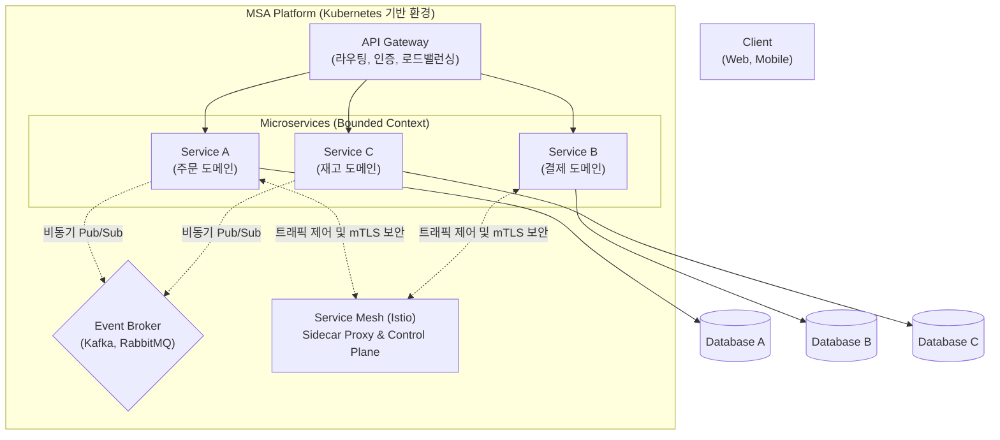

# MSA (Micro Service Architecture)

---

## I. 비즈니스 기민성 확보를 위한 모듈형 아키텍처, MSA의 개요

### 가. MSA의 정의

* 단일 애플리케이션을 비즈니스 도메인(Business Capability) 중심으로 작고 독립적으로 배포 가능한 여러 서비스의 조합으로 구축하는 [[클라우드 네이티브]] 아키텍처 패턴

### 나. MSA의 필요성 및 특징

* **모놀리식 한계 극복**: 전체 시스템의 덩치가 커짐에 따른 배포 지연 및 일부분의 장애가 전체로 전파되는 단일 장애점(SPOF) 문제 해결 필요
* **특징**: 독립적 배포(CI/CD 연계), 폴리글랏(Polyglot) 프로그래밍 지원, 장애 격리(Fault Isolation), 서비스별 독립적 확장(Auto-Scaling)

---

## II. MSA의 아키텍처 및 핵심 기술 요소

### 가. MSA의 아키텍처 및 동작 원리

* [[API Gateway]]가 외부 요청의 진입점 역할을 수행하며, 내부의 각 마이크로서비스는 독립된 데이터베이스를 소유함
* 서비스 간 통신 시 Service Mesh를 통해 보안과 트래픽을 제어하고, 비동기 이벤트 브로커를 활용해 결합도를 낮춤

### 나. MSA의 핵심 기술 및 구성 요소

| 구분 | 요소기술(키워드) | 세부 설명 |
| --- | --- | --- |
| **서비스 분할** | [[DDD (Domain Driven Design)]] | - 비즈니스 도메인 중심으로 Bounded Context를 정의하여 서비스 경계 도출 및 분할 |
| **진입점 제어** | API Gateway | - 외부 클라이언트 요청 라우팅, 인증/인가, API 통합(Composition) 등 교차 관심사 처리 |
| **데이터 독립성** | Database per Service | - 각 마이크로서비스가 독립적인 데이터베이스를 보유하여 서비스 간 데이터 [[결합도]] 최소화 |
| **분산 [[트랜잭션]]** | Saga Pattern | - 분산 환경에서 로컬 트랜잭션을 순차적으로 실행하고, 실패 시 보상 트랜잭션(Compensating)으로 일관성 유지 |
| **데이터 동기화** | CQRS & Event Sourcing | - 데이터의 읽기(Query)와 쓰기(Command) 모델을 분리하고, 상태 변경 내역을 이벤트로 저장하여 최종 일관성 확보 |
| **통신 인프라** | Service Mesh | - 사이드카(Sidecar) 프록시를 통해 서비스 간 mTLS, 서킷 브레이커, 트래픽 제어를 비즈니스 로직과 분리 |
| **운영 자동화** | CI/CD & Container | - [[도커|Docker]]/Kubernetes 기반의 [[컨테이너]] 가상화로 개별 서비스의 [[무중단 배포]] 및 자동 확장 구현 |
| **가시성 확보** | Observability (분산 추적) | - OpenTelemetry, Jaeger 등을 활용하여 다수의 서비스에 걸친 요청 흐름을 추적(Trace ID)하고 장애 병목 탐지 |

---

## III. 전통적 아키텍처와의 비교 및 최신 동향

### 가. Monolithic Architecture와 MSA 비교

| 비교 항목 | Monolithic Architecture | Micro Service Architecture (MSA) |
| --- | --- | --- |
| **배포 단위** | 전체 애플리케이션 통합 배포 (Big Bang) | 개별 서비스 단위 독립적 배포 |
| **확장성 (Scaling)** | Scale-up 중심, 전체 [[인스턴스]] 복제 | Scale-out 중심, 부하가 집중된 특정 서비스만 확장 |
| **[[데이터베이스]]** | 단일 통합 데이터베이스 (강력한 정합성 보장) | Database per Service (Eventual Consistency 수용) |
| **기술 스택** | 단일 언어 및 [[프레임워크]] 종속 | Polyglot (서비스별 최적의 기술 스택 자율적 선택) |
| **장단점** | 개발 초기 단순함, 시스템 커질수록 복잡도 폭증 | 분산 환경 장애 격리 우수, 네트워크/운영 복잡성 증가 |

### 나. MSA 실무 도입 시 한계점 극복 및 최신 동향

* **운영 복잡성 심화 극복**: 서비스 수가 기하급수적으로 늘어나는 마이크로서비스 스프롤(Sprawl) 현상을 통제하기 위해, 개발자가 인프라 고민 없이 비즈니스 로직에만 집중할 수 있도록 지원하는 **플랫폼 엔지니어링(Platform Engineering)** 및 내부 개발자 포털(IDP) 도입이 가속화됨
* **네트워크 오버헤드 최소화**: 서비스 간 빈번한 동기 호출(HTTP/REST)로 인한 지연 시간(Latency)을 줄이기 위해, gRPC 기반의 경량 통신과 Event-Driven 기반의 비동기 아키텍처로 통신 방식이 전환되는 추세임

---

### 🔗 연관 토픽

- **소속 도메인**: [[00_소프트웨어공학_MOC|🏗️ 소프트웨어공학]]
- **세부 분류**: `4. 아키텍처 스타일 & 객체지향 설계 원리`
- **핵심 연관 토픽**:
  - [[프레임워크]]
  - [[결합도]]
  - [[DDD (Domain Driven Design)]]
  - [[API Gateway]]
  - [[무중단 배포]]
