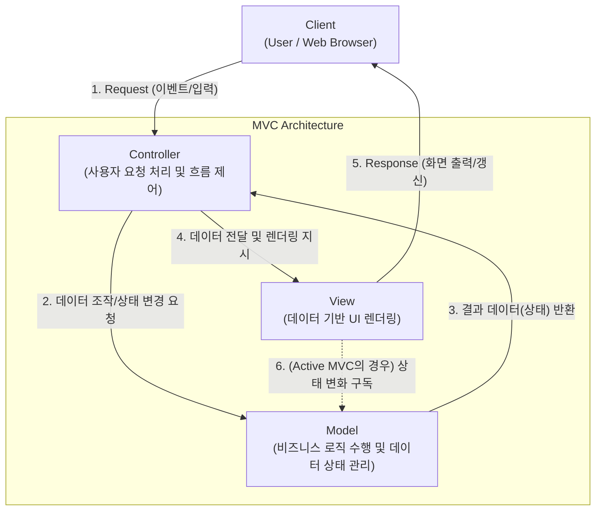

# MVC 패턴 (Model-View-Controller Pattern)

---

## I. 사용자 인터페이스 분리 설계의 표준, MVC 패턴의 개요

### 가. MVC 패턴의 정의

* 애플리케이션을 데이터(Model), 사용자 인터페이스(View), 제어 로직(Controller)의 3가지 역할로 분리하여 개발하는 [[소프트웨어 아키텍처]] [[디자인 패턴]]

### 나. MVC 패턴의 필요성 및 특징

* **관심사의 분리(SoC, Separation of Concerns)**: 비즈니스 로직과 프레젠테이션 로직을 분리하여 코드의 가독성, 재사용성 및 유지보수성 극대화
* **병렬 협업 지원**: 디자이너(View)와 백엔드 개발자(Model, Controller)가 독립적으로 업무를 수행할 수 있는 환경 제공
* **낮은 결합도와 높은 [[응집도]]**: 각 구성 요소가 자신의 역할에만 집중하게 하여 시스템 수정 시 타 영역에 미치는 영향(Side Effect) 최소화

---

## II. MVC 패턴의 개념도 및 핵심 구성 요소

### 가. MVC 패턴의 개념도 및 동작 원리

* 사용자의 모든 입력은 Controller로 인입되며, Controller는 Model을 호출해 비즈니스 로직을 수행함
* Model 수행 결과 데이터를 Controller가 View로 전달하여 사용자에게 최종 응답(UI)을 제공하는 흐름으로 동작함

### 나. MVC 패턴의 핵심 기술 및 구성 요소

| 구분 | 요소기술(키워드) | 세부 설명 |
| --- | --- | --- |
| **핵심 계층** | Model (모델) | - 애플리케이션의 정보(데이터)와 비즈니스 룰, 상태 변경 로직을 캡슐화하는 계층 |
| **핵심 계층** | View (뷰) | - Model의 데이터를 바탕으로 사용자에게 시각적 인터페이스(HTML, [[JSON]] 등) 제공 |
| **핵심 계층** | Controller (컨트롤러) | - 사용자의 입력을 해석하고, Model과 View 사이의 데이터 흐름을 중재하는 [[라우터]] 역할 |
| **디자인 원칙** | Separation of Concerns | - 각 컴포넌트의 책임(관심사)을 명확히 분리하여 스파게티 코드 방지 및 [[모듈화]] 달성 |
| **설계 패턴** | [[Observer (상태 변화 통지)|Observer]] Pattern | - Model의 상태 변화 발생 시, 이를 구독하고 있는 View에 즉각적으로 통지 (Active MVC) |
| **웹 확장 (Spring)** | Front Controller | - DispatcherServlet과 같이 모든 클라이언트 요청을 단일 진입점에서 중앙 집중적으로 처리 |
| **웹 확장 (Spring)** | View Resolver | - Controller가 반환한 논리적 뷰 이름을 실제 뷰(JSP, Thymeleaf 등) 물리 파일로 매핑 |
| **객체 전달** | DTO / VO | - 계층 간(Layer) 의존성을 낮추기 위해 데이터 교환용으로 사용하는 순수 데이터 전송 객체 |

---

## III. MVC 파생 아키텍처 비교 및 최신 동향

### 가. UI 아키텍처 패턴의 진화 (MVC vs MVP vs MVVM)

| 비교 항목 | MVC (Model-View-Controller) | [[01_IT Tech/MVP]] (Model-View-Presenter) | [[MVVM (Model, View, View Model)|MVVM]] (Model-View-ViewModel) |
| --- | --- | --- | --- |
| **매개자 역할** | **Controller** (요청 진입점) | **Presenter** (View와 1:1 대응) | **ViewModel** (View를 위한 상태 모델) |
| **의존성([[결합도]])** | View와 Model 간 간접적 의존성 존재 가능 | View와 Model 완벽 분리 (Presenter가 중재) | View와 Model 완벽 분리 (ViewModel이 중재) |
| **핵심 통신 방식** | Method Call (메서드 호출) | Interface를 통한 통신 | **Data Binding (양방향 바인딩)** |
| **주요 적용 분야** | 전통적 Web [[프레임워크]] (Spring MVC, Django) | Android Native 앱 (과거 방식) | 모던 Web Front-End (Vue.js, React), WPF |

### 나. 최신 프론트엔드/백엔드 아키텍처 동향

* **단일 페이지 애플리케이션(SPA) 중심의 분할**: 웹 개발 트렌드가 SPA로 넘어감에 따라, 백엔드는 View 렌더링을 포기하고 REST API 또는 GraphQL 기반의 JSON 데이터만 응답하는 순수 **Model-Controller** 형태로 단순화됨
* **단방향 데이터 흐름(Flux/Redux) 대두**: 프론트엔드 환경에서 양방향 바인딩(MVVM)의 상태 변화 추적 어려움을 극복하기 위해, React 진영을 중심으로 Action -> Dispatcher -> Store -> View로 이어지는 단방향 아키텍처(Flux)가 MVC의 대안으로 널리 활용됨

---

### 🔗 연관 토픽

- **소속 도메인**: [[00_소프트웨어공학_MOC|🏗️ 소프트웨어공학]]
- **세부 분류**: `4. 아키텍처 스타일 & 객체지향 설계 원리`
- **핵심 연관 토픽**:
  - [[프레임워크]]
  - [[MVVM (Model, View, View Model)]]
  - [[응집도]]
  - [[모듈화|모듈화 (Modularity)]]
  - [[Observer (상태 변화 통지)]]
