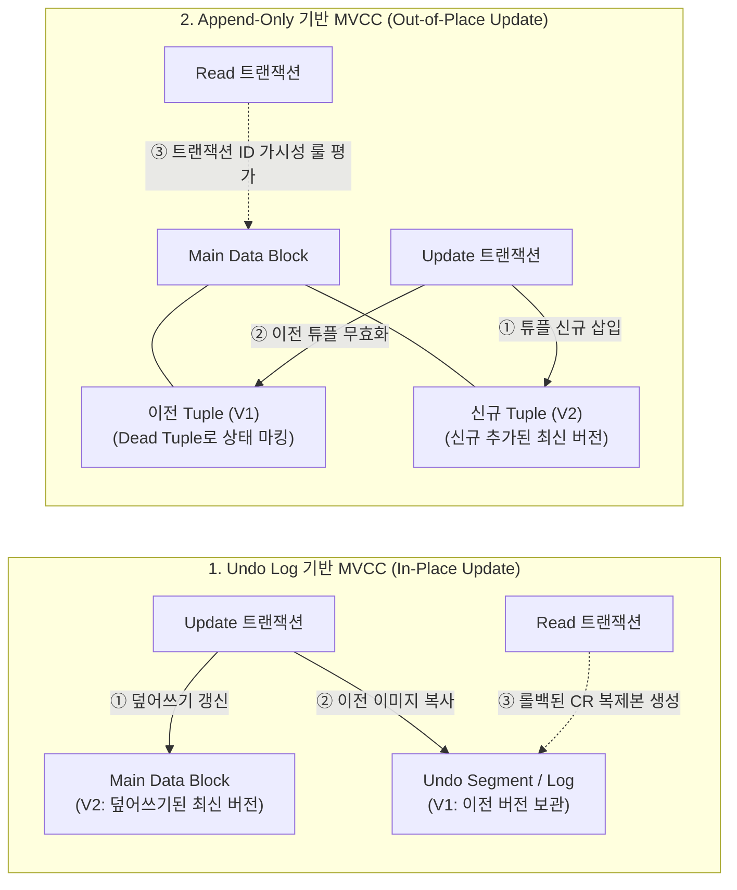

# MVCC(다중 버전 동시성 제어) 2가지 유형

---

## I. 고성능 트랜잭션 동시성 제어 기법, MVCC의 개요

### 가. MVCC(Multi-Version Concurrency Control)의 정의

* 데이터베이스에서 데이터의 갱신 시 기존 데이터를 덮어쓰지 않고(또는 백업하고) 다수의 버전(Version)을 유지하여, 읽기(Read) 작업과 쓰기(Write) 작업 간의 락(Lock) 경합 없이 동시성을 극대화하는 [[트랜잭션]] 제어 기법

### 나. MVCC 2가지 유형의 등장 배경 및 특징

* **동시성 저하 문제 극복**: 기존 Lock 기반 제어의 성능 저하(Read-Write 블로킹)를 해결하기 위해 스냅샷(Snapshot) 기반의 읽기 일관성(CR) 제공
* **구현 방식에 따른 2가지 유형**:
* **Undo Log (Rollback Segment) 기반**: 메인 테이블을 덮어쓰고 구버전은 별도 공간에 저장 (공간 효율성 중시)
* **Append-Only (MGA) 기반**: 구버전을 유지한 채 신규 버전을 테이블에 추가 저장 (롤백 속도 및 처리 단순성 중시)

---

## II. MVCC 2가지 유형의 개념도 및 핵심 기술 요소

### 가. MVCC 2가지 유형의 동작 원리 개념도

* **Undo Log 기반**: 원본 데이터를 최신 값으로 변경(In-place)하고, 이전 버전을 Undo 영역으로 밀어내어 읽기 트랜잭션이 CR(Consistent Read) 블록을 재조합함
* **Append-Only 기반**: 원본 데이터를 수정하지 않고 새로운 튜플을 삽입(Out-of-place)하며, 메타데이터(트랜잭션 ID)를 비교하여 자신에게 유효한 버전을 읽어들임

### 나. MVCC 2가지 유형의 핵심 기술 요소

| 구분 | 요소기술(키워드) | 세부 설명 |
| --- | --- | --- |
| **공통 요소** | Transaction ID (XID) | - 트랜잭션 시작 시 부여되는 고유 식별자로 데이터 버전의 가시성(Visibility) 판단 기준 |
| **공통 요소** | Snapshot Isolation | - 특정 시점의 [[데이터베이스]] 스냅샷을 바탕으로 일관성 있는 데이터 읽기 제공 |
| **Undo Log 기반** | In-Place Update | - 데이터 블록의 튜플을 덮어쓰는 방식으로 갱신하여 메인 데이터 공간 [[단편화]] 최소화 |
| **Undo Log 기반** | Rollback Segment | - 갱신 전의 데이터 이미지를 보관하는 별도의 Undo 영역 (CR 생성 및 롤백에 사용) |
| **Undo Log 기반** | CR (Consistent Read) | - 읽기 트랜잭션 시작 시점의 SCN(System Change Number)을 기준으로 과거 버전을 재조합 |
| **Append-Only 기반** | Out-of-Place Update | - 갱신 시 기존 튜플은 삭제(Dead) 마킹하고, 새로운 트랜잭션 ID(t_xmin)로 신규 튜플 추가 |
| **Append-Only 기반** | t_xmin / t_xmax | - 튜플 헤더에 삽입 트랜잭션 ID(t_xmin)와 삭제 트랜잭션 ID(t_xmax)를 기록하여 가시성 통제 |
| **Append-Only 기반** | Vacuum (가비지 컬렉션) | - 어느 트랜잭션에서도 더 이상 참조하지 않는 데드 튜플(Dead Tuple)을 주기적으로 정리 및 공간 회수 |

---

## III. MVCC 2가지 유형의 비교 및 향후 동향

### 가. Undo Log 기반 vs Append-Only 기반 MVCC 비교

| 비교 항목 | Undo Log 기반 (In-Place Update) | Append-Only 기반 (Out-of-Place Update) |
| --- | --- | --- |
| **데이터 갱신 방식** | 기존 튜플 덮어쓰기 (In-Place) | 새로운 튜플 추가 (Append-Only) |
| **구버전 저장 위치** | 별도의 영역 (Undo Segment) | 메인 테이블의 동일한 페이지 내 (또는 오버플로) |
| **읽기 (CR) 오버헤드** | 높음 (Undo 데이터를 활용한 CR 블록 재조합 필요) | 낮음 (헤더 상태값만 읽어 가시성 판단) |
| **쓰기 / 롤백 오버헤드** | 쓰기 오버헤드 낮음 / 롤백 오버헤드 높음 | 쓰기 오버헤드 높음 / 롤백 오버헤드 극히 낮음 |
| **가비지 컬렉션** | 불필요 (트랜잭션 종료 시 Undo 덮어쓰기 허용) | 필수 (주기적인 Vacuum 데몬 구동 필요) |
| **대표적인 [[DBMS]]** | Oracle, MySQL (InnoDB) | PostgreSQL, CUBRID |

### 나. MVCC 기술의 향후 발전 동향

* **인메모리(In-Memory) DB 최적화**: 디스크 I/O가 제거된 환경(SAP HANA 등)에서는 Timestamp 기반 및 Time-Travel 기능을 지원하는 MGA(Multi-Generation Architecture) 형태로 MVCC가 진화 중
* **분산 환경의 정합성 보장 ([[New SQL|NewSQL]])**: Spanner, [[CockroachDB]] 등 글로벌 [[분산 데이터베이스]] 환경에서 MVCC를 구현하기 위해, TrueTime API나 하이브리드 논리적 시계(HLC)를 활용한 전역적 스냅샷 격리(Global Snapshot Isolation) 기법이 도입되고 있음

---

### 🔗 연관 토픽

- **소속 도메인**: [[00_데이터베이스_MOC|🗄️ 데이터베이스]]
- **세부 분류**: `2. 트랜잭션 & 동시성 제어 (Concurrency)`
- **핵심 연관 토픽**:
  - [[트랜잭션]]
  - [[New SQL]]
  - [[CockroachDB|CockroachDB(코크로치DB)]]
  - [[데이터베이스]]
  - [[DBMS]]
