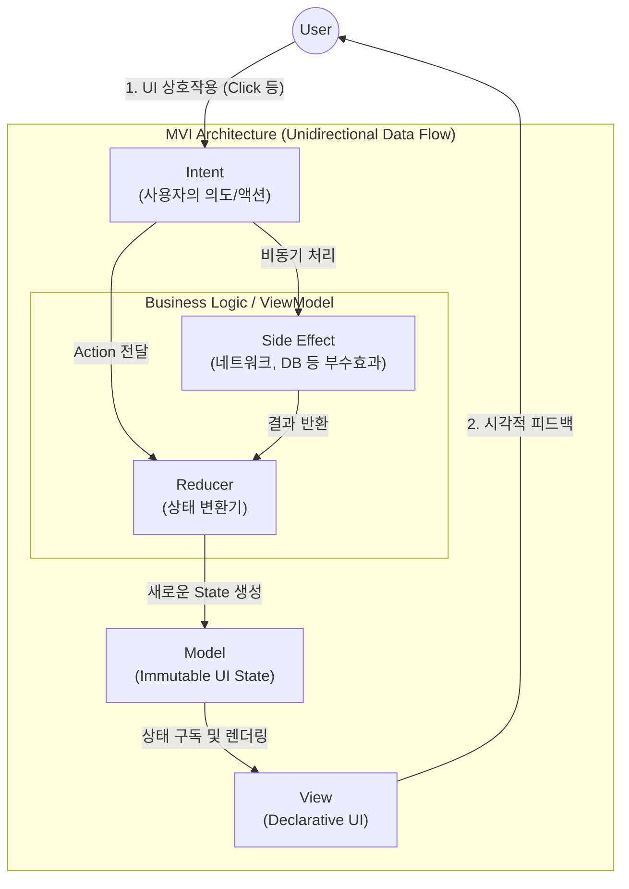

# MVI (Model-View-Intent) 패턴

---

## I. 상태 예측 가능성 극대화를 위한 선언형 아키텍처, MVI 패턴의 개요

### 가. MVI 패턴의 정의

* 상태(State) 불변성과 단방향 데이터 흐름(UDF, Unidirectional Data Flow)을 기반으로, 사용자 이벤트(Intent)에 따라 단일 상태 모델(Model)을 갱신하여 뷰(View)를 렌더링하는 UI 아키텍처 패턴

### 나. MVI 패턴의 등장배경 및 특징

* **등장배경**: 기존 [[MVVM (Model, View, View Model)|MVVM]] 아키텍처에서 다수의 데이터 스트림(LiveData/Flow) 운영 시 발생하는 상태 충돌(State Overlap) 및 의도치 않은 부수 효과(Side Effect) 제어의 어려움 극복
* **특징**:
* **엄격한 단방향 흐름**: 데이터가 반드시 Intent → Model → View의 한 방향으로만 순환함
* **단일 진실 공급원(SSOT)**: 화면의 모든 상태를 하나의 불변 객체(State)로 통합 관리함
* **선언형 UI 최적화**: Jetpack Compose, SwiftUI 등 모던 프론트엔드 프레임워크와 높은 시너지 창출

---

## II. MVI 패턴의 개념도 및 핵심 기술 요소

### 가. MVI 패턴의 개념도 및 동작 원리

* 사용자의 입력은 **Intent**로 캡슐화되어 비즈니스 로직으로 전달되며, **Reducer**를 통해 새로운 불변 **Model(State)** 을 생성함
* **View**는 갱신된 단일 Model을 관찰(Observe)하여 스스로를 다시 그리는(Recomposition) 방식으로 동작함

### 나. MVI 패턴의 핵심 기술 및 구성 요소

| 구분 | 요소기술(키워드) | 세부 설명 |
| --- | --- | --- |
| **핵심 계층** | Intent (의도) | - 사용자의 버튼 클릭, 스와이프 등 UI 이벤트나 생명주기 변화를 캡슐화한 행위 객체 |
| **핵심 계층** | Model (상태) | - 화면이 표현해야 할 모든 데이터(로딩, 성공, 에러 등)를 담고 있는 불변(Immutable) 상태 객체 |
| **핵심 계층** | View (뷰) | - Model의 변화를 관찰하여 화면을 렌더링하고, 사용자의 상호작용을 Intent로 변환하여 방출 |
| **상태 관리** | UDF (단방향 데이터 흐름) | - 데이터의 상태가 오직 한 방향으로만 흐르도록 강제하여 상태 변경 추적 및 디버깅 용이성 확보 |
| **상태 변환** | Reducer (리듀서) | - 이전 상태(Previous State)와 현재 Intent를 입력받아 새로운 상태(New State)를 반환하는 순수 함수 |
| **비동기 처리** | Side Effect (부수 효과) | - API 호출, [[데이터베이스]] 작업, 네비게이션 등 순수 함수 밖에서 발생하는 비동기 작업을 처리하는 계층 |
| **데이터 [[무결성]]** | Immutable Object | - 상태 충돌 방지를 위해 기존 객체를 수정하지 않고, `copy()` 등을 통해 매번 새로운 객체를 생성 |
| **비동기 스트림** | Reactive Streams | - Kotlin Coroutines(StateFlow, SharedFlow), RxJava 등을 활용하여 상태 변화를 비동기 스트림으로 처리 |

---

## III. MVI와 MVVM의 비교 및 향후 최신 동향

### 가. MVI 패턴과 MVVM 패턴의 비교

| 비교 항목 | MVVM (Model-View-ViewModel) | MVI (Model-View-Intent) |
| --- | --- | --- |
| **데이터 흐름** | 양방향(Data Binding) 또는 단방향 혼용 | 엄격한 단방향 데이터 흐름 (UDF) |
| **상태 관리** | 다수의 LiveData / StateFlow 개별 관리 | 단일 상태 객체(Single State)로 통합 관리 |
| **이벤트 처리** | ViewModel의 함수(Method) 직접 호출 | Intent(액션 객체)를 스트림으로 전달 |
| **부작용 제어** | 상태 변경 시 예기치 않은 부작용 발생 가능성 높음 | 순수 함수(Reducer) 기반으로 상태 예측 가능 |
| **적용 비용** | 상대적으로 구현이 직관적이고 빠름 | 러닝 커브가 높고 보일러플레이트 코드가 많음 |

### 나. MVI 패턴의 향후 전망 및 동향

* **선언형(Declarative) UI의 표준 아키텍처**: Android의 Jetpack Compose, iOS의 SwiftUI, 웹의 React와 같이 상태 기반으로 화면을 다시 그리는 선언형 패러다임과 결합하여 모바일 네이티브 개발의 사실상 표준(De facto standard)으로 자리매김함
* **상태 복사 오버헤드 최적화**: 매 이벤트마다 새로운 불변 객체를 생성함에 따른 가비지 컬렉션(GC) 부하 및 메모리 오버헤드를 극복하기 위해, Orbit MVI, MvRx 등의 최적화된 [[프레임워크]] 활용 및 Kotlin의 Value Class(Inline Class) 도입이 적극적으로 이루어지고 있음

---

### 🔗 연관 토픽

- **소속 도메인**: [[00_소프트웨어공학_MOC|🏗️ 소프트웨어공학]]
- **세부 분류**: `4. 아키텍처 스타일 & 객체지향 설계 원리`
- **핵심 연관 토픽**:
  - [[프레임워크]]
  - [[MVVM (Model, View, View Model)]]
  - [[무결성]]
  - [[MSA (Micro Service Architecture)]]
  - [[데이터베이스]]
