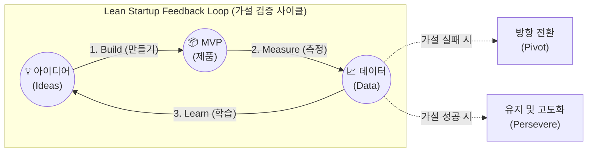

# MVP (Minimum Viable Product)

---

## I. 린 스타트업의 핵심 전략, MVP의 개요

### 가. MVP(Minimum Viable Product)의 정의

* 불확실성이 높은 시장 환경에서 비즈니스 가설 검증과 검증된 학습(Validated Learning)을 위해 최소한의 핵심 기능(Core Feature)만을 탑재하여 신속하게 출시하는 제품

### 나. MVP의 필요성 및 특징

* **자원 낭비 최소화(Waste Reduction)**: 완벽한 제품 개발에 소요되는 막대한 시간과 비용의 낭비 방지 및 실패 리스크 감소
* **주요 특징**:
* **Build-Measure-Learn**: 만들기-측정-학습의 반복적인 피드백 순환 고리(Feedback Loop) 적용
* **초기 수용자 중심**: 제품의 불완전성을 수용하고 피드백을 제공할 의향이 있는 조기 수용자(Early Adopter) 타겟팅

---

## II. MVP의 개념도 및 핵심 기술 요소

### 가. MVP의 개념도 및 동작 원리

* 도출된 비즈니스 가설(Idea)을 바탕으로 최소 기능 제품(MVP)을 신속히 구축(Build)하여 시장에 출시함
* 실사용자의 행동 데이터(Data)를 측정(Measure) 및 학습(Learn)하여 비즈니스 모델의 유지(Persevere) 또는 방향 전환(Pivot)을 결정함

### 나. MVP의 핵심 기술 및 구성 요소

| 구분 | 요소기술(키워드) | 세부 설명 |
| --- | --- | --- |
| **핵심 원리** | Validated Learning | - (검증된 학습) 실제 고객의 정량적/정성적 행동 데이터를 통한 비즈니스 가설 검증 |
| **의사결정** | Pivot (방향 전환) | - 가설이 틀렸음이 입증될 경우 비즈니스 모델, 타겟 고객, 제품 방향을 수정 |
| **의사결정** | Persevere (유지) | - 가설이 맞았을 경우 현재의 방향성을 유지하며 제품의 품질 및 기능 고도화 |
| **성과 지표** | Actionable Metrics | - 허무영 지표(Vanity Metrics)를 배제하고 의사결정에 직결되는 실질적 행동 지표 (AARRR 등) |
| **구현 기법** | Concierge MVP | - 자동화된 시스템 구축 없이 사람이 직접 수동으로 고객에게 서비스를 제공하며 수요 검증 |
| **구현 기법** | Wizard of Oz MVP | - 프론트엔드는 완벽해 보이나 백엔드(처리 로직)는 사람이 수동 처리하는 눈속임 기법 |
| **구현 기법** | Landing Page MVP | - 제품 출시 전 핵심 가치만 설명하는 단일 웹페이지를 런칭하여 이메일 수집 및 구매 클릭률(CTR) 측정 |
| **구현 기법** | Piecemeal MVP | - 자체 개발 없이 기존에 존재하는 상용 도구(SaaS, OSS 등)들을 조합하여 서비스 워크플로우 구현 |

---

## III. 유사 개념 비교 및 MVP 기술의 향후 전망

### 가. MVP와 유사 개념(Prototype, MLP) 비교

| 비교 항목 | Prototype (프로토타입) | MVP (최소 기능 제품) | MLP (Minimum Lovable Product) |
| --- | --- | --- | --- |
| **주요 목적** | 기술적 실현 가능성 및 UI/UX 설계 검증 | 비즈니스 가설 검증 및 시장의 실제 수요 확인 | 초기 고객의 열성적인 애정(팬덤) 및 만족 확보 |
| **타겟 고객** | 내부 팀, 이해관계자, 투자자 | 초기 수용자 (Early Adopters) | 감성적 만족을 중시하는 핵심 타겟층 |
| **제품 완성도** | 낮음 (기능 동작 및 시각적 요소 위주) | 중간 (디자인보다 핵심 문제 해결 가치 제공에 집중) | 높음 (핵심 기능 + 우수한 디자인/UX 품질 포함) |
| **핵심 피드백** | 버그 발견, 사용성 결함, 흐름 개선점 | 지불 의사(Willingness to pay), 리텐션, 비즈니스 지표 | 추천 의향(NPS), 바이럴 확산 효과, 리뷰 |

### 나. MVP의 한계 극복 및 최신 트렌드

* **MLP(Minimum Lovable Product)로의 패러다임 진화**: 시장 경쟁이 치열해짐에 따라 단순 기능 위주의 조악한 MVP로는 초기 고객 유치가 어려워져, 최소 기능에 뛰어난 사용자 경험(UX)과 감성적 가치를 더한 MLP 전략으로 전환되는 추세
* **초민첩성(Hyper-Agility) 확보**: No-code / Low-code 플랫폼과 생성형 AI(GenAI)를 활용하여 MVP 기획, 디자인, 개발, 배포 주기가 과거 수개월에서 수일/수시간 이내로 극단적으로 단축되며 가설 검증 비용이 제로에 수렴하고 있음

---

### 🔗 연관 토픽

- **소속 도메인**: [[00_프로젝트관리_MOC|📋 프로젝트관리]]
- **세부 분류**: `3. 소프트웨어 원가 산정 & 성과 관리 (Cost & EVM)`
- **핵심 연관 토픽**:
  - [[린 방법론|린 (Lean) 방법론]]
  - [[범위관리]]
  - [[품질관리]]
  - [[MVVM (Model, View, View Model)]]
  - [[디자인 씽킹]]
