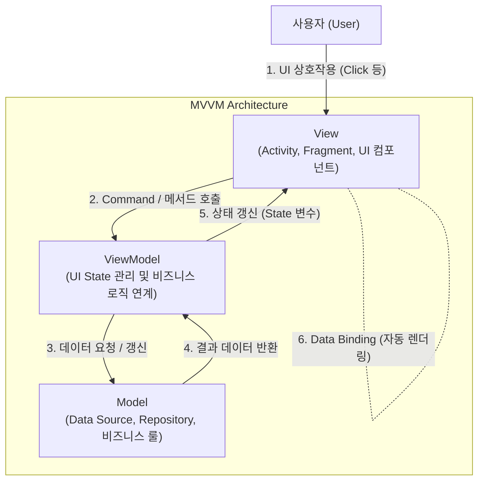

# MVVM (Model-View-ViewModel) 패턴

---

## I. 모던 UI 개발을 위한 데이터 바인딩 아키텍처, MVVM의 개요

### 가. MVVM 패턴의 정의

* 사용자 인터페이스(View)와 비즈니스 로직(Model) 간의 의존성을 분리하고, 이 둘을 중재하는 뷰모델(ViewModel)을 두어 상태 동기화를 자동화하는 UI 아키텍처 [[디자인 패턴]]

### 나. MVVM 패턴의 필요성 및 특징

* **스파게티 코드 방지**: UI 컴포넌트와 데이터 처리 로직이 결합되어 발생하는 [[유지보수]] 난해성 해결
* **주요 특징**:
* **데이터 바인딩(Data Binding)**: 뷰모델의 상태 변화를 뷰에 자동으로 반영하여 보일러플레이트 코드 최소화
* **테스트 용이성**: 뷰(View)에 대한 종속성 없이 비즈니스 로직 및 상태 관리 로직(ViewModel)에 대한 [[단위 테스트]] 수행 가능

---

## II. MVVM의 개념도 및 핵심 기술 요소

### 가. MVVM 패턴의 개념도 및 동작 원리

* 사용자의 입력에 따라 뷰(View)가 뷰모델(ViewModel)의 메서드를 호출하고, 뷰모델은 모델(Model)을 통해 데이터를 가공함
* 뷰모델의 상태(State)가 변경되면 데이터 바인딩 메커니즘을 통해 뷰(View)가 자동으로 갱신됨

### 나. MVVM의 핵심 기술 및 구성 요소

| 구분 | 요소기술(키워드) | 세부 설명 |
| --- | --- | --- |
| **핵심 계층** | Model (모델) | - 데이터 소스(DB, Network), 도메인 로직, 엔티티를 관리하는 데이터 계층 |
| **핵심 계층** | View (뷰) | - 사용자에게 보이는 화면을 구성하며, ViewModel의 상태를 관찰(Observe)하여 UI 렌더링 |
| **핵심 계층** | ViewModel (뷰모델) | - View를 위한 데이터 상태를 보유하고, 비즈니스 로직을 처리하여 View와 Model을 중재 |
| **데이터 연동** | Data Binding | - UI 컴포넌트와 ViewModel의 속성을 직접 연결하여 값 변경 시 자동 UI 반영 |
| **상태 관리** | LiveData / StateFlow | - 생명주기를 인식하며 데이터의 변경 사항을 뷰에 안전하게 전달하는 반응형 스트림 |
| **동작 제어** | Command / Binding Adapter | - 뷰의 이벤트를 뷰모델의 함수와 연결하여 입력 처리를 [[캡슐화]] |
| **아키텍처 통합** | Repository Pattern | - 로컬 DB와 원격 서버 등 데이터 소스의 출처를 추상화하여 ViewModel에 단일 진입점 제공 |
| **생명주기 관리** | ViewModel Lifecycle | - 화면 회전 등 구성 변경(Configuration Change) 시에도 상태 데이터를 안전하게 유지 |

---

## III. MVVM 패턴의 비교 및 최신 동향

### 가. MVP 패턴과 MVVM 패턴의 비교

| 비교 항목 | [[01_IT Tech/MVP]] (Model-View-Presenter) | MVVM (Model-View-ViewModel) |
| --- | --- | --- |
| **중재자 역할** | Presenter | ViewModel |
| **View와의 관계** | 1:1 강결합 (View의 인터페이스 직접 참조) | 1:N 또는 느슨한 결합 (View를 직접 알지 못함) |
| **데이터 동기화** | Presenter가 View의 메서드를 직접 호출하여 갱신 | **Data Binding** 및 관찰자 패턴을 통한 자동 동기화 |
| **테스트 편의성** | 뷰 인터페이스 Mocking 필요 | UI 컴포넌트 독립적인 순수 로직 테스트 용이 |
| **적용 [[프레임워크]]** | 안드로이드 전통 구조, Windows Forms 등 | WPF, 안드로이드 Jetpack, Vue.js, SwiftUI |

### 나. MVVM 패턴의 향후 전망 및 최신 동향

* **선언형 UI(Jetpack Compose/SwiftUI)와의 융합**: 과거 [[XML]] 레이아웃과 데이터 바인딩 라이브러리 조합에서 벗어나, 뷰모델의 상태(State)를 선언형 UI가 구독하여 렌더링하는 구조로 발전
* **MVI 패턴으로의 진화**: 복잡한 비동기 상태 관리에서 발생할 수 있는 상태 충돌을 막기 위해, MVVM의 뼈대 위에 단방향 데이터 흐름(UDF) 개념을 결합한 MVI 패턴으로의 전환이 활발히 이루어짐

---

### 🔗 연관 토픽

- **소속 도메인**: [[00_소프트웨어공학_MOC|🏗️ 소프트웨어공학]]
- **세부 분류**: `4. 아키텍처 스타일 & 객체지향 설계 원리`
- **핵심 연관 토픽**:
  - [[프레임워크]]
  - [[MVC 패턴 (Model-View-Controller Pattern)]]
  - [[캡슐화|캡슐화 (encapsulation)]]
  - [[디자인 패턴|디자인 패턴 (Design Pattern)]]
  - [[MVI (Model-View-Intent) 패턴]]
