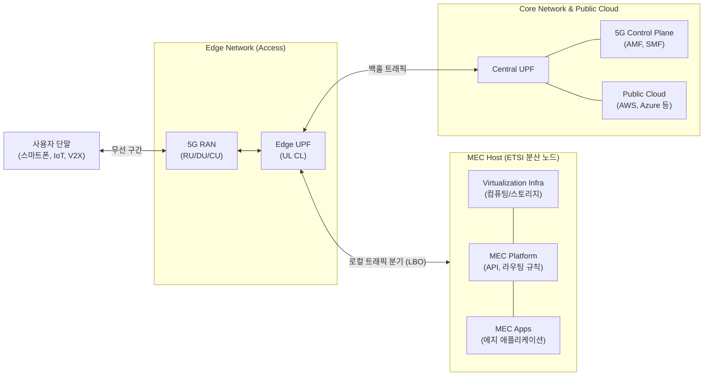

# Mobile Edge Computing (MEC)

---

## I. 초저지연 및 광대역 통신을 위한 에지 혁신, MEC의 개요

### 가. MEC(Mobile/Multi-access Edge Computing)의 정의

* 이동통신 접속망(RAN) 인근의 사용자 물리적 근거리([[EDGE|Edge]])에 [[클라우드 컴퓨팅]] 및 IT 서비스 환경을 구축하여 데이터를 분산 처리하는 ETSI 표준 아키텍처 기술

### 나. MEC의 필요성 및 특징

* **초저지연/광대역 보장**: 코어망(Core Network)으로 집중되는 [[백홀 트래픽]] 부하를 경감시키고 1ms 이하의 초저지연(URLLC) 통신 달성
* **컨텍스트 인식 및 보안**: 사용자 위치 기반 실시간 데이터 처리(Data Localization)를 통해 응답성을 극대화하고 프라이버시 침해 위험 최소화

---

## II. MEC의 개념도 및 핵심 기술 요소

### 가. MEC의 시스템 아키텍처 및 동작 원리

* 5G 사용자 평면 기능(UPF)의 상향링크 분류기(UL CL)를 통해 목적지 IP를 검사하고, 로컬 트래픽을 MEC 호스트로 즉시 분기(Offloading)시켜 코어망 부하를 제거함

### 나. MEC의 핵심 기술 및 구성 요소

| 구분 | 요소기술(키워드) | 세부 설명 |
| --- | --- | --- |
| **플랫폼 아키텍처** | MEC Host | - 에지 애플리케이션, MEC 플랫폼(MEP), [[가상화]] 인프라(NFVI)로 구성된 통합 실행 환경 |
| **플랫폼 아키텍처** | MEC Platform (MEP) | - 트래픽 라우팅 규칙을 설정하고 서비스 레지스트리 관리 및 에지 특화 API(위치/대역폭) 제공 |
| **네트워크 연동** | Local Breakout (LBO) | - 단말의 데이터 트래픽을 중앙 코어망까지 보내지 않고 에지 단에서 즉시 분기하여 처리하는 기술 |
| **네트워크 연동** | 5G UPF & UL CL | - 상향링크 분류기(Uplink Classifier)를 통해 트래픽을 필터링하여 MEC 또는 코어망으로 라우팅 |
| **운영 관리** | MEO (MEC Orchestrator) | - 시스템 전반의 자원 가시성 확보 및 에지 앱의 온보딩, 인스턴스화, 종료 등 전체 라이프사이클 관리 |
| **인프라 가상화** | [[NFV]] & Container | - 전용 통신 장비를 범용 x86 서버 기반의 VM 및 [[쿠버네티스]] [[컨테이너]] 환경으로 가상화하여 유연성 확보 |
| **개방형 인터페이스** | RNI API | - Radio Network Information API로, 무선 접속망 채널 상태 및 기지국 혼잡도 정보를 앱에 실시간 제공 |
| **보안 및 프라이버시** | Data Localization | - 민감한 원시 데이터(CCTV 릴레이, 헬스케어 등)를 중앙 클라우드로 전송하지 않고 로컬 처리하여 보안 강화 |

---

## III. 클라우드 컴퓨팅과의 비교 및 최신 동향

### 가. 중앙 클라우드 컴퓨팅과 MEC 기술 비교

| 비교 항목 | 중앙 클라우드 (Central Cloud) | MEC (Multi-access Edge Computing) |
| --- | --- | --- |
| **인프라 배치 위치** | 코어망 외부 (원격 데이터센터) | 접속망(RAN) 인근 (기지국, 지역 국사, 기업망 내부) |
| **네트워크 지연시간** | 수십 ~ 수백 ms (Best-Effort 기반) | 1 ~ 10ms 이내 (URLLC 초저지연 보장) |
| **망 트래픽 부하** | 코어망 및 백홀망에 트래픽 심화/집중 | 에지 단 로컬 분기(Offloading)로 백홀 트래픽 절감 |
| **핵심 적용 분야** | 대용량 저장소, 대규모 AI 모델 학습 | [[Smart Car(자율주행)|자율주행]](C-V2X), 실시간 공장 자동화, 몰입형 AR/VR |

### 나. MEC 최신 동향(2026년 기준) 및 향후 전망

* **Edge AI 모델 내재화**: 제조 현장의 센서 진동/열 감지 이상 탐지나 매장 내 비전 [[딥러닝]](YOLO 등) 추론을 MEC에서 직접 수행하여, 원격 통신 단절 시에도 45ms 이하의 실시간 무결점 자율 제어 달성
* **통신-컴퓨팅 융합 및 6G 연계**: 5G-Advanced 및 6G 환경을 대비하여, 분산형 안테나 시스템(Cell-Free [[MIMO]]) 및 위성 통신(Starlink 등) 저대역폭 구간에서의 로컬 데이터 릴레이 거점으로 MEC의 [[프레임워크]] 표준 확장 진행 중

---

### 🔗 연관 토픽

- **소속 도메인**: [[00_네트워크_MOC|🌐 네트워크]]
- **세부 분류**: `1. OSI 7계층 & 데이터링크 계층 (L1/L2)`
- **핵심 연관 토픽**:
  - [[NFV]]
  - [[EDGE|edge]]
  - [[네트워크 슬라이싱]]
  - [[가상화]]
  - [[5G|5G 주요 기술]]
