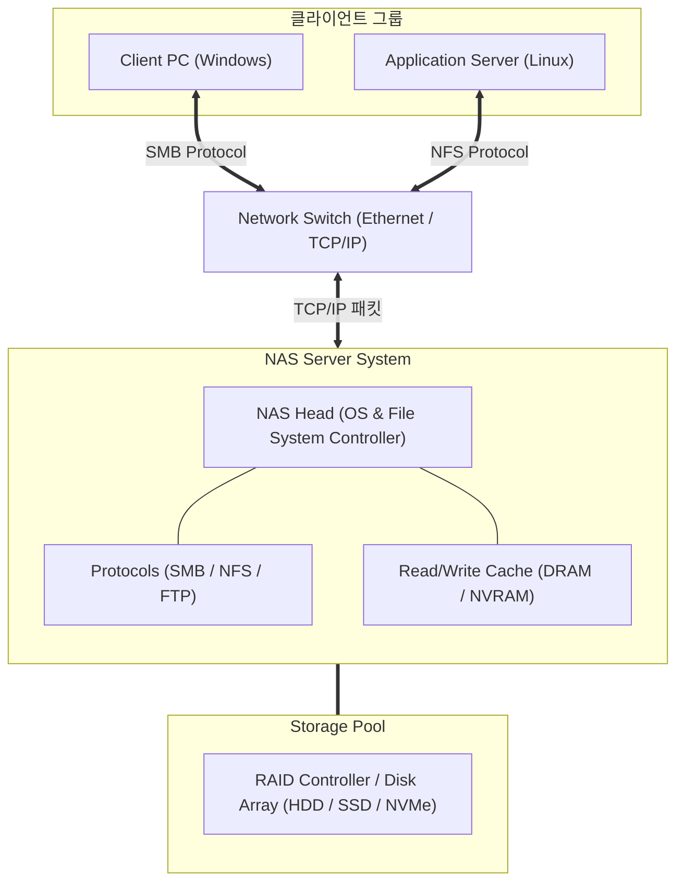

# NAS (Network Attached Storage)

---

## I. 네트워크 기반 파일 공유 스토리지, NAS의 개요

### 가. NAS의 정의

* 파일 레벨(File-level)의 데이터 저장 장치로, [[TCP]]/IP 이더넷 네트워크(LAN)를 통해 이기종 클라이언트와 서버에 공통의 파일 저장 공간을 제공하는 네트워크 스토리지 서버

### 나. NAS의 필요성 및 특징

* **효율적인 파일 공유**: 이기종 [[OS(운영체제)|운영체제]] 간 원활한 파일 협업 및 중앙 집중식 데이터 관리 지원
* **주요 특징**:
* **파일 단위 접근**: 블록 단위가 아닌 파일 시스템 레벨에서 데이터 읽기/쓰기 수행 (NFS, SMB [[프로토콜]] 활용)
* **구축 및 확장 용이성**: 전용 SAN 장비 대비 기존 IP 네트워크 인프라를 활용하여 비용 절감 및 확장 용이

---

## II. NAS의 아키텍처 및 핵심 기술 요소

### 가. NAS의 시스템 아키텍처 및 동작 원리

* 클라이언트가 네트워크 스위치를 통해 SMB 또는 NFS 프로토콜로 NAS 헤더에 파일 접근을 요청함
* NAS 헤더는 파일 시스템과 캐시를 거쳐 스토리지 풀([[RAID]] 구성된 디스크)에서 파일을 읽거나 기록한 뒤 결과를 응답함

### 나. NAS의 핵심 기술 및 구성 요소

| 구분 | 요소기술(키워드) | 세부 설명 |
| --- | --- | --- |
| **통신 프로토콜** | SMB / CIFS | - 윈도우(Windows) 환경 중심의 클라이언트가 파일을 공유하고 접근하기 위한 표준 [[네트워크 프로토콜]] |
| **통신 프로토콜** | NFS (Network File System) | - 유닉스(UNIX) 및 리눅스(Linux) 환경에서 원격 파일 시스템을 로컬처럼 마운트하여 사용 |
| **파일 시스템** | 파일 시스템 (ZFS / XFS) | - 대용량 파일 관리, 디렉토리 구조 최적화, 데이터 [[무결성]] 검증 및 저널링 지원 |
| **물리 네트워크** | Ethernet & TCP/IP | - 전용 광케이블망이 아닌 표준 이더넷 LAN 인프라를 활용하여 비용 효율적 통신 보장 |
| **스토리지 결합** | 스케일아웃 NAS 아키텍처 | - 노드(NAS Head와 Storage)를 병렬로 확장하여 대규모 용량과 성능을 동시에 확보 |
| **데이터 보호** | RAID & Snapshot | - 디스크 장애 대비 [[다중화]](RAID) 및 특정 시점의 데이터 상태를 보존하는 스냅샷 기능 제공 |
| **보안 및 규정** | WORM & ACL | - [[랜섬웨어]] 방어를 위한 수정 불가 저장소(WORM) 및 세밀한 파일 접근 권한 제어(ACL) |
| **고성능 가속** | NVMe-oF & RDMA | - 플래시 메모리 기반 초고속 스토리지와 직접 메모리 접근을 통한 네트워크 지연 최소화 |

---

## III. NAS와 SAN의 비교 및 향후 최신 동향

### 가. NAS와 SAN (Storage Area Network)의 비교

| 비교 항목 | NAS (Network Attached Storage) | SAN (Storage Area Network) |
| --- | --- | --- |
| **접근 방식** | **파일 레벨 (File-level Access)** | **블록 레벨 (Block-level Access)** |
| **네트워크 구성** | 표준 이더넷 (LAN / IP 네트워크) | 전용 광섬유 (Fibre Channel) 또는 iSCSI 네트워크 |
| **사용 프로토콜** | SMB, NFS, AFP | FC-SCSI, NVMe-over-Fabrics |
| **주요 활용 분야** | 대사 파일 공유, 문서 협업, 백업 및 아카이빙 | 고성능 [[데이터베이스]]([[DBMS]]), 대규모 [[트랜잭션]] 처리 |
| **구축 및 관리 비용** | 상대적으로 저렴 (기존 인프라 활용 가능) | 상대적으로 고가 (전용 하드웨어 및 전문 지식 필요) |

### 나. NAS의 최신 기술 동향 및 전망

* **하이브리드 클라우드 스토리지 연동**: 온프레미스 NAS와 퍼블릭 클라우드를 실시간으로 동기화하여, 자주 쓰지 않는 데이터는 클라우드로 자동 계층화(Tiering)하는 Cloud-Tiering 기술 대중화
* **AI 기반 지능형 보안 고도화**: 랜섬웨어 감염 시 파일 [[암호화]] 패턴을 실시간으로 감지하고, 즉시 변경 불가능한(Immutable) 스냅샷을 생성하여 데이터 유실을 원천 차단하는 자율 방어형 NAS 솔루션 확산

---

### 🔗 연관 토픽

- **소속 도메인**: [[00_컴퓨터구조_MOC|💻 컴퓨터구조]]
- **세부 분류**: `2. 캐시 & 메모리 계층 구조 · 스토리지`
- **핵심 연관 토픽**:
  - [[RAID]]
  - [[스토리지 유형|스토리지 유형 (블록, 파일, 오브젝트 스토리지)]]
  - [[무결성]]
  - [[데이터베이스]]
  - [[트랜잭션]]
