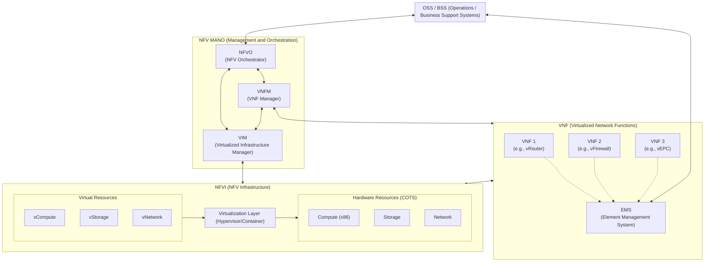

# NFV (Network Functions Virtualization)

---

## I. 차세대 통신망 인프라 혁신, NFV의 개요

### 가. NFV(Network Functions Virtualization)의 정의

* [[방화벽]], [[라우터]], 로드밸런서 등 기존 전용 하드웨어(Appliance)에 종속되었던 네트워크 기능을 범용 서버(x86)의 소프트웨어(VM/Container) 형태로 가상화하는 네트워크 아키텍처 기술
* ETSI(유럽통신표준기구) 주도로 통신 사업자의 CAPEX/OPEX 절감 및 서비스 민첩성(Agility) 확보를 위해 등장한 5G/6G 시대 핵심 기술

### 나. NFV의 핵심 특징 및 기대효과

* **Agility(민첩성)**: 신규 네트워크 서비스 [[프로비저닝]] 시간 단축 및 소프트웨어 기반 신속한 배포(CI/CD 적용)
* **유연성 및 확장성**: 트래픽 증감에 따른 컴퓨팅 자원의 스케일 아웃/인(Scale-out/in)이 소프트웨어적으로 동적 처리 가능
* **비용 절감**: 고가의 벤더 종속적 텔레콤 하드웨어를 저렴한 상용(COTS) 서버로 대체하여 자원 운영 효율성 극대화

---

## II. NFV의 개념도 및 핵심 구성 요소

### 가. NFV의 아키텍처(ETSI 표준) 및 동작 원리

* 범용 하드웨어 자원을 [[가상화]](NFVI)하고, 그 위에 네트워크 장비 기능(VNF)을 소프트웨어로 구동함
* 전체 가상 자원과 네트워크 서비스의 생명주기 및 통합 오케스트레이션은 MANO 영역에서 중앙 통제함

### 나. NFV의 핵심 기술 요소

| 분류 | 요소기술(키워드) | 세부 설명 |
| --- | --- | --- |
| **통합 관리 (MANO)** | **NFVO** (Orchestrator) | 전체 네트워크 서비스(NS)의 생명주기 관리 및 글로벌 인프라 자원 오케스트레이션 수행 |
| **통합 관리 (MANO)** | **VNFM** (VNF Manager) | 개별 VNF 인스턴스의 생성, 확장(Scaling), 업데이트 및 종료(Termination) 통제 |
| **통합 관리 (MANO)** | **VIM** (Infrastructure Mgr) | NFVI 인프라(컴퓨팅, 스토리지, 네트워크) 자원 할당, 추적, 제어 (예: OpenStack) |
| **네트워크 기능** | **VNF** (Virtual Network Function) | L4~L7 계층의 네트워크 장비(방화벽, IPS, EPC 등)를 소프트웨어 모듈로 구현한 개체 |
| **네트워크 기능** | **EMS** (Element Mgmt System) | 특정 VNF에 대한 고유한 기능적 관리 (FCAPS: 장애, 과금, 성능, 보안 관리) |
| **가상화 인프라** | **NFVI** (NFV Infrastructure) | VNF가 배포되고 실행되는 물리적 상용 하드웨어(COTS) 및 가상화 계층 자원의 집합 |
| **가상화 기술** | **[[Hypervisor (VMM)|Hypervisor]] / OS** | KVM, VMware 등 물리적 서버 자원을 논리적으로 분할하여 vCPU, vNIC 등을 제공 |
| **외부 연동 인터페이스** | **RESTful API** | MANO 내부 모듈 간, 그리고 OSS/BSS와의 개방형 표준 API 연동을 통한 제어 자동화 |

---

## III. NFV와 SDN 비교 및 최신 동향 (전망)

### 가. 차세대 네트워크 혁신을 위한 NFV와 SDN 비교

| 구분 | NFV (Network Functions Virtualization) | [[SDN(Software Defined Network)|SDN]] (Software Defined Networking) |
| --- | --- | --- |
| **핵심 목적** | 네트워크 장비 기능의 **소프트웨어화(가상화)** | 네트워크의 **제어부(Control)와 데이터전송부(Data) 분리** |
| **적용 대상/계층** | L4 ~ L7 계층 (방화벽, 로드밸런서, 통신 코어망 등) | L2 ~ L3 계층 (라우터, [[스위치 (Layer 3 Switch)|스위치]] 패킷 전송) |
| **주도 기관** | ETSI (유럽통신표준기구 / 통신사업자 위주) | ONF (Open Networking Foundation / IT 클라우드 위주) |
| **구현 및 동작 방식** | 범용 서버(x86) 내 가상머신(VM) 및 [[컨테이너]] 활용 | [[OpenFlow]] [[프로토콜]] 기반 중앙 집중형 SDN 컨트롤러 통제 |
| **상호 보완성** | NFV 인프라 내 가상 네트워크 관리를 위해 SDN 도입 | SDN 서비스 체이닝(Service Chaining)을 위해 NFV 활용 |

### 나. NFV의 최신 트렌드 및 진화 방향 (Cloud-Native NFV)

* **CNF (Cloud-Native Network Functions) 진화**: 기존 무거운 VM 기반의 VNF에서 벗어나 마이크로서비스 아키텍처([[MSA (Micro Service Architecture)|MSA]]) 및 [[쿠버네티스]](K8s) 기반의 컨테이너 기술(CNF)로 전환하여 5G/6G 코어망의 이식성과 효율성 극대화
* **AI/ML 기반 인텔리전트 오케스트레이션**: Cognitive NFV 트렌드에 따라 트래픽 패턴 예측, 자가 치유(Self-Healing), 제로 터치 프로비저닝(Zero-Touch Provisioning) 구현을 위한 AI 자동화 결합 가속화
* **MEC ([[Mobile Edge Computing]]) 융합**: 초저지연 통신을 위해 엣지 클라우드 인프라에 가상화된 네트워크 기능(NFV)을 전진 배치시켜 분산 컴퓨팅 효율 확보 및 실시간 서비스 대응 체계 구축

---

### 🔗 연관 토픽

- **소속 도메인**: [[00_네트워크_MOC|🌐 네트워크]]
- **세부 분류**: `5. 통신 인프라 & 차세대 네트워크 기술`
- **핵심 연관 토픽**:
  - [[SDN(Software Defined Network)]]
  - [[Mobile Edge Computing|Mobile Edge Computing (MEC)]]
  - [[가상화]]
  - [[스위치 (Layer 3 Switch)]]
  - [[프로비저닝]]
