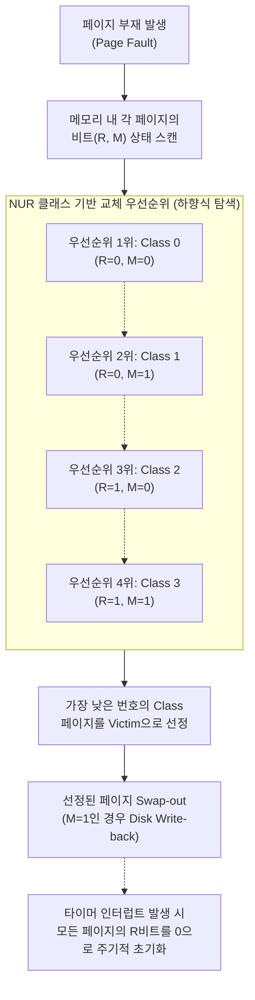

# NUR (Not Used Recently)

---

## I. 가상메모리 최적화, NUR(Not Used Recently)의 개요

### 가. NUR의 정의

* 주기억장치 내의 페이지 중 최근에 사용되지 않은 페이지를 교체 대상(Victim)으로 선정하는 가상메모리 [[페이지 교체 알고리즘]]
* 참조 비트(Reference Bit)와 변형 비트(Modified Bit)라는 두 개의 하드웨어 비트를 활용하여 [[LRU]](Least Recently Used)의 높은 오버헤드를 근사적으로 해결하는 기법

### 나. NUR의 필요성 및 특징

* **LRU [[알고리즘]] 한계 극복**: 타임스탬프 기록이나 연결 리스트 유지에 드는 시간 및 공간적 오버헤드 최소화
* **하드웨어 지원 기반**: MMU([[MMU(Memory Management Unit)|Memory Management Unit]])의 하드웨어 비트를 활용하여 고속 연산 가능
* **[[클래스]] 기반 우선순위**: 비트 조합에 따라 4가지 클래스로 분류하여 직관적인 교체 우선순위 결정

---

## II. NUR의 개념도 및 핵심 기술 요소

### 가. NUR의 개념도 및 동작 원리

* 타이머 인터럽트를 통해 참조 비트를 주기적으로 0으로 갱신함으로써 '최근'의 의미를 부여
* 가장 낮은 클래스(Class 0)부터 탐색하여 최초로 발견되는 페이지를 즉시 교체 대상으로 선정

### 나. NUR의 핵심 기술 요소

| 구분 | 요소기술(키워드) | 세부 설명 |
| --- | --- | --- |
| **제어 상태값** | 참조 비트 (Reference Bit) | 페이지가 호출(읽기/쓰기)될 때 1로 세팅, 주기적으로 0으로 초기화됨 |
| **제어 상태값** | 변형 비트 (Modified Bit) | 페이지 내용이 수정(쓰기)되었을 때 1로 세팅 (Dirty Bit와 동일) |
| **교체 등급** | Class 0 (R=0, M=0) | 최근 참조 안됨, 수정 안됨 (교체 1순위, 디스크 I/O 없이 즉시 교체 가능) |
| **교체 등급** | Class 1 (R=0, M=1) | 참조 안됨, 수정됨 (R비트 초기화에 의해 발생, 교체 2순위, Write-back 필요) |
| **교체 등급** | Class 2 (R=1, M=0) | 최근 참조 됨, 수정 안됨 (교체 3순위, 최근 사용되었으나 데이터 변경 없음) |
| **교체 등급** | Class 3 (R=1, M=1) | 최근 참조 됨, 수정 됨 (교체 4순위, 교체 시 시스템 부담이 가장 큼) |
| **운영 메커니즘** | 주기적 R비트 초기화 | Clock [[인터럽트]] 발생 시 주기적으로 R비트를 일괄 0으로 리셋하여 최신성 반영 |
| **운영 메커니즘** | 하드웨어 의존성 (MMU) | 소프트웨어적 타이머 대신 [[CPU]]/MMU 차원의 하드웨어 비트 지원을 받아 고속 처리 |

---

## III. NUR과 주요 페이지 교체 알고리즘 비교

| 비교 항목 | NUR (Not Used Recently) | LRU (Least Recently Used) | [[FIFO]] (First In First Out) |
| --- | --- | --- | --- |
| **교체 기준** | 참조(R) 및 변형(M) 비트 조합 | 가장 오랫동안 참조되지 않은 페이지 | 적재된 지 가장 오래된 페이지 |
| **오버헤드** | **낮음** (2개의 비트만 유지) | **높음** (타임스탬프 또는 연결 리스트) | **매우 낮음** (큐([[Queue]]) 구조 유지) |
| **구현 방식** | 하드웨어 비트 + 타이머 인터럽트 | 카운터, 스택([[Stack]]) 등 활용 | 선입선출 큐(FIFO Queue) |
| **페이지 부재율** | LRU와 유사한 수준의 우수한 성능 | 최적 알고리즘([[OPT]])에 근접한 낮은 부재율 | 벨라디의 모순([[Belady's Anomaly]]) 발생 가능 |
| **활용 환경** | LRU 구현이 부담스러운 상용 OS 환경 | [[캐시 메모리]], DB 버퍼 풀 등 | 단순 임베디드 시스템 등 |

* **향후 동향 및 발전 방안**: 현대의 범용 [[OS(운영체제)|운영체제]](Windows, Linux 등)에서는 순수 NUR보다는 이를 환형 큐 형태로 발전시킨 **클락(Clock) 알고리즘** 및 **SCR (Second Chance Replacement)** 방식을 주력으로 채택하여 성능과 오버헤드의 최적 균형을 확보하고 있음.

---

### 🔗 연관 토픽

- **소속 도메인**: [[00_운영체제_MOC|⚙️ 운영체제]]
- **세부 분류**: `5. 가상 메모리 관리 & 페이지 교체 알고리즘`
- **핵심 연관 토픽**:
  - [[LRU]]
  - [[OPT]]
  - [[Belady's Anomaly]]
  - [[페이지 교체 알고리즘|페이지 교체 알고리즘 (Paging Replacement Algorithm)]]
  - [[FIFO]]
