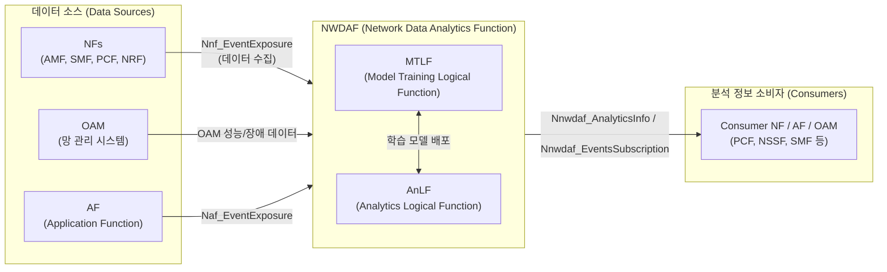

# NWDAF(Network Data Analytics Function)

---

## I. 5G 코어망의 지능화 엔진, NWDAF의 개요

### 가. NWDAF(Network Data Analytics Function)의 정의

* 5G 코어 네트워크(5GC)에서 다양한 네트워크 기능(NF), OAM, AF로부터 데이터를 수집하고 기계학습(ML) 기반 분석 및 예측을 수행하여 인사이트를 제공하는 3GPP 표준 네트워크 지능화 엔진
* 서비스 기반 아키텍처(SBA, Service-Based Architecture) 내에서 타 NF에게 AI/ML 분석 정보를 제공하여 트래픽 최적화 및 자동화를 지원하는 핵심 기능

### 나. NWDAF의 필요성 및 주요 특징

* **필요성**: 5G/6G 초연결 환경에서 수동 네트워크 제어의 한계 극복, 제로 터치(Zero-Touch) 기반 자율형 네트워크 및 네트워크 슬라이스(Network Slicing)의 동적 관리 요구 증대
* **주요 특징**: 데이터 수집/모델학습/추론 논리 기능 분리(AnLF/MTLF), 개방형 API(Nnwdaf)를 통한 통계 및 예측 기반 실시간 인사이트 제공

---

## II. NWDAF의 아키텍처 및 핵심 구성요소

### 가. NWDAF의 아키텍처 및 동작 원리

* **동작 흐름**: 다양한 소스(NF, AF, OAM)로부터 이벤트 및 트래픽 데이터를 수집(Nnf/Naf)하여 MTLF에서 모델을 학습시키고, AnLF에서 추론을 수행하여 예측 결과를 Nnwdaf 인터페이스로 컨슈머(Consumer)에게 제공함

### 나. NWDAF의 핵심 기술 요소

| 분류 | 요소기술(키워드) | 세부 설명 |
| --- | --- | --- |
| **내부 논리 기능** | **AnLF** (Analytics Logical Function) | 수집된 데이터를 바탕으로 ML 모델을 실행하여 실시간 추론을 수행하고, 소비자에게 통계 및 예측 정보 제공 |
| **내부 논리 기능** | **MTLF** (Model Training Logical Function) | 이력 데이터를 수집하여 ML 모델을 학습(Training)시키고, 갱신된 분석 모델을 AnLF에 배포하는 역할 수행 |
| **서비스 인터페이스** | **Nnwdaf_EventsSubscription** | 소비자 NF가 NWDAF의 특정 이벤트(분석/예측 결과)를 지속적으로 수신하기 위한 구독(Subscribe)/알림 인터페이스 |
| **서비스 인터페이스** | **Nnwdaf_AnalyticsInfo** | 소비자 NF가 특정 시점의 데이터 분석 결과를 NWDAF에 단발성으로 요청(Request)하고 응답(Response)받는 인터페이스 |
| **서비스 인터페이스** | **Nnf_EventExposure** | NWDAF가 AMF, SMF 등 5G 핵심망 NF로부터 실시간 운영 상태 및 트래픽 데이터를 수집하기 위한 개방형 API |
| **분석/예측 사례** | **Network Slicing Analytics** | 네트워크 슬라이스별 자원 사용량, 부하율 및 트래픽 변화 추이를 분석하여 선제적인 자원 할당 및 고갈 예측 |
| **분석/예측 사례** | **UE Mobility Analytics** | 단말(UE)의 이동성 패턴과 궤적을 학습/예측하여 효율적인 페이징(Paging) 및 최적의 핸드오버(Handover) 지원 |
| **분석/예측 사례** | **[[QoS]] Sustainability** | 특정 영역에서 시간적, 공간적 QoS 보장 여부를 사전에 예측하여 트래픽 폭주 및 품질 저하에 선제적으로 대응 |

---

## III. NWDAF의 3GPP 표준 진화 및 향후 전망

### 가. 3GPP 릴리즈별 NWDAF 기술 진화 및 향후 전망

| 구분 | 표준화 단계 | 진화 특징 및 핵심 방향 |
| --- | --- | --- |
| **도입기** | **3GPP Release 15** | NWDAF 기본 구조 최초 도입 및 코어망 내 기초적인 네트워크 데이터 수집/트래픽 통계 분석 기능 정의 |
| **발전기** | **3GPP Release 16** | SBA 기반 5GC 완전 연동을 목표로 다양한 유즈케이스(UE 이동성, QoS 예측, 슬라이스 부하 분석 등) 추가 및 지능화 본격화 |
| **고도화** | **3GPP Release 17** | **MTLF와 AnLF의 구조적 분리(Disaggregation)** 적용, **분산형 NWDAF 아키텍처** 및 다중 도메인 간 **연합학습(Federated Learning)** 지원 도입 |
| **향후 전망** | **6G AI-Native Network** | 인지 네트워크(Cognitive Network), 제로 터치 [[프로비저닝]](Zero-touch Provisioning)을 실현하는 6G 자율운영 코어망의 핵심 인텔리전스 계층으로 발전 |

* **향후 과제 및 적용 방안**: 데이터 수집과 실시간 추론 시 발생할 수 있는 코어망 제어 평면(Control Plane)의 통신 오버헤드 최소화 전략이 필수적이며, 통신사업자의 MEC([[Mobile Edge Computing]]) 자원과 연계하여 지연시간을 획기적으로 줄이는 분산형 엣지 오케스트레이션 적용이 확대될 전망임.

---

### 🔗 연관 토픽

- **소속 도메인**: [[00_네트워크_MOC|🌐 네트워크]]
- **세부 분류**: `4. 무선 및 차세대 이동통신 (5G/6G/Wi-Fi)`
- **핵심 연관 토픽**:
  - [[QoS|QoS (Quality of Service)]]
  - [[프로비저닝]]
  - [[Mobile Edge Computing|Mobile Edge Computing (MEC)]]
  - [[O-RAN]]
  - [[5G 특화망]]
