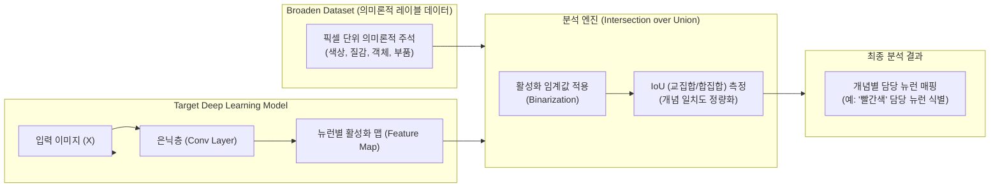

# 네트워크 내부 해석을 위한 인공지능 분석 기법, Network Dissection의 개요

### 가. Network Dissection의 정의

* [[딥러닝]] 모델(특히 [[CNN]] 등)의 내부 은닉층(Hidden Layer)이 개별 뉴런 단위로 인간이 이해할 수 있는 시각적 개념(색상, 질감, 객체 부품 등)을 학습하고 있는지 정량적으로 진단하는 모델 해석([[XAI]]) 분석 기법

### 나. Network Dissection의 필요성 및 특징

* **블랙박스 문제 해결**: 딥러닝 모델의 높은 성능 뒤에 숨겨진 내부 작동 원리를 역추적하여 [[신뢰성]] 확보
* **주요 특징**:
* **개념 수준 정량화**: 단순 가중치 분석이 아닌, 뉴런의 활성화(Activation) 상태와 실제 시각 개념 간의 인과관계 매핑
* **모델 진단 및 개선**: [[편향]](Bias)이나 취약점을 사전에 발견하여 모델 압축 및 안전성 검증에 기여

---

## II. Network Dissection의 개념도 및 핵심 기술 요소

### 가. Network Dissection의 개념도 및 동작 원리

* 대상 모델의 입력 이미지에 따른 은닉층 뉴런의 활성화 맵을 추출한 후, 픽셀 단위로 의미론적 레이블이 주석 처리된 대규모 데이터셋(Broaden Dataset)과 비교함
* IoU(Intersection over Union) 지표를 통해 특정 뉴런이 어떤 시각적 개념(Concept)과 높은 상관관계를 가지는지 정량적으로 측정함

### 나. Network Dissection의 핵심 기술 및 구성 요소

| 구분 | 요소기술(키워드) | 세부 설명 |
| --- | --- | --- |
| **비교 대상** | Broaden Dataset | - 픽셀 수준의 의미론적 레이블(색상, 질감, 재질, 사물, 부품 등)이 정밀하게 주석된 대조군 데이터셋 |
| **활성화 추출** | Feature Map Activation | - 특정 입력 이미지가 주어졌을 때, 합성곱 신경망 내부 은닉층의 개별 채널(뉴런)이 출력하는 반응 값 |
| **임계값 처리** | Spatial Binarization | - 연속적인 활성화 맵을 이진화(Mask)하여 특정 개념 영역과 일치하는지 판단하는 전처리 과정 |
| **정량 지표** | IoU (Intersection over Union) | - 뉴런의 활성화 영역과 데이터셋의 의미론적 주석 영역 간의 겹치는 비율을 계산하는 핵심 매칭 지표 |
| **개념 매핑** | Concept Labeling | - 개별 뉴런에 '나무', '문', '금속 질감' 등 인간이 인지할 수 있는 명확한 의미 레이블 부여 |
| **응용 기법** | Model Pruning (가지치기) | - 분석 결과 아무런 시각적 개념을 담당하지 않거나 중복되는 뉴런을 제거하여 모델 경량화 수행 |
| **보안 진단** | Bias & Vulnerability Detection | - 학습 데이터의 편향으로 인해 특정 뉴런이 비정상적인 특징에 반응하는지 검출하여 보안성 강화 |
| **시각화 툴** | Saliency & Heatmap | - 분석된 뉴런의 가중치와 활성화 상태를 역산하여 이미지 상에서 어떤 영역을 주목하는지 시각화 |

---

## III. 유사 XAI 기법 비교 및 향후 전망

### 가. Network Dissection과 주요 XAI(설명 가능한 AI) 기법 비교

| 비교 항목 | Network Dissection | Grad-CAM (Gradient-weighted Class Activation Mapping) | [[LIME]] (Local Interpretable Model-agnostic Explanations) |
| --- | --- | --- | --- |
| **분석 대상** | 내부 은닉층의 **개별 뉴런(Unit)** 단위 분석 | 특정 [[클래스]] 예측에 기여한 **입력 영역(Spatial Region)** 시각화 | 개별 예측 결과에 대한 **입력 피처(Feature)의 기여도** 분석 |
| **분석 관점** | 구조적/개념적 해석 (이 뉴런은 무엇을 아는가?) | 시각적 중요도 (어떤 영역을 보고 판단했는가?) | 로컬 근사 해석 (이 샘플에 왜 이런 결과가 나왔는가?) |
| **데이터 요구량** | 대규모 의미론적 레이블 데이터셋(Broaden) 필수 | 대상 모델과 입력 이미지만 있으면 즉시 적용 가능 | 모델 무관(Model-agnostic), 블랙박스 상태에서 샘플링 활용 |
| **주요 활용** | 모델 내부 구조 진단, 뉴런 단위 조작 및 가지치기 | 실시간 추론 결과 설명, 의료/금융 등 도메인 시각화 검증 | 표형 데이터 및 텍스트 모델의 개별 예측 결과 설명 |

### 나. Network Dissection의 한계점 극복 및 향후 전망

* **초거대 AI 및 멀티모달 모델로의 확장**: 단일 CNN 기반의 시각적 개념 분석에서 벗어나, 대규모 언어 모델([[초거대 언어 모델|LLM]]) 및 비전-언어 모델(VLM)의 어텐션 맵과 내부 토큰 표현 방식을 해석하기 위한 'Mechanistic Interpretability(기계적 해석 가능성)' 분야로 진화 중
* **AI 안전성(Safety) 규제 대응**: EU AI Act 등 글로벌 [[인공지능]] 규제 강화에 발맞추어, 모델의 의사결정 과정을 뉴런 및 개념 수준에서 검증하고 할루시네이션이나 편향을 사전에 차단하기 위한 필수 컴포넌트로 연구 개발 활발

---

### 🔗 연관 토픽

- **소속 도메인**: [[00_인공지능_MOC|🤖 인공지능]]
- **세부 분류**: `1. 수학 · 통계학 & 데이터 전처리`
- **핵심 연관 토픽**:
  - [[CNN|CNN (Convolutional Neural Network)]]
  - [[딥러닝]]
  - [[인공지능]]
  - [[편향]]
  - [[XAI]]
