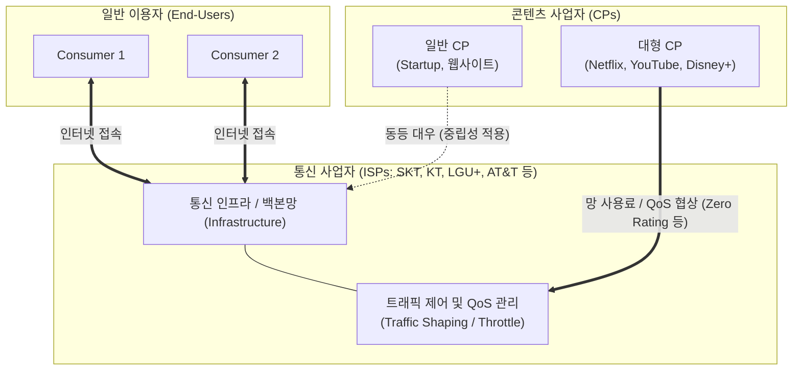

# 네트워크 중립성 (Network Neutrality)

---

## I. 인터넷 트래픽 공정 분배의 핵심 원칙, 네트워크 중립성의 개요

### 가. 네트워크 중립성의 정의

* 통신 사업자([[ISP (Information Strategy Plan)|ISP]])는 모든 인터넷 트래픽을 내용, 유래, 목적지, 서비스 유형에 관계없이 동등하게 취급하고 차별해서는 안 된다는 개방형 인터넷 통신 규범

### 나. 네트워크 중립성의 필요성 및 특징

* **시장 지배력 남용 방지**: 거대 통신 사업자(ISP)의 망 독점을 이용한 특정 콘텐츠 사업자(CP) 차별 및 부당 요금 부과 방지
* **특징**: 무차별 원칙(No Discrimination), 무차단 원칙(No Blocking), 유료 우선순위(Paid Prioritization) 금지 등을 핵심 축으로 구성

---

## II. 네트워크 중립성 분쟁 구조 및 핵심 기술 요소

### 가. 네트워크 중립성 충돌 구조 및 동작 원리

* 일반 이용자와 콘텐츠 사업자(CP)는 ISP의 통신망 인프라를 통해 데이터를 송수신함
* 망 중립성이 보장될 경우 모든 트래픽이 동등하게 처리되나, 대형 CP의 트래픽 급증에 따른 망 투자 비용 분담 및 트래픽 제어([[QoS]])를 두고 이해관계 대립 발생

### 나. 네트워크 중립성의 핵심 기술 및 제도적 요소

| 구분 | 요소기술(키워드) | 세부 설명 |
| --- | --- | --- |
| **기본 원칙** | No Blocking (무차단) | - ISP가 합법적인 콘텐츠, 앱, 서비스의 접근을 정당한 이유 없이 차단하지 않는 원칙 |
| **기본 원칙** | No Discrimination (무차별) | - 출처, 목적지, [[프로토콜]] 종류에 따라 트래픽을 불평등하게 지연시키거나 변조하지 않음 |
| **기본 원칙** | Paid Prioritization (유료 우선) | - 추가 요금을 지불한 사업자에게 더 빠른 전송 속도(패스트레인)를 제공하는 것을 금지 |
| **트래픽 제어** | [[Traffic Shaping (트래픽 쉐이핑)|Traffic Shaping]] / Management | - 네트워크 과부하 방지를 위해 일시적으로 트래픽을 조절하는 기술이나, 차별적 수단으로 악용될 소지 존재 |
| **상업 모델** | Zero Rating (제로 레이팅) | - 특정 서비스 이용 시 데이터 요금을 면제하거나 차감하는 제도로, 중립성 침해 논란의 핵심 대상 |
| **망 분담 이슈** | 망 사용료 (Network Usage Fee) | - 대형 CP가 유발하는 막대한 트래픽 비용을 ISP 망 투자비와 연계하여 분담해야 한다는 법적·경제적 논점 |
| **규제 동향** | FCC 규제 전환 | - 미국 FCC의 통신 중립성 규제 폐지와 복원이 정권 교체에 따라 반복되며 글로벌 표준의 불확실성 증대 |
| **법적 대안** | 스페셜리티 서비스 (Specialized Services) | - 일반 인터넷과 분리된 별도 대역폭을 통해 특정 서비스(의료, [[Smart Car(자율주행)|자율주행]] 등)에 최적화된 품질 보장 허용 |

---

## III. 전통적 중립성 원칙의 한계 및 최신 동향

### 가. 전통적 엄격한 중립성과 유연적 규제 체계 비교

| 비교 항목 | 엄격한 [[망 중립성]] (Traditional) | 유연적 상호 운용 체계 (Modern Trend) |
| --- | --- | --- |
| **기본 시각** | 모든 트래픽은 완벽히 평등해야 함 | 네트워크 현실과 서비스 특성에 따른 차등 허용 필요 |
| **대형 CP 규율** | 트래픽 유발량과 무관하게 동일 조건 보장 | 과도한 트래픽 유발 사업자의 공정한 망 투자 기여 요구 |
| **신기술 수용** | 자율주행, 원격 의료 등 초저지연 서비스 제공 제약 | QoS 기반 특수 서비스(Specialized Service) 분리 허용 |
| **규제 방향** | 법적 구속력을 통한 강제적 차단 금지 | 사후 규제(Ex-post) 및 공정 경쟁 중심의 시장 자율 조율 |

### 나. 네트워크 중립성의 최신 동향 및 향후 전망

* **대형 CP와 ISP 간 망 사용료 분쟁 격화**: 글로벌 빅테크(넷글릭스, 구글 등)의 트래픽 독점에 대응하여 유럽연합(EU)의 'Fair Share' 법안 논의 및 국내 망 이용계약법 입법 공방이 지속되며 중립성 개념이 '비용 분담' 이슈로 재정의됨
* **AI 및 6G 시대를 위한 패러다임 전환**: 초저지연(URLLC)과 [[네트워크 슬라이싱]](Network Slicing)이 필수적인 6G 및 자율주행·[[UAM]] 환경에서는 모든 트래픽의 일률적 평등보다는 서비스 특성에 맞는 유연한 품질 보장을 허용하는 방향으로 규제 프레임워크가 진화 중

---

### 🔗 연관 토픽

- **소속 도메인**: [[00_네트워크_MOC|🌐 네트워크]]
- **세부 분류**: `3. 전송 계층 & 트래픽 / 혼잡 제어 (L4)`
- **핵심 연관 토픽**:
  - [[망 중립성|망 중립성 (Network Neutrality)]]
  - [[Traffic Shaping (트래픽 쉐이핑)]]
  - [[QoS|QoS (Quality of Service)]]
  - [[네트워크 슬라이싱]]
  - [[백홀 트래픽]]
