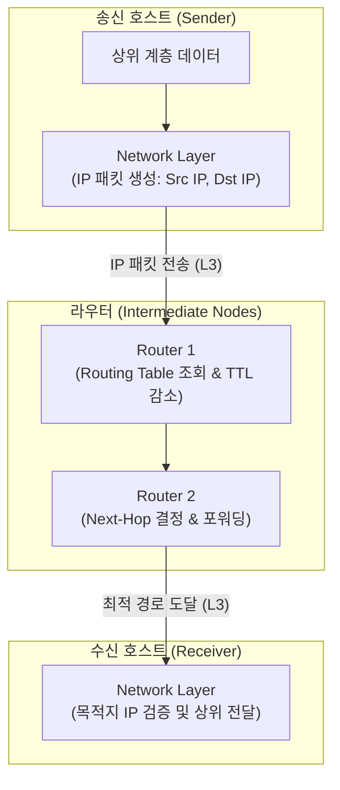

# OSI 7계층의 핵심 전송 관리 계층, 네트워크 3계층 (Network Layer)의 개요

### 가. 네트워크 3계층의 정의

* OSI 7계층 모델 중 발신지에서 수신지까지 데이터 패킷이 최적의 경로를 찾아 전달(Routing)될 수 있도록 논리적 주소 지정과 포워딩을 수행하는 계층

### 나. 네트워크 3계층의 필요성 및 특징

* **라우팅 및 경로 제어**: 서로 다른 네트워크(Subnet) 간의 이기종 통신을 위해 최적의 패킷 이동 경로(Route) 선택
* **주요 특징**:
* **논리적 주소 부여**: IP 주소 등을 활용하여 전 세계 단말을 유일하게 식별
* **비연결형/[[신뢰성]] 없는 전송**: IP [[프로토콜]] 기반의 Best-Effort 전달 방식을 지원하여 상위 계층에서 신뢰성 보장

---

## II. 네트워크 3계층의 아키텍처 및 핵심 기술 요소

### 가. 네트워크 3계층의 패킷 전달 및 라우팅 동작 원리

* 송신 호스트가 생성한 IP 패킷(출발지/목적지 IP 포함)은 네트워크 3계층 라우터의 라우팅 테이블을 거치며 최적의 넥스트 홉(Next-Hop)으로 포워딩됨
* 각 라우터를 통과할 때마다 TTL(Time-to-Live) 값이 1씩 감소하며 무한 루프를 방지함

### 나. 네트워크 3계층의 핵심 기술 및 구성 요소

| 구분 | 요소기술(키워드) | 세부 설명 |
| --- | --- | --- |
| **핵심 프로토콜** | IP (Internet Protocol) | - 비연결형, Best-Effort 기반으로 패킷을 목적지까지 전달하는 3계층의 핵심 핵심 프로토콜 ([[IPv4]]/[[IPv6]]) |
| **주소 체계** | IP Addressing & [[Subnetting (서브네팅)|Subnetting]] | - 네트워크 식별자와 호스트 식별자로 구분하여 논리적 주소를 부여하고 브로드캐스트 영역 분할 |
| **제어 및 오류** | [[ICMP]] (Internet Control Message Protocol) | - 패킷 전송 중 발생한 오류(Destination Unreachable)를 보고하고 네트워크 진단(Ping) 수행 |
| **경로 설정** | Routing Protocols (OSPF, [[BGP]]) | - [[라우터]] 간 최적의 경로 정보를 교환하고 라우팅 테이블을 동적으로 갱신하는 프로토콜 |
| **패킷 제어** | Fragmentation & Reassembly | - 전송 링크의 MTU 크기보다 패킷이 클 경우 조각화하고 수신 측에서 재조합 |
| **주소 변환** | [[ARP]] / NDP | - IP 주소를 기반으로 물리적 [[MAC]] 주소를 획득하거나 IPv6 환경에서 노드 탐색 수행 |
| **품질 제어** | [[QoS]] ([[DiffServ (Differentiated Services)|DiffServ]] / ToS) | - IP 패킷 헤더 내 우선순위 필드를 활용하여 실시간 트래픽(음성, 영상 등) 우선 처리 보장 |
| **[[가상화]] 기술** | MPLS / Tunneling | - 레이블 스위칭을 통해 가상 사설망([[VPN]]) 구성 및 트래픽 엔지니어링 수행 |

---

## III. 전송 계층과의 비교 및 최신 동향

### 가. 네트워크 3계층(Network)과 전송 4계층(Transport) 비교

| 비교 항목 | 네트워크 3계층 (Network Layer) | 전송 4계층 (Transport Layer) |
| --- | --- | --- |
| **주요 역할** | 단말 간 **경로 설정 및 패킷 라우팅** ([[End-to-End]]) | [[프로세스]] 간 **신뢰성 있는 데이터 전송** (Process-to-Process) |
| **핵심 주소** | IP 주소 (Logical Address) | 포트 번호 (Port Number) |
| **신뢰성 여부** | Best-Effort (신뢰성 보장 없음, 유실 가능) | 신뢰성 보장 ([[TCP]]의 경우 재전송 및 순서 제어) |
| **대표 프로토콜** | IP, ICMP, OSPF, BGP | TCP, UDP, QUIC |

### 나. 네트워크 3계층 기술의 최신 동향 및 전망

* **IPv6 및 세그먼트 라우팅(SRv6) 상용화**: 초고속 5G/6G 및 AI 클러스터 환경에서 라우팅 헤더 조작을 단순화하고 프로그래밍 가능한 경로 제어를 위해 SRv6(Segment Routing over IPv6) 도입 확산
* **소프트웨어 정의 네트워킹([[SDN(Software Defined Network)|SDN]]) 연계**: 전통적인 분산 라우팅 방식에서 벗어나, 중앙 컨트롤러가 3계층 포워딩 규칙을 동적으로 제어하여 네트워크 지연을 최소화하고 트래픽 최적화 달성

---

### 🔗 연관 토픽

- **소속 도메인**: [[00_네트워크_MOC|🌐 네트워크]]
- **세부 분류**: `1. OSI 7계층 & 데이터링크 계층 (L1/L2)`
- **핵심 연관 토픽**:
  - [[프로토콜]]
  - [[TCP]]
  - [[라우터]]
  - [[IPv6]]
  - [[BGP|BGP(Border Gateway Protocol)]]
