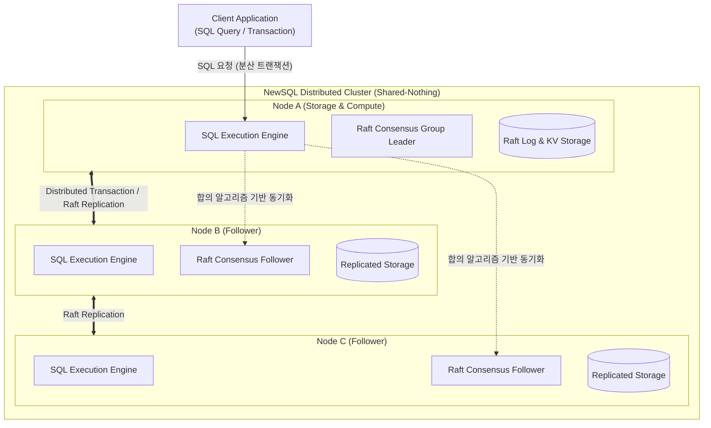

# NewSQL

---

## I. 확장성과 일관성을 동시 충족하는 차세대 분산 데이터베이스, NewSQL의 개요

### 가. NewSQL의 정의

* [[NoSQL (CAP 이론 BASE 속성)|NoSQL]]의 뛰어난 수평적 확장성(Scalability)과 기존 관계형 [[데이터베이스]](RDBMS)가 제공하는 ACID(원자성, 일관성, 고립성, 지속성) [[트랜잭션]] 보장을 동시에 제공하는 고성능 [[분산 데이터베이스]] 아키텍처

### 나. NewSQL의 등장 배경 및 특징

* **기존 데이터베이스의 한계 극복**: RDBMS는 대규모 트래픽 분산 처리에 한계가 있고, NoSQL은 확장성은 뛰어나나 복잡한 조인(Join)과 강력한 일관성을 포기해야 하는 딜레마(CAP Theorem) 극복 필요
* **핵심 특징**: 공유 무결점(Shared-Nothing) 아키텍처 기반 자동 [[샤딩]](Sharding), 분산 2단계 커밋(2PC) 및 [[합의 알고리즘]] 기반 ACID 보장, 인메모리 최적화

---

## II. NewSQL의 아키텍처 및 핵심 기술 요소

### 가. NewSQL의 분산 아키텍처 및 동작 원리

* 클라이언트의 [[SQL(Structured Query Language)|SQL]] 요청을 분산 노드의 실행 엔진이 받아 파싱하고, 데이터 파티션을 샤딩하여 여러 노드에 분산 저장함
* 노드 간 데이터 일관성은 Raft 또는 Paxos 같은 합의(Consensus) 알고리즘을 통해 실시간으로 복제 및 동기화됨

### 나. NewSQL의 핵심 기술 및 구성 요소

| 구분 | 요소기술(키워드) | 세부 설명 |
| --- | --- | --- |
| **분산 합의** | Raft / Paxos Protocol | - 분산 노드 간 데이터 복제 시 과반수 동의를 얻어 네트워크 분할(Split-Brain) 상황에서도 ACID 보장 |
| **시간 동기화** | TrueTime / HLC | - 전 세계 분산 노드 간의 미세한 시간 오차를 보정하여 전역적 스냅샷 격리(Global Snapshot Isolation) 지원 |
| **데이터 분할** | Distributed Sharding | - 데이터를 자동으로 여러 노드에 분산 및 리밸런싱하여 핫스팟(Hotspot) 방지 및 수평적 확장 구현 |
| **트랜잭션** | Distributed 2PC (2-Phase Commit) | - 다중 노드에 걸쳐 수행되는 트랜잭션의 커밋 여부를 안전하게 조율하여 원자성 확보 |
| **스토리지** | LSM-Tree / In-Memory | - 쓰기 성능 최적화를 위한 로그 구조 병합 트리 구조 및 메모리 기반 인덱싱 적용 |
| **SQL 엔진** | Distributed Query [[OPTIMIZER|Optimizer]] | - 분산된 노드 간 네트워크 [[조인|조인(Join)]] 비용을 최소화하도록 최적의 실행 계획 수립 |
| **[[HA(High Availability)|고가용성]]** | Automated Failover | - 특정 노드 장애 발생 시 Raft 리더 선출 메커니즘을 통해 수 초 이내에 무중단 절체(Failover) 수행 |
| **대표 제품** | Google Spanner, [[CockroachDB]] | - 글로벌 분산 환경에서 표준 SQL과 완전한 ACID 트랜잭션을 제공하는 상용/오픈소스 뉴SQL 대표 주자 |

---

## III. 전통적 RDBMS 및 NoSQL과의 비교 및 향후 전망

### 가. RDBMS, NoSQL, NewSQL 다차원 비교

| 비교 항목 | 전통적 RDBMS | NoSQL | NewSQL |
| --- | --- | --- | --- |
| **확장성 (Scalability)** | 수직적 확장 (Scale-up) 중심 | 수평적 확장 (Scale-out) 중심 | **수평적 확장 (Scale-out)** 중심 |
| **트랜잭션 (ACID)** | 완벽 지원 (강한 일관성) | 지원하지 않음 (최종 일관성, Eventual Consistency) | **완벽 지원 (ACID 보장)** |
| **데이터 모델** | 정형 데이터 (Schema-based) | 비정형/반정형 (Schema-less, KV, Document) | **정형 데이터 (SQL, Relational)** |
| **아키텍처** | 단일 노드 또는 공유 디스크 | 공유 무결점 (Shared-Nothing) | **공유 무결점 (Shared-Nothing)** 분산 구조 |
| **주요 한계점** | 대규모 트래픽 분산 및 고비용 확장성 한계 | 복잡한 조인 및 트랜잭션 [[무결성]] 구현의 어려움 | 초기 아키텍처 구성 및 운영 복잡성 높음 |

### 나. NewSQL의 최신 트렌드 및 향후 전망

* **[[클라우드 네이티브]] 및 서버less 전환**: [[쿠버네티스]](Kubernetes) 환경에서의 자동 배포가 보편화되었으며, 사용량에 따라 컴퓨팅과 스토리지를 동적으로 확장하는 서버리스(Serverless) NewSQL(예: CockroachCloud 등) 서비스 급증
* **AI 및 멀티모달 데이터 통합**: 벡터 검색(Vector Search) 기능을 내장하여 관계형 데이터와 비정형 AI 임베딩 벡터를 단일 트랜잭션 안에서 동시에 처리할 수 있는 하이브리드 분산 DB로 진화 중

---

### 🔗 연관 토픽

- **소속 도메인**: [[00_데이터베이스_MOC|🗄️ 데이터베이스]]
- **세부 분류**: `2. 트랜잭션 & 동시성 제어 (Concurrency)`
- **핵심 연관 토픽**:
  - [[트랜잭션]]
  - [[CockroachDB|CockroachDB(코크로치DB)]]
  - [[데이터베이스]]
  - [[NoSQL (CAP 이론 BASE 속성)]]
  - [[분산 데이터베이스|분산 데이터베이스 (Distributed Database)]]
