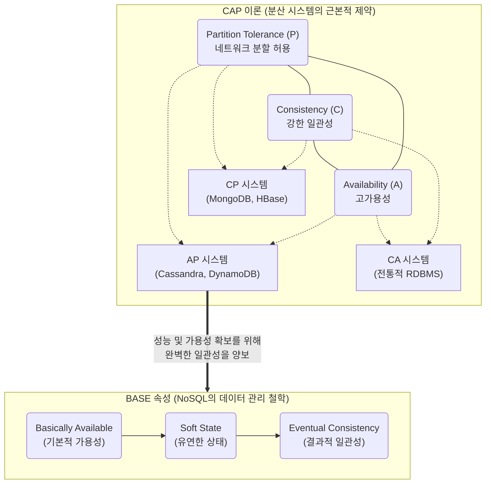

# NoSQL (CAP 이론, BASE 속성)

---

## I. 대규모 분산 데이터 처리, NoSQL의 개요

* **정의**: 비정형 데이터의 대규모 처리와 수평적 확장성(Scale-out) 확보를 위해 유연한 [[스키마]] 구조를 가지며, 전통적인 RDBMS의 [[트랜잭션]](ACID) 제약을 탈피한 비관계형 [[데이터베이스]]
* **등장배경**: [[클라우드 컴퓨팅]] 및 빅데이터 환경 도래에 따른 대용량 트래픽 처리 한계 노출, 강한 일관성(Consistency)보다 [[HA(High Availability)|고가용성]](Availability)과 성능을 중시하는 아키텍처 요구 증대
* **핵심 철학**: CAP 이론(3가지 속성 중 2가지만 동시 만족) 기반의 트레이드오프 설계, BASE 속성(결과적 일관성)을 통한 가용성 및 성능 극대화

---

## II. NoSQL의 핵심 이론(CAP) 및 동작 속성(BASE)

### 가. CAP 이론과 BASE 속성의 상관관계 개념도

* 분산 환경에서는 네트워크 분할(P)이 필수 불가결하므로 실제로는 CP 또는 AP 구조를 선택하게 됨
* AP 시스템은 트랜잭션의 엄격함을 완화하여 시스템 가용성과 확장성을 극대화하는 BASE 원칙을 수용함

### 나. CAP 및 BASE 주요 핵심 속성

| 분류 | 핵심 속성 (키워드) | 세부 설명 |
| --- | --- | --- |
| **CAP** | **C**onsistency (일관성) | 분산된 모든 노드에서 클라이언트가 동시에 동일한 데이터를 조회할 수 있는 단일 뷰 제공 |
| **CAP** | **A**vailability (가용성) | 일부 노드에 장애가 발생하더라도 모든 클라이언트의 읽기/쓰기 요청에 대해 정상 응답 보장 |
| **CAP** | **P**artition Tolerance (분할 허용성) | 노드 간 네트워크 단절이나 메시지 유실 등 통신 장애 상황에서도 시스템 전체는 정상 동작함 |
| **BASE** | **B**asically **A**vailable (기본 가용성) | 분산 시스템의 다수 노드 중 일부 장애 발생 시에도 전체 시스템은 언제든지 응답이 가능함 |
| **BASE** | **S**oft State (상태 유연성) | 노드의 상태는 외부 입력 없이 자율적으로 갱신될 수 있으며, 항상 정확한 상태 유지를 요구하지 않음 |
| **BASE** | **E**ventual Consistency (결과적 일관성) | 즉각적인 일관성은 보장하지 못하더라도, 일정 시간이 경과하면 모든 노드의 데이터가 최신으로 동기화됨 |
| **분류** | **Key-Value / Document** | Redis, DynamoDB (K-V, 초고속 캐싱) / MongoDB, Couchbase ([[JSON]] 문서 형태 저장) |
| **분류** | **Column / Graph** | Cassandra, HBase (대용량 쓰기 및 컬럼 패밀리) / Neo4j (노드와 엣지 관계 기반 소셜 네트워크 분석) |

---

## III. RDBMS와 NoSQL 비교 및 최신 발전 동향

### 가. RDBMS(ACID)와 NoSQL(BASE) 비교

| 비교 항목 | RDBMS (Relational DB) | NoSQL (Non-Relational DB) |
| --- | --- | --- |
| **트랜잭션 철학** | **ACID** (원자성, 일관성, 고립성, 영속성) | **BASE** (기본 가용성, 유연한 상태, 결과적 일관성) |
| **데이터 스키마** | 고정 스키마 (Schema-on-Write), 정형 데이터 | 유연한 스키마 (Schema-on-Read), 비정형/반정형 |
| **확장 방식** | 수직적 확장 (Scale-Up 위주) | 수평적 확장 (Scale-Out 위주) |
| **CAP 지원** | CA (단일 노드 강한 일관성 및 가용성 보장) | CP 또는 AP (네트워크 분할 상황에서 하나를 선택) |
| **주요 활용 분야** | 금융, ERP 등 데이터 정합성이 필수적인 시스템 | SNS, IoT 로그, 실시간 추천 등 대규모 데이터 처리 |

### 나. CAP 이론의 한계 보완 및 NoSQL 발전 동향

* **[[PACELC]] 이론 등장**: CAP 이론은 '네트워크 분할(P)' 상황 시의 제약만 설명하는 한계 존재. 정상 상태(E, Else)일 때 지연시간(Latency)과 일관성(Consistency) 간의 트레이드오프를 추가 고려하는 PACELC 아키텍처로 진화
* **[[New SQL|NewSQL]]로의 패러다임 변화**: NoSQL의 확장성(Scale-Out)과 RDBMS의 강한 일관성(ACID) 트랜잭션 보장 능력을 동시에 만족시키는 Spanner, [[CockroachDB]] 등 차세대 분산 관계형 데이터베이스(NewSQL) 도입 가속화
* **Multi-Model DB 확산**: 단일 엔진에서 Key-Value, Document, Graph 등 다양한 NoSQL 모델과 관계형 쿼리([[SQL(Structured Query Language)|SQL]])를 동시 지원하는 통합 아키텍처 구축 트렌드 확산

---

### 🔗 연관 토픽

- **소속 도메인**: [[00_데이터베이스_MOC|🗄️ 데이터베이스]]
- **세부 분류**: `1. 데이터 모델링 & 관계형 DB 설계`
- **핵심 연관 토픽**:
  - [[데이터베이스]]
  - [[스키마]]
  - [[트랜잭션]]
  - [[New SQL]]
  - [[CockroachDB|CockroachDB(코크로치DB)]]
