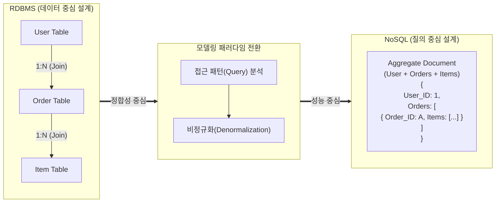

# NoSQL 데이터모델링 패턴

---

## I. 애플리케이션 질의 중심 데이터 설계, NoSQL 데이터모델링의 개요

### 가. NoSQL 데이터모델링의 정의

* 관계형 데이터베이스의 정합성(정규화) 위주 설계와 달리, 애플리케이션의 **데이터 접근 패턴(Query Pattern)** 과 **확장성**을 최우선으로 고려하여 데이터를 구조화하는 기법
* 복잡한 [[조인|조인(Join)]] 연산을 회피하고, 읽기/쓰기 성능을 극대화하기 위해 비정규화(Denormalization) 및 애그리게이트(Aggregate) 단위로 데이터를 설계하는 방법론

### 나. NoSQL 데이터모델링의 필요성 및 특징

* **Query-Driven Design**: 저장 구조가 아닌 애플리케이션의 질의(Query) 형태를 기반으로 [[스키마]] 설계
* **비정규화(Denormalization) 기반 성능 최적화**: 중복 데이터를 허용하여 I/O 성능 극대화 및 응답 지연 시간(Latency) 최소화
* **유연한 스키마(Schema-less)**: 비정형 데이터 수용 및 비즈니스 요구사항 변화에 따른 신속한 데이터 구조 변경(Agility) 지원

---

## II. NoSQL 데이터모델링 패턴 개념도 및 핵심 기법

### 가. NoSQL 데이터모델링의 개념도 및 원리

* RDBMS의 [[엔티티]] 간 조인(Join) 구조를 애플리케이션 쿼리 패턴에 맞춰 하나의 애그리게이트(Document 등)로 병합(Embedding)하여 읽기 성능을 최적화함

### 나. NoSQL 데이터모델링 핵심 패턴

| 분류 | 모델링 패턴(키워드) | 세부 설명 |
| --- | --- | --- |
| **기본 구조** | **비정규화 (Denormalization)** | 조회 횟수와 I/O 감소를 위해 의도적으로 데이터를 중복 저장하여 읽기 성능 극대화 |
| **기본 구조** | **애그리게이트 (Aggregate)** | 연관된 개체(Entity)들을 묶어 단일 구조([[JSON]] Document, Column Family 등)로 관리 |
| **관계 표현** | **애플리케이션 조인 (App-Side Join)** | DB 차원의 조인을 배제하고, 애플리케이션 계층에서 다중 질의(Multi-Query)를 통해 데이터 병합 |
| **접근 최적화** | **구체화된 뷰 (Materialized View)** | 잦은 집계/검색 결과를 미리 계산(Pre-computing)하여 별도 테이블에 저장해 질의 성능 향상 |
| **인덱싱** | **인덱스 테이블 ([[RDBMS 인덱스(index)|Index]] Table)** | 보조 인덱스(Secondary Index)를 지원하지 않는 DB에서 검색 키 룩업(Look-up)용 맵핑 테이블 생성 |
| **구조화** | **트리 집계 (Tree Aggregation)** | 계층형 데이터(Tree) 구조를 Materialized Path나 Nested Set 등 배열 형태로 구성하여 경로 탐색 |
| **식별자** | **복합 키 (Composite Key)** | [[파티셔닝]](Partitioning) 라우팅 및 정렬(Sort) 기준을 충족하기 위해 여러 필드를 조합하여 키 생성 |
| **최신 설계** | **싱글 테이블 (Single Table Design)** | 이기종 엔티티를 하나의 테이블에 저장하고 복합 키로 필터링하여 처리 (DynamoDB 권장 패턴) |

---

## III. RDBMS vs NoSQL 데이터모델링 절차 비교 및 최신 동향

### 가. RDBMS와 NoSQL 모델링 절차 비교

| 구분 | RDBMS 모델링 (Data-Driven) | [[NoSQL (CAP 이론 BASE 속성)|NoSQL]] 모델링 (Query-Driven) |
| --- | --- | --- |
| **1단계 (도메인 분석)** | 요구사항 분석 및 엔티티 도출 | 도메인 모델 파악 및 애플리케이션 기능 정의 |
| **2단계 (논리 모델링)** | 개념적/논리적 ERD 작성 (정규화) | **질의/접근 패턴(Access Pattern) 매핑** |
| **3단계 (물리 모델링)** | 테이블 생성, 인덱스 설계 | **데이터 모델 설계 (비정규화, 복합 키, 집계)** |
| **4단계 (최적화)** | 성능 향상을 위한 역정규화(제한적) | 하드웨어 기반 파티셔닝, [[샤딩]] 전략 수립 (물리 최적화) |
| **중요 기준** | [[무결성]](Integrity), 중복 최소화 | 성능(Performance), 확장성(Scalability) |

### 나. NoSQL 모델링의 최신 트렌드 및 시사점

* **Multi-Model DB로의 진화**: 단일 [[데이터베이스]] 엔진 내에서 Document, Graph, Key-Value 모델링을 동시 지원하여 복잡한 비즈니스 요건을 수용 (예: ArangoDB, Cosmos DB)
* **Vector Search 통합 모델링**: AI 및 [[초거대 언어 모델|LLM]](대형 언어 모델)의 부상으로 NoSQL 스키마 내에 고차원 벡터(Vector) 임베딩 데이터를 함께 저장하고 [[유사도]] 검색(KNN)을 지원하는 패턴 확산 (예: MongoDB Atlas)
* **강력한 일관성(Strong Consistency) 옵션 제공**: BASE 속성을 극복하고 금융 등 엔터프라이즈 환경 적용을 위해, 튜닝 가능한 일관성(Tunable Consistency) 모델을 설계에 반영하는 추세

---

### 🔗 연관 토픽

- **소속 도메인**: [[00_데이터베이스_MOC|🗄️ 데이터베이스]]
- **세부 분류**: `1. 데이터 모델링 & 관계형 DB 설계`
- **핵심 연관 토픽**:
  - [[데이터베이스]]
  - [[스키마]]
  - [[NoSQL (CAP 이론 BASE 속성)]]
  - [[엔티티|엔티티(Entity)]]
  - [[조인|조인(Join)]]
