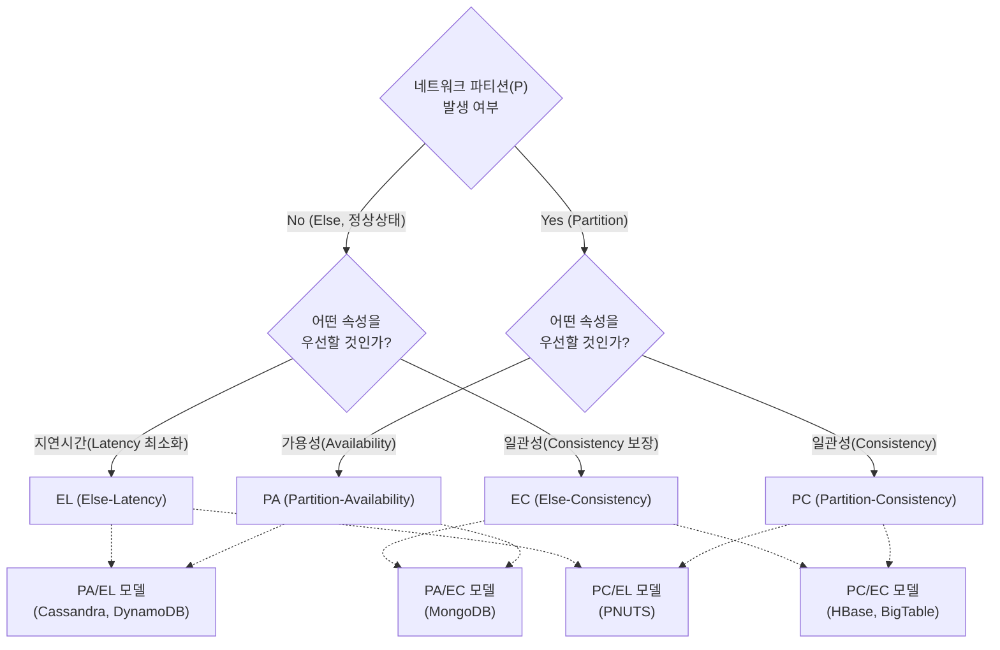

# NoSQL 품질속성 PACELC

---

## I. CAP 이론의 한계 극복, PACELC 모델의 개요

### 가. PACELC 모델의 정의

* [[분산 데이터베이스]] 환경에서 네트워크 단절(Partition) 시의 [[HA(High Availability)|가용성]](A)/일관성(C) 선택뿐만 아니라, 정상 상태(Else)에서의 지연시간(L)/일관성(C) 간의 트레이드오프(Trade-off)를 정의한 아키텍처 평가 모델
* 예일대 다니엘 아바디(Daniel Abadi) 교수가 CAP 이론의 불완전성을 보완하기 위해 제안한 [[NoSQL (CAP 이론 BASE 속성)|NoSQL]] [[데이터베이스]] 성능 및 품질 속성 기준

### 나. PACELC 모델의 등장 배경 및 필요성

* **CAP 이론의 한계**: 실제 클라우드 분산 환경에서 네트워크 [[파티셔닝|파티션]](P)은 드물게 발생하나, CAP 이론은 파티션 상황에서의 동작만 설명함
* **정상 상태 성능 평가 기준 부재**: 네트워크가 정상(Else)일 때 일관성 동기화로 인한 응답 지연(Latency) 문제 설명 필요
* **글로벌 스케일 설계 지침**: 다중 리전(Multi-Region) 환경에서 사용자 경험(빠른 응답)과 데이터 정합성 간의 아키텍처 결정 기준 요구

---

## II. PACELC 모델의 개념도 및 핵심 아키텍처 속성

### 가. PACELC 모델의 개념도 및 동작 원리

* 네트워크 분할(P) 시 A와 C 중 하나를 선택하고, 분할되지 않은 평상시(E)에는 L과 C 중 하나를 우선순위로 선택하여 전체 분산 시스템의 아키텍처를 결정

### 나. PACELC 모델의 핵심 구성 요소 및 분류

| 분류 | 요소기술(키워드) | 세부 설명 |
| --- | --- | --- |
| **P 상황 속성** | **P (Partition)** | 클러스터 내 노드 간 통신 단절(네트워크 파티션) 상태 |
| **P 상황 속성** | **A (Availability)** | P 상황 시 일관성이 깨지더라도 즉각적인 응답(가용성)을 보장 |
| **P 상황 속성** | **C (Consistency)** | P 상황 시 데이터 정합성을 위해 일시적으로 응답 불가 상태 허용 |
| **E 상황 속성** | **E (Else)** | 네트워크 장애가 없는 정상적인 시스템 운영 상태 |
| **E 상황 속성** | **L (Latency)** | E 상황 시 빠른 응답(저지연)을 위해 비동기식 복제 적용 (성능 우선) |
| **E 상황 속성** | **C (Consistency)** | E 상황 시 데이터 정합성을 위해 동기식 복제 적용 (정합성 우선) |
| **아키텍처 모델** | **PA/EL 모델** | P 시 가용성 보장, E 시 저지연 보장 (예: DynamoDB, Cassandra) |
| **아키텍처 모델** | **PC/EC 모델** | P와 E 상황 모두 완벽한 데이터 일관성 최우선 보장 (예: HBase, BigTable) |
| **아키텍처 모델** | **PA/EC 모델** | P 시 가용성 보장, E 시 일관성 최우선 보장 (예: MongoDB) |

---

## III. CAP vs PACELC 비교 및 최신 동향

### 가. 분산 시스템 품질속성 CAP과 PACELC 비교

| 비교 항목 | CAP 이론 | [[PACELC]] 모델 |
| --- | --- | --- |
| **평가 관점** | 장애 상황(네트워크 단절) 국한 | 장애 상황(P) + 정상 상황(E) 통합 고려 |
| **선택 기준** | 파티션 발생 시 A와 C 중 택 1 | 파티션 시 A vs C / 정상 시 L vs C |
| **성능(응답) 속성** | 가용성(A)으로만 표현됨 | 정상 시의 지연시간(Latency) 개념 구체화 |
| **NoSQL 분류력** | CP, AP, CA (분류 한계 존재) | PA/EL, PC/EC, PA/EC, PC/EL (정밀한 분류) |

### 나. PACELC 기반 NoSQL 트렌드 및 시사점

* **튜너블 컨시스턴시(Tunable Consistency)**: 애플리케이션 요구사항에 따라 L(Latency)과 C(Consistency)의 강도를 동적으로 조절할 수 있는 유연한 설정 지원 (예: Azure Cosmos DB의 [[PMBOK 프로세스 그룹 (5단계)|5단계]] 일관성 수준 제공)
* **[[New SQL|NewSQL]]의 부상**: PACELC의 한계를 극복하고 글로벌 스케일에서 완벽한 일관성(C)과 지연시간(L) 최소화를 동시에 달성하기 위해 원자시계(TrueTime) 등을 활용한 Google Spanner 중심의 NewSQL 확산
* **멀티 리전 Active-Active 아키텍처 고려**: [[클라우드 네이티브]] 환경 설계 시 PACELC 지표를 기준으로 비즈니스 크리티컬리티(결제=PC/EC, 로그/추천=PA/EL)에 따른 적정 NoSQL 엔진 도입 및 분산 아키텍처 설계 필수

---

### 🔗 연관 토픽

- **소속 도메인**: [[00_데이터베이스_MOC|🗄️ 데이터베이스]]
- **세부 분류**: `5. 분산 데이터베이스 & NoSQL & 대용량`
- **핵심 연관 토픽**:
  - [[데이터베이스]]
  - [[NoSQL (CAP 이론 BASE 속성)]]
  - [[파티셔닝|파티션]]
  - [[New SQL]]
  - [[분산 데이터베이스|분산 데이터베이스 (Distributed Database)]]
