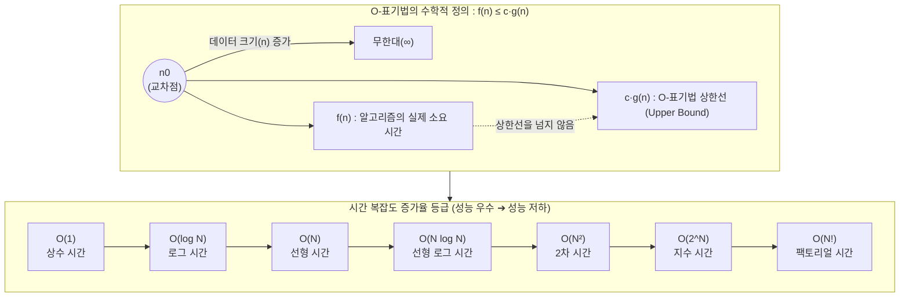

# O-Notation (O-표기법)

---

## I. 알고리즘 성능 평가의 핵심 기준, O-표기법의 개요

### 가. O-표기법(Big-O Notation)의 정의

* 입력 데이터 크기($n$)가 무한대로 커질 때, 알고리즘의 실행 시간이나 메모리 사용량의 증가율을 최고차항 중심으로 표현한 점근적 표기법(Asymptotic Notation)
* 수학적으로 $n \ge n_0$인 모든 $n$에 대하여 $f(n) \le c \cdot g(n)$을 만족하는 양의 상수 $c$와 $n_0$가 존재할 때, $O(g(n))$으로 표기하며 알고리즘의 **최악의 경우(Worst-Case) 성능 상한선(Upper Bound)** 을 나타냄

### 나. O-표기법의 필요성 및 특징

* **하드웨어 독립성**: 하드웨어 성능이나 프로그래밍 언어에 의존하지 않고 [[알고리즘]] 자체의 효율성 평가 가능
* **확장성 예측**: 데이터 증가에 따른 성능 저하율을 직관적으로 파악하여 병목 지점 예측
* **단순화([[추상화]])**: 영향력이 적은 상수항과 낮은 차수의 항을 무시하고(예: $O(3n^2 + 2n) \rightarrow O(n^2)$) 지배적인 최고차항만 표기

---

## II. O-표기법의 개념도 및 핵심 기술 요소

### 가. O-표기법의 개념도 및 동작 원리

* 특정 시점($n_0$) 이후부터 실제 실행 시간 $f(n)$은 항상 예측 상한선 $c \cdot g(n)$ 아래에 존재함
* 데이터 처리량이 방대해질수록 알고리즘의 시간 복잡도 등급(Class)이 시스템 전체 성능을 지배함

### 나. O-표기법의 주요 분류 및 연산 법칙 (핵심 요소)

| 분류 | 등급 / 법칙 (키워드) | 세부 설명 |
| --- | --- | --- |
| **시간 복잡도** | **O(1)** (Constant) | 입력 크기와 무관하게 일정한 실행 시간 보장 (예: [[해시 테이블]] 조회, 배열 인덱스 접근) |
| **시간 복잡도** | **O(log N)** (Logarithmic) | 실행 시간이 입력 크기의 로그에 비례하여 증가, 매우 효율적 (예: 이진 탐색, B-Tree 검색) |
| **시간 복잡도** | **O(N)** (Linear) | 입력 크기에 정비례하여 실행 시간 증가 (예: 1차원 배열 순차 탐색, 연결 리스트 순회) |
| **시간 복잡도** | **O(N log N)** (Linearithmic) | 선형 로그 시간, 범용 정렬 알고리즘의 한계치 (예: [[병합 정렬]], [[퀵 정렬]], 힙 정렬) |
| **시간 복잡도** | **O(N²)** (Quadratic) | 이중 반복문 구조, 데이터 증가 시 급격한 성능 저하 발생 (예: [[버블 정렬]], 선택 정렬) |
| **연산 법칙** | **상수 제거 법칙** | $O(c \cdot f(n)) = O(f(n))$, 최고차항의 계수는 성능 증가율에 미치는 영향이 적어 생략함 |
| **연산 법칙** | **합의 법칙** | $O(f(n) + g(n)) = O(\max(f(n), g(n)))$, 순차적인 구문은 가장 높은 복잡도를 채택 |
| **연산 법칙** | **곱의 법칙** | $O(f(n) \cdot g(n))$, 중첩된 반복문이나 재귀 호출 시 복잡도를 곱셈 처리하여 산출 |

---

## III. 점근적 표기법 간 비교 및 최신 동향

### 가. 점근적 표기법(Asymptotic Notations) 3요소 비교

|**구분**|**빅오 (Big-O)**|**빅오메가 (Big-Ω)**|**빅세타 (Big-Θ)**|
|---|---|---|---|
|**표기 기호**|$O(n)$|$\Omega(n)$|$\Theta(n)$|
|**수학적 의미**|상한선 (Upper Bound)      $f(n) \le c \cdot g(n)$|하한선 (Lower Bound)      $f(n) \ge c \cdot g(n)$|임계선 (Tight Bound)      상한선과 하한선을 동시 만족|
|**알고리즘 관점**|**최악의 경우 (Worst-case)**|**최선의 경우 (Best-case)**|**평균의 경우 (Average-case)**|
|**활용 목적**|시스템 장애 예방 및 최소 성능 한계선 보장 (가장 널리 쓰임)|운이 좋을 때의 최소 소요 시간 (실용성 낮음)|알고리즘의 가장 정확하고 평균적인 성능 예측|

### 나. 최신 기술 동향 관점에서의 O-표기법 시사점

* **AI/[[초거대 언어 모델|LLM]] 최적화 한계 극복**: 최근 [[트랜스포머|트랜스포머(Transformer)]] 모델의 Self-Attention 메커니즘은 시퀀스 길이($N$)에 대해 $O(N^2)$의 시간/공간 복잡도를 가짐. 이를 $O(N \log N)$ 또는 $O(N)$으로 낮추기 위한 Linear Attention, Mamba(SSM 모델) 등의 최신 알고리즘 연구가 활발히 진행 중.
* **Space-Time Trade-off**: 클라우드 인프라 자원이 풍부해짐에 따라, 시간 복잡도를 낮추기 위해 메모리 공간(공간 복잡도)을 적극적으로 희생하는 인메모리(In-Memory) 캐싱, Redis 기반 $O(1)$ 룩업 설계가 현대 엔터프라이즈 아키텍처의 핵심 패턴으로 자리 잡음.

---

### 🔗 연관 토픽

- **소속 도메인**: [[00_컴퓨터구조_MOC|💻 컴퓨터구조]]
- **세부 분류**: `2. 캐시 & 메모리 계층 구조 · 스토리지`
- **핵심 연관 토픽**:
  - [[퀵 정렬|퀵 정렬 (Quick Sort)]]
  - [[해시 테이블]]
  - [[알고리즘]]
  - [[병합 정렬|병합 정렬 (Merge Sort)]]
  - [[버블 정렬|버블 정렬 (Bubble Sort)]]
