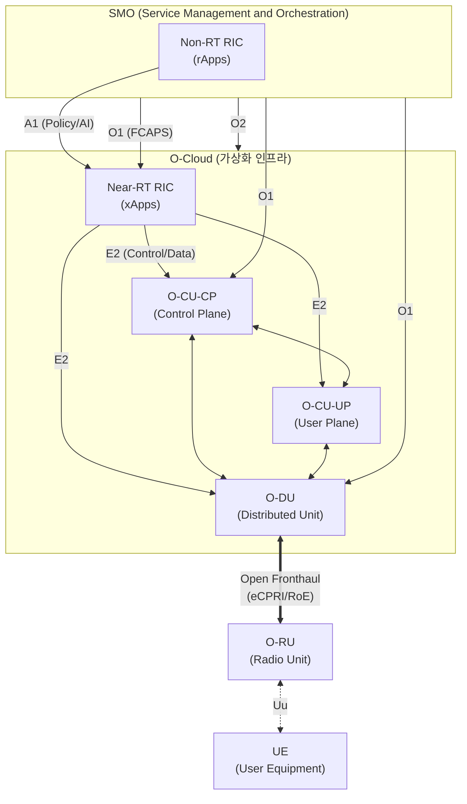

# O-RAN (Open Radio Access Network)

---

## I. 개방형 무선 접속망, O-RAN의 개요

### 가. O-RAN의 정의

* 5G/6G 이동통신에서 특정 장비 제조사에 종속되지 않도록 개방형 표준 인터페이스를 적용하여, 기지국 하드웨어와 소프트웨어를 분리하고 지능화(AI/ML)를 지원하는 차세대 무선 접속망 아키텍처

### 나. O-RAN의 등장배경 및 핵심 특징

* **등장배경**: 기존 통신 장비의 벤더 종속성(Vendor Lock-in) 탈피, 상용 하드웨어(COTS) 활용을 통한 통신망 구축 및 운영 비용(CAPEX/OPEX) 절감 요구 증대
* **핵심 특징**:
* **개방화(Openness)**: O-RU와 O-DU 간 Open Fronthaul 등 표준 인터페이스 적용
* **[[가상화]](Virtualization)**: vRAN/Cloud RAN 기반의 유연한 인프라(O-Cloud) 구성
* **지능화(Intelligence)**: RIC(RAN Intelligent Controller)를 통한 무선망 자율 제어 및 AI/ML 최적화

---

## II. O-RAN의 개념도 및 핵심 기술 요소

### 가. O-RAN의 개념도 및 동작 원리

* 기존 기지국 기능을 O-CU, O-DU, O-RU로 분할하고 개방형 인터페이스(A1, E2, O1 등)로 상호 연결함
* SMO 내의 Non-RT RIC와 O-Cloud의 Near-RT RIC가 결합하여 AI/ML 기반 무선 자원 지능화 제어(xApp/rApp) 수행

### 나. O-RAN의 핵심 기술 및 구성 요소

| 분류 | 요소기술(키워드) | 세부 설명 |
| --- | --- | --- |
| **무선망 개체** | **O-RU** (Open Radio Unit) | 기지국의 하위 물리계층(Lower PHY) 및 RF 신호 처리, 안테나 송수신 기능 수행 |
| **무선망 개체** | **O-DU** (Open Distributed Unit) | RLC, [[MAC]], 상위 물리계층(High PHY) 기능 수행 및 O-RU와 패킷 데이터 송수신 |
| **무선망 개체** | **O-CU** (Open Centralized Unit) | RRC, SDAP, PDCP 계층 처리 및 트래픽 특성에 따라 CP(제어부)와 UP(사용자부)로 분리 운영 |
| **지능화 제어부** | **RIC** (RAN Intelligent Controller) | 무선 [[자원 최적화]] 및 자동화를 위한 AI/ML 기반 [[SDN(Software Defined Network)|SDN]] 컨트롤러 (Near-RT 및 Non-RT로 구분) |
| **오케스트레이션** | **SMO** | 전체 O-RAN 도메인의 FCAPS(장애, 과금, 성능, 보안 관리) 및 [[프로비저닝]] 수행 관리 플랫폼 |
| **애플리케이션** | **xApp / rApp** | Near-RT RIC에서 1초 미만 제어를 수행하는 앱(xApp), SMO에서 비실시간 AI 모델링을 수행하는 앱(rApp) |
| **표준 인터페이스** | **Open Fronthaul** | O-DU와 O-RU를 연결하는 개방형 표준 인터페이스 (Option 7-2x Split 아키텍처 및 eCPRI 적용) |
| **표준 인터페이스** | **A1 / E2 인터페이스** | Non-RT RIC의 정책을 전달하는 A1 인터페이스, Near-RT RIC가 기지국을 제어 및 모니터링하는 E2 인터페이스 |

---

## III. O-RAN과 Traditional RAN 비교 및 향후 전망

### 가. 전통적 접속망(Traditional RAN)과 O-RAN 비교

| 비교 항목 | Traditional RAN (기존 망) | O-RAN (개방형 접속망) |
| --- | --- | --- |
| **아키텍처 구조** | 통합형 (BBU + RRU 구조) | 기능 분할 및 가상화 (O-CU + O-DU + O-RU) |
| **장비 생태계** | 단일 벤더 독점 (Vendor Lock-in) | 다기종 벤더 상호운용성 보장 (Multi-Vendor) |
| **인터페이스** | 폐쇄형 인터페이스 (독자적 CPRI) | 개방형 표준 인터페이스 (O-RAN Open Fronthaul) |
| **하드웨어 환경** | 통신사 전용 고가 하드웨어 | 범용 서버(COTS) 및 화이트박스 하드웨어 활용 |
| **망 지능화** | 제한적, 정적 Rule 기반 최적화 | 개방형 API 및 RIC(AI/ML) 기반 동적 최적화 제어 |

### 나. O-RAN의 최신 기술 동향 및 향후 과제

* **Private 5G 및 특화망 도입 가속**: 기업 맞춤형 망 구축 비용 절감과 유연성 확보를 위해 B2B 특화망(이음5G)을 중심으로 O-RAN 생태계 확산 중
* **제로 트러스트 기반 보안 강화**: 다양한 벤더의 장비 혼용 및 오픈소스 API 활용에 따른 보안 취약점(Surface Area 증가)을 해결하기 위해 O-RAN Alliance 주도의 [[제로 트러스트 보안모델|Zero Trust]] Architecture(ZTA) 적용 및 인증 체계 표준화 활발

---

### 🔗 연관 토픽

- **소속 도메인**: [[00_네트워크_MOC|🌐 네트워크]]
- **세부 분류**: `4. 무선 및 차세대 이동통신 (5G/6G/Wi-Fi)`
- **핵심 연관 토픽**:
  - [[SDR (Software Defined Radio)]]
  - [[C-RAN(Centralized Cloud RAN)|C-RAN(Centralized / Cloud RAN)]]
  - [[SDN(Software Defined Network)]]
  - [[RAN(Radio Access Network) Sharing]]
  - [[가상화]]
