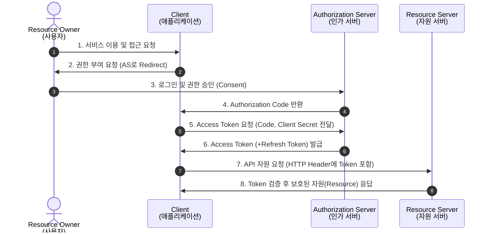

# OAuth(Open Authorize) 2.0

---

## I. 안전한 자원 접근 위임, OAuth 2.0의 개요

### 가. OAuth 2.0의 정의

* 사용자의 계정 정보(비밀번호 등)를 서비스에 노출하지 않고, 서드파티 애플리케이션(Client)이 사용자를 대신하여 자원(Resource)에 접근할 수 있도록 인가(Authorization)를 위임하는 개방형 표준 [[프로토콜]]
* RFC 6749 표준으로 정의되며, 웹, 모바일, 데스크톱 등 다양한 클라이언트 환경을 지원하기 위해 4가지 권한 부여 방식(Grant Type)을 제공하는 보안 [[프레임워크]]

### 나. OAuth 2.0의 필요성 및 주요 특징

* **보안성 강화**: 패스워드 직접 공유 방식(Anti-Pattern) 배제, Access Token 기반의 제한적 접근 권한 제어
* **유연한 확장성**: HTTP/HTTPS 기반의 RESTful API 아키텍처에 최적화, 다양한 디바이스 및 토큰 생명주기(Refresh Token) 관리 지원
* **표준화된 위임**: 서비스 간 연동(API Mashup) 시 사용자 동의(Consent) 기반의 투명하고 안전한 권한 위임

---

## II. OAuth 2.0의 개념도 및 핵심 기술 요소

### 가. OAuth 2.0의 동작 원리 (Authorization Code Grant Type 기준)

* 서드파티 앱(Client)은 브라우저를 통해 인가 코드를 먼저 발급받고, 백엔드 통신을 통해 안전하게 Access Token을 교환하여 최종 자원에 접근함

### 나. OAuth 2.0의 핵심 기술 및 구성 요소

| 분류 | 요소기술(키워드) | 세부 설명 |
| --- | --- | --- |
| **주체 (Roles)** | **Resource Owner** | 보호된 자원에 대한 접근 권한을 부여할 수 있는 주체 (일반 사용자) |
| **주체 (Roles)** | **Client** | 사용자를 대신하여 보호된 자원(API)에 접근을 요청하는 서드파티 애플리케이션 |
| **서버 구성** | **Authorization Server** | 사용자를 인증하고 접근 권한을 확인한 후 Access Token을 발급하는 인가 서버 |
| **서버 구성** | **Resource Server** | Access Token을 검증하고 사용자의 보호된 자원(데이터)을 제공하는 API 서버 |
| **토큰 (Tokens)** | **Access Token** | 자원에 접근할 수 있는 제한된 권한(Scope, 수명)을 담고 있는 자격 증명 (주로 JWT 활용) |
| **토큰 (Tokens)** | **Refresh Token** | Access Token 만료 시 사용자 개입 없이 새로운 Access Token을 갱신하기 위한 토큰 |
| **접근 제어** | **Scope** | Client가 접근할 수 있는 자원의 범위와 권한 수준을 정의 (예: read, write, profile) |
| **권한 부여** | **Authorization Code** | 토큰의 탈취 위험을 방지하기 위해 프론트엔드-백엔드 간 전달되는 임시 인증 코드 |

---

## III. OAuth 2.0과 OIDC(OpenID Connect) 비교 및 최신 보안 동향

### 가. OAuth 2.0과 OIDC 비교 (인가 vs 인증)

| 비교 항목 | OAuth 2.0 | OIDC (OpenID Connect) |
| --- | --- | --- |
| **핵심 목적** | **인가 (Authorization, 권한 위임)** | **인증 (Authentication, 신원 확인)** |
| **발급 토큰** | Access Token | **ID Token (JWT 형태)** + Access Token |
| **데이터 전달** | 자원에 대한 접근 권한 (Scope) | 사용자의 식별 정보 (Profile, Email 등) |
| **표준 계층** | 권한 위임 프레임워크 (단독 동작) | OAuth 2.0 프로토콜 위에서 동작하는 인증 계층 |

### 나. OAuth 2.0 최신 보안 동향 및 향후 전망 (OAuth 2.1)

* **PKCE(Proof Key for Code Exchange) 의무화**: 인가 코드 가로채기 공격(Authorization Code Interception Attack)을 방지하기 위해 모바일 앱뿐만 아니라 모든 클라이언트 환경에서 PKCE 사용 필수화
* **취약한 Grant Type 폐지**: 보안 위험이 높은 Implicit Grant(암묵적 부여)와 Resource Owner Password Credentials Grant(비밀번호 자격 증명) 방식을 OAuth 2.1 표준 권고안에서 전면 폐지(Deprecated)
* **API 보안 규격 강화(FAPI)**: [[마이데이터]](MyData) 및 오픈뱅킹 확산에 따라 상호 인증(mTLS), 메세지 서명 등을 결합하여 보안을 극대화한 금융 등급 API(Financial-grade API) 보안 프로파일 적용이 표준화되는 추세임

---

### 🔗 연관 토픽

- **소속 도메인**: [[00_보안_MOC|🛡️ 보안]]
- **세부 분류**: `6. 개인정보보호 & 프라이버시 강화 기술`
- **핵심 연관 토픽**:
  - [[마이데이터]]
  - [[프레임워크]]
  - [[프로토콜]]
  - [[개인정보보호법]]
  - [[IEC 62443]]
