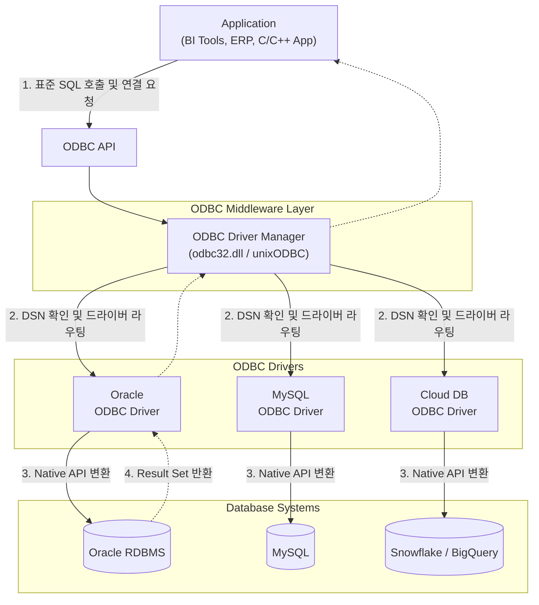

# Open Database Connectivity (ODBC)

---

## I. 이기종 DB 상호운용성 보장, ODBC의 개요

* **정의**: 애플리케이션이 [[데이터베이스]] 관리 시스템([[DBMS]])의 종류에 관계없이 일관된 방식으로 데이터에 접근할 수 있도록 마이크로소프트가 개발한 개방형 표준 데이터베이스 API
* **등장배경**: 클라이언트-서버 환경에서 이기종 DBMS(Oracle, MySQL, [[SQL(Structured Query Language)|SQL]] Server 등) 연동 시 발생하는 벤더 종속성(Vendor Lock-in) 문제 해결 및 코드 재사용성 확보 필요
* **특징**: 드라이버 기반 아키텍처(플러그인 형태), SQL Access Group의 CLI(Call Level Interface) 표준 준수, DBMS 독립성 및 상호운용성 제공

---

## II. ODBC의 아키텍처 및 핵심 구성요소

### 가. ODBC의 아키텍처 및 동작 원리

* 애플리케이션은 특정 DBMS를 알 필요 없이 ODBC API만 호출하며, Driver Manager가 DSN(Data Source Name)을 참조하여 적절한 Driver를 통해 질의(SQL)를 Native DB 언어로 변환하여 처리함

### 나. ODBC의 핵심 구성 요소 및 기술

| 분류 | 요소기술(키워드) | 세부 설명 |
| --- | --- | --- |
| **핵심 계층** | **ODBC API** | 애플리케이션과 드라이버 관리자 간의 통신을 위한 표준 C 언어 함수 집합 |
| **핵심 계층** | **Driver Manager** | 애플리케이션의 연결 요청(DSN)을 분석하여 적합한 DB 드라이버를 로드/언로드 및 동적 라우팅 수행 |
| **핵심 계층** | **ODBC Driver** | ODBC 표준 API 호출을 특정 DBMS가 이해할 수 있는 고유 [[프로토콜]](Native API)로 변환하는 어댑터 역할 |
| **연결 설정** | **DSN (Data Source Name)** | DB 연결에 필요한 서버 주소, 포트, 인증 정보(ID/PW), 드라이버 위치 등을 저장한 논리적 식별자 구조 |
| **실행 기반** | **SQL CLI** | Call Level Interface 기반으로, 컴파일 시점이 아닌 런타임에 동적으로 SQL 구문을 실행([[Dynamic SQL (동적 SQL)|Dynamic SQL]]) |
| **처리 구조** | **Statement Handle** | SQL 쿼리 실행, 파라미터 바인딩, [[트랜잭션]] 제어를 관리하는 객체 |
| **결과 반환** | **Result Set (Cursor)** | DB로부터 반환된 결과 행(Row) 집합을 저장하고, 애플리케이션이 순회하며 읽을 수 있도록 지원 |
| **플랫폼 확장** | **unixODBC / iODBC** | 윈도우 환경을 넘어 Linux, UNIX, macOS 등 오픈소스 OS 환경에서도 ODBC를 사용할 수 있게 하는 [[프레임워크]] |

---

## III. 데이터베이스 연동 기술 비교 및 향후 전망

### 가. ODBC, JDBC, OLE DB 기술 비교

| 비교 항목 | ODBC (Open Database Connectivity) | [[JDBC]] (Java Database Connectivity) | OLE DB (Object Linking & Embedding DB) |
| --- | --- | --- | --- |
| **기반 언어** | C / C++ 기반 | Java 기반 | COM (C++ 기반 [[객체지향]]) |
| **플랫폼 종속성** | OS 의존적 (Driver에 따라 다름) | OS 독립적 (JVM 환경에서 동작) | Windows 플랫폼 종속적 |
| **주요 대상** | 관계형 데이터베이스 (RDBMS) | 관계형 데이터베이스 (RDBMS) | RDBMS 및 비정형 데이터(Excel, 메일 등) 포괄 |
| **활용 생태계** | BI 도구, 레거시 시스템, 네이티브 앱 | Java/Spring 기반 엔터프라이즈 웹 애플리케이션 | 윈도우 기반 레거시 응용 프로그램 (ADO 기반) |

### 나. ODBC의 최신 동향 및 산업 적용 방향

* **BI 및 데이터 통합 도구의 표준 연동망**: Tableau, Power BI 등 [[데이터 가시화|데이터 시각화]] 도구 및 ETL 솔루션에서 이기종 데이터 소스 통합을 위해 여전히 핵심 인터페이스로 활용됨
* **클라우드 데이터 웨어하우스(CDW) 지원 확장**: Snowflake, Databricks, BigQuery 등 최신 클라우드 기반 데이터 플랫폼들도 레거시 시스템 및 서드파티 앱과의 호환성을 위해 전용 ODBC 드라이버를 적극적으로 제공
* **향후 전망**: ORM(JPA, Hibernate)과 REST/GraphQL API 방식의 데이터 접근이 웹/앱 개발의 주류를 이루고 있으나, 대용량 데이터 추출 및 엔터프라이즈 레거시 통합 영역에서는 ODBC가 계속해서 표준 하위 인프라로서의 지위를 유지할 것으로 전망됨

---

### 🔗 연관 토픽

- **소속 도메인**: [[00_데이터베이스_MOC|🗄️ 데이터베이스]]
- **세부 분류**: `1. 데이터 모델링 & 관계형 DB 설계`
- **핵심 연관 토픽**:
  - [[데이터베이스]]
  - [[DBMS]]
  - [[데이터 가시화|데이터 가시화 (Data Visualization)]]
  - [[트랜잭션]]
  - [[Dynamic SQL (동적 SQL)]]
