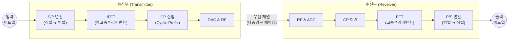

# OFDM (Orthogonal Frequency Division Multiplexing)

---

## I. 주파수 이용 효율 극대화, 다중 반송파 전송 기술 OFDM의 개요

### 가. OFDM의 정의

* 고속의 전송 데이터를 상호 직교성(Orthogonality)을 갖는 다수의 저속 부반송파(Subcarrier)로 분할하여 동시에 전송하는 [[다중화]] 및 변조 기법
* 광대역 채널을 다수의 협대역 채널로 나누어 전송함으로써 다중 경로 페이딩(Multipath Fading)에 강하고 주파수 효율을 극대화한 4G/5G 및 Wi-Fi의 핵심 물리계층 기술

### 나. OFDM의 주요 특징 및 등장배경

* **주파수 효율성**: 부반송파 간 스펙트럼을 중첩시켜 기존 FDM 대비 대역폭 낭비(보호대역) 최소화
* **간섭 방지**: CP(Cyclic Prefix)를 삽입하여 다중 경로 전파로 인한 심볼 간 간섭(ISI) 원천 차단
* **고속 구현**: 수많은 발진기 대신 IFFT/FFT [[알고리즘]] 기반의 디지털 신호처리(DSP)로 고속 변복조 수행

---

## II. OFDM의 개념도 및 핵심 기술 요소

### 가. OFDM 송수신 아키텍처 및 동작 원리

* 고속의 직렬 데이터를 병렬로 분할(S/P) 후 IFFT를 통해 주파수 도메인 신호를 시간 도메인으로 변환함
* 다중 경로 지연에 의한 ISI를 막기 위해 심볼의 뒷부분을 복사하여 앞부분에 붙이는 CP를 삽입하여 전송함

### 나. OFDM의 핵심 구성 및 기술 요소

| 분류 | 요소기술(키워드) | 세부 설명 |
| --- | --- | --- |
| **핵심 원리** | **직교성 (Orthogonality)** | 인접한 부반송파 간의 위상을 직교(90도)하게 배치하여, 스펙트럼이 중첩되어도 수신단에서 간섭 없이 분리 가능 |
| **신호 처리** | **IFFT / FFT** | 다수의 반송파 생성을 위한 아날로그 모뎀 대신, 고속 푸리에 변환 알고리즘을 이용해 주파수-시간 축 변환 수행 |
| **간섭 회피** | **CP (Cyclic Prefix)** | 유효 심볼의 마지막 부분을 복사하여 심볼 앞의 보호구간(Guard Interval)에 삽입, 다중 경로 지연 확산으로 인한 ISI 방지 |
| **데이터 분할** | **S/P 및 P/S 변환** | 초고속 직렬 전송 데이터를 다수의 저속 병렬 데이터로 변환하여 각 심볼 주기를 늘림으로써 주파수 선택적 페이딩 극복 |
| **주요 한계점** | **PAPR (Peak-to-Average Power Ratio)** | 다수의 부반송파 위상이 동기화될 때 최대 전력(Peak)이 급증하는 현상, 송신 앰프(PA)의 비선형 왜곡 유발 및 배터리 소모 증가 |
| **다중 접속** | **OFDMA** | 단일 사용자가 전체 부반송파를 점유하는 OFDM과 달리, 다수의 사용자에게 부반송파를 분할 할당하여 동시 접속 지원 |

---

## III. FDM과 OFDM 비교 및 향후 진화 방향

### 가. FDM과 OFDM 비교

| 비교 항목 | FDM (Frequency Division Multiplexing) | OFDM (Orthogonal FDM) |
| --- | --- | --- |
| **스펙트럼 형태** | 채널 간 분리됨 (중첩 없음) | 부반송파 간 50% 중첩 (직교성 유지) |
| **대역폭 효율성** | 낮음 (보호대역 낭비 발생) | **매우 높음** (보호대역 불필요) |
| **다중경로 대응** | 취약함 (별도 등화기 필요) | **강인함** (CP 삽입을 통한 지연 흡수) |
| **구현 복잡도** | 아날로그 필터 및 다중 발진기 필요 (낮음) | IFFT/FFT 기반 고도의 디지털 신호 처리 (높음) |

### 나. OFDM 기술의 향후 발전 동향

* **Scalable OFDM (Numerology 도입)**: 5G NR에서는 단일 부반송파 간격(15kHz)을 사용하는 LTE와 달리, 서비스 요구사항(eMBB, URLLC, mMTC)에 따라 부반송파 간격(15, 30, 60, 120kHz)을 가변적으로 조정하는 Scalable Numerology 적용
* **단말 전력 효율 향상 (SC-FDMA)**: OFDM의 고질적 단점인 높은 PAPR 문제를 해결하기 위해, 상향링크(Uplink)에서는 IFFT 전단에 DFT를 추가 수행하여 피크 전력을 억제하는 SC-FDMA 기술 적용
* **AI/ML 연계 수신기 최적화**: 6G 시대를 대비하여 채널 추정, 빔포밍 및 CP 길이를 실시간 무선 환경에 맞게 동적으로 최적화하는 [[딥러닝]] 기반 OFDM 수신기 구조 연구 활발

---

### 🔗 연관 토픽

- **소속 도메인**: [[00_네트워크_MOC|🌐 네트워크]]
- **세부 분류**: `2. 네트워크 계층 & 라우팅 프로토콜 (L3)`
- **핵심 연관 토픽**:
  - [[다중화|다중화(Multiplexing)]]
  - [[알고리즘]]
  - [[딥러닝]]
  - [[MIMO]]
  - [[라우팅 알고리즘|라우팅 알고리즘(Routing Protocol, 거리벡터, 링크상태)]]
