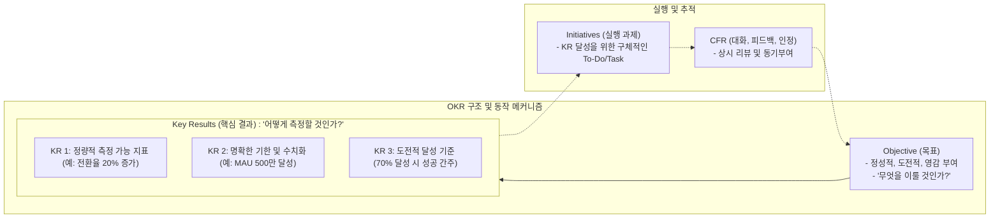

# OKR (Objectives and Key Results)

---

## I. 도전적 목표와 측정 가능한 결과, OKR의 개요

### 가. OKR의 정의

* 전사적 조직 목표(Objective)와 이를 달성하기 위한 구체적이고 측정 가능한 핵심 결과(Key Results)를 설정하여, 조직 전체를 한 방향으로 정렬(Alignment)시키는 애자일([[Agile]]) 목표 설정 [[프레임워크]]
* 구글(Google), 인텔(Intel) 등 실리콘밸리 기업들의 핵심 성장 동력으로, '무엇을 달성할 것인가'와 '어떻게 달성 및 측정할 것인가'를 명확히 정의하는 성과 관리 기법

### 나. OKR의 등장배경 및 핵심 특징

* **등장배경**: 연 단위 하향식 평가 지표(MBO)의 한계 극복, 급변하는 비즈니스 환경(VUCA)에 대응하기 위한 민첩한 목표 궤도 수정 및 혁신 필요성 대두
* **핵심 특징**:
* **도전적 목표(Stretch Goals)**: 100% 달성이 어려운 도전적인 목표를 통해 한계 돌파 유도
* **투명성(Transparency)**: 전 직원의 목표와 진척도를 투명하게 공개하여 사일로(Silo) 타파
* **보상과의 분리**: 평가 및 금전적 보상과 분리하여 실패에 대한 두려움 없이 자발적 혁신 촉진

---

## II. OKR의 개념도 및 핵심 구성 요소

### 가. OKR의 개념도 및 동작 원리

* 목표(O) 하위에 3~5개의 정량화된 핵심 결과(KR)를 매핑하고, 이를 달성하기 위한 구체적 실행 과제(Initiative)를 도출함
* 주/월 단위 정기 체크인과 CFR 기반의 피드백 루프를 통해 민첩하게 궤도를 수정하고 성과를 관리함

### 나. OKR의 핵심 구성 요소

| 분류 | 요소기술(키워드) | 세부 설명 |
| --- | --- | --- |
| **프레임워크 구성** | **Objective (목표)** | 조직이 나아가야 할 방향을 제시하는 정성적이고 행동 지향적이며 영감을 주는 명확한 비전 |
| **프레임워크 구성** | **Key Result (핵심 결과)** | Objective 달성 여부를 판별하기 위한 정량적, 시간 제한적 측정 지표 (목표당 3~5개 권장) |
| **프레임워크 구성** | **Initiative (실행 과제)** | KR 수치를 변화시키기 위해 현장에서 실제로 수행하는 구체적인 프로젝트, 액션 플랜, 태스크 |
| **핵심 철학/특징** | **Alignment (정렬)** | 회사-팀-개인의 OKR을 상향식(Bottom-up)과 하향식(Top-down)으로 양방향 연계 및 맵핑 |
| **핵심 철학/특징** | **Moonshot (도전성)** | 70% 수준의 달성률을 성공(Sweet Spot)으로 간주할 만큼 야심 차고 극단적인 혁신 목표 설정 |
| **핵심 철학/특징** | **Agile Rhythm (짧은 주기)** | 주로 분기(Quarterly) 단위로 목표를 수립하고 상시 리뷰하여 환경 변화에 신속하게 적응 |
| **지원 시스템** | **CFR 체계** | 상호작용을 위한 대화(Conversation), 코칭 기반 피드백(Feedback), 긍정적 인정(Recognition) 체계 |
| **지원 시스템** | **Dashboard / Tracker** | 전 직원이 서로의 OKR 진척도(Progress)를 언제든 확인할 수 있는 투명한 추적 관리 대시보드 |

---

## III. OKR과 기존 성과관리(MBO, KPI) 체계 비교 및 성공적 정착 방안

### 가. OKR, KPI, MBO 간 비교 분석

| 비교 항목 | OKR (Objectives and Key Results) | KPI (Key Performance Indicator) | MBO (Management by Objectives) |
| --- | --- | --- | --- |
| **도입 목적** | **도전적 목표 달성과 비약적 성장** | 핵심 비즈니스 [[프로세스]] 상태 측정 및 유지 | 연간 성과 평가 및 개인 보상 기준 산정 |
| **지표 성격** | 혁신 중심 (성장 지표, 변화 주도) | 현상 유지 중심 (BAU, 후행 지표 위주) | 실적 중심 (할당된 목표, 방어적 지표 설정) |
| **평가 주기** | 분기(Quarter) 등 짧고 유연한 주기 | 일/주/월 단위의 상시 운영 모니터링 | 연간(Yearly) 1회 (정적) |
| **공개 여부** | **전사 투명 공개 (협업/얼라인 극대화)** | 관련 부서/담당자 위주 대시보드 공유 | 개인별 비공개 원칙 (사일로 발생 우려) |
| **보상 연계** | **보상과 엄격히 분리 (인사고과 미반영)** | 일부 성과 지표로 활용 및 직접 연계 | 인사고과 및 금전적 보상과 **직접 연계** |

### 나. 실무 적용 시 한계점 및 성공적인 정착 방안 (향후 전망)

* **한계 및 문제점**: 국내 기업의 성과주의 문화 속에서 OKR을 단순한 '분기별 KPI'나 '평가 도구'로 변질시켜 적용하는 경우, 구성원들이 달성하기 쉬운 목표(Sandbagging)만 설정하는 부작용 발생
* **성공적 정착 방안 (리더십 측면)**: 최고경영진의 적극적인 스폰서십(Sponsorship) 하에 실패를 용인하는 심리적 안전감(Psychological Safety) 확보 필수
* **향후 동향**: 단순한 성과 관리 프레임워크를 넘어, 애자일 조직으로의 체질 개선 및 디지털 트랜스포메이션(DT) 성공을 이끄는 전사적 '조직 문화 혁신 도구'로 그 활용 영역이 지속 확대되는 추세임

---

### 🔗 연관 토픽

- **소속 도메인**: [[00_경영전략_MOC|📈 경영전략]]
- **세부 분류**: `5. IT 투자 성과 평가 & 비즈니스 연속성 계획 (BCP)`
- **핵심 연관 토픽**:
  - [[PDCA(Plan-Do-Check-Act, Deming Cycle)]]
  - [[Agile]]
  - [[시빅 해킹|시빅 해킹(Civic Hacking)]]
  - [[프로세스]]
  - [[프레임워크]]
