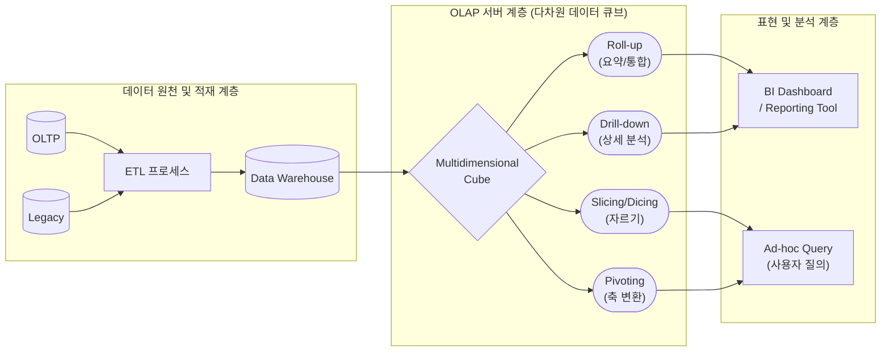

# OLAP (Online Analytical Processing)

---

## I. 다차원 데이터 분석의 핵심, OLAP의 개요

### 가. OLAP의 정의

* 사용자가 다양한 비즈니스 관점에서 다차원 정보에 직접 접근하여, 대화식으로 데이터를 분석하고 의사결정에 활용하는 분석형 데이터 처리 기술
* 데이터 웨어하우스(DW)나 데이터 마트(DM)의 비정규화된 데이터를 기반으로 Roll-up, Drill-down 등의 연산을 통해 비즈니스 인사이트를 도출하는 체계

### 나. OLAP의 필요성 및 특징

* **필요성**: [[OLTP]] 환경의 복잡한 쿼리로 인한 성능 저하 한계 극복, 직관적인 비즈니스 인텔리전스(BI) 및 의사결정지원시스템(DSS) 요구 증대
* **핵심 특징**: 다차원 큐브(Cube) 기반 고속 응답, 대화형(Interactive) 사용자 분석 지원, 주제 중심의 이력 데이터 활용

---

## II. OLAP의 아키텍처 및 핵심 구성요소

### 가. OLAP의 아키텍처 및 다차원 분석 동작 원리

* 원천 데이터가 ETL을 거쳐 DW에 적재되고, OLAP 서버의 큐브 구조로 변환되어 다양한 다차원 연산(Roll-up, Drill-down 등)을 통해 최종 사용자에게 시각화됨

### 나. OLAP의 핵심 기술 및 분석 요소

| 구분 | 요소기술(키워드) | 세부 설명 |
| --- | --- | --- |
| **아키텍처 유형** | **ROLAP** (Relational) | 관계형 DB 기반(Star/Snowflake Schema), 대용량 데이터 처리에 적합하나 복잡한 질의 시 성능 저하 우려 |
| **아키텍처 유형** | **MOLAP** (Multidimensional) | 다차원 배열(MDDB)에 데이터를 사전 계산하여 저장, 쿼리 응답 속도가 매우 빠르나 저장 용량 한계 존재 |
| **아키텍처 유형** | **HOLAP** (Hybrid) | 요약 데이터는 다차원(MOLAP), 상세 데이터는 관계형(ROLAP)에 분산 저장하여 성능과 용량의 균형 확보 |
| **분석 연산 (기능)** | **Roll-up** | 계층 구조를 따라 하위 상세 데이터에서 상위 요약 데이터로 접근하여 데이터를 병합 및 요약 (통합) |
| **분석 연산 (기능)** | **Drill-down** | 상위 요약 데이터에서 하위 계층의 상세 데이터로 깊이 있게 탐색하여 근본 원인 분석 |
| **분석 연산 (기능)** | **Slicing** | 다차원 데이터 큐브에서 특정 1개의 차원(단면)만을 선택하여 2차원 평면 데이터로 분리 및 조회 |
| **분석 연산 (기능)** | **Dicing** | 다차원 데이터 큐브에서 2개 이상의 차원(조건)을 조합하여 작은 큐브(Sub-cube) 형태로 추출 |
| **분석 연산 (기능)** | **Pivoting** | 사용자의 관점 변화에 따라 보고서의 행, 열, 페이지 등 기준 축(차원)을 회전시켜 데이터를 재배치 |

---

## III. OLAP과 OLTP 비교 및 최신 동향

### 가. OLAP과 OLTP 체계 비교

| 비교 항목 | OLAP (Online Analytical Processing) | OLTP (Online Transaction Processing) |
| --- | --- | --- |
| **주요 목적** | 비즈니스 의사결정 지원, 다차원 분석 | 일상적인 비즈니스 업무 및 [[트랜잭션]] 처리 |
| **데이터 특성** | 과거 중심의 이력 데이터, 요약/통합 데이터 | 현재 중심의 최신 데이터, 상세 데이터 |
| **접근 패턴** | 복잡한 쿼리 중심, 주로 읽기(Read-only) | 단순 쿼리 중심, 빈번한 읽기/쓰기(CRUD) |
| **[[데이터베이스]] 설계** | 비정규화, 다차원 [[스키마]] (Star, Snowflake) | 고도 정규화 상태 (데이터 중복 최소화) |
| **성능 기준** | 쿼리 [[처리량]], 응답 속도 (수 초 ~ 수 분) | 초당 트랜잭션 처리 수 (TPS), (수 밀리초) |

### 나. OLAP 기술의 최신 발전 동향 및 전망

* **HTAP (Hybrid Transaction/Analytical Processing) 진화**: In-Memory 기술 발전에 따라 별도의 ETL 과정 없이 OLTP와 OLAP을 단일 데이터베이스 엔진에서 실시간으로 동시 처리하는 아키텍처 확산
* **Cloud-Native OLAP**: 대규모 병렬 처리(MPP) 및 스토리지와 컴퓨팅이 완전히 분리된 클라우드 기반 데이터 웨어하우스(Snowflake, BigQuery 등)로 전환 가속화
* **실시간 스트리밍 OLAP**: IoT 장비, 웹 로그 등 스트리밍 데이터를 초저지연으로 집계 및 분석하기 위한 실시간 OLAP(ClickHouse, Apache Druid) 활용 증가

---

### 🔗 연관 토픽

- **소속 도메인**: [[00_데이터베이스_MOC|🗄️ 데이터베이스]]
- **세부 분류**: `1. 데이터 모델링 & 관계형 DB 설계`
- **핵심 연관 토픽**:
  - [[데이터베이스]]
  - [[OLTP]]
  - [[스키마]]
  - [[조인|조인(Join)]]
  - [[데이터베이스 정규화|데이터베이스 정규화(Normalization)]]
