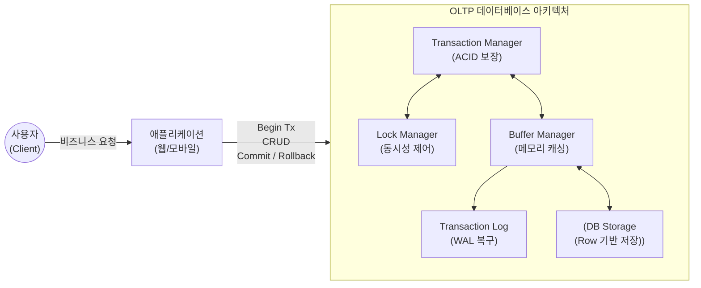

# OLTP (Online Transaction Processing)

---

## I. 실시간 비즈니스 트랜잭션 처리, OLTP의 개요

### 가. OLTP의 정의

* 다수의 사용자가 실시간으로 발생시키는 대량의 [[트랜잭션]](Insert, Update, Delete)을 네트워크 상에서 [[무결성]](Integrity) 있게 처리하는 [[데이터베이스]] 시스템
* 금융, 예약, 쇼핑몰 등 일상적인 기업 비즈니스 업무 처리를 위해 즉각적인 응답과 높은 동시성을 지원하는 온라인 프로세싱 체계

### 나. OLTP의 주요 특징 및 등장배경

* **무결성 보장**: 금융 사고 등을 방지하기 위해 엄격한 ACID(원자성, 일관성, 고립성, 영속성) 원칙 준수
* **높은 동시성(Concurrency)**: 수많은 사용자의 동시다발적 CRUD 요청에 대해 데이터 잠금([[Locking]]) 충돌을 최소화하며 신속하게 처리
* **중복 최소화**: 갱신 이상([[Anomaly(이상현상)|Anomaly]])을 방지하고 쓰기 성능을 높이기 위해 고도로 정규화(Normalization)된 데이터 모델 설계

---

## II. OLTP의 아키텍처 및 핵심 구성요소

### 가. OLTP의 내부 구조 및 동작 원리

* 다중 사용자의 동시 트랜잭션 요청에 대해 락 매니저(Lock Manager)와 버퍼 매니저(Buffer Manager)를 거쳐 데이터의 일관성을 유지하며 실시간 처리함

### 나. OLTP의 핵심 기술 및 구성 요소

| 분류 | 요소기술(키워드) | 세부 설명 |
| --- | --- | --- |
| **트랜잭션 관리** | **ACID** | 원자성(Atomicity), 일관성(Consistency), 고립성(Isolation), 영속성(Durability)을 통한 [[신뢰성]] 보장 |
| **동시성 제어** | **MVCC** | 다중 버전 동시성 제어 기술을 통해 읽기와 쓰기 간의 Lock 대기 시간을 최소화하여 성능 극대화 |
| **데이터 모델링** | **제3 정규화 (3NF)** | 데이터 중복을 최소화하여 Insert/Update/Delete 시 발생하는 갱신 이상 방지 및 쓰기 효율 향상 |
| **저장 구조** | **Row-based Storage** | 하나의 레코드(행)를 인접한 물리적 디스크 블록에 저장하여, 특정 건에 대한 CRUD 처리 속도 최적화 |
| **인덱싱** | **B-Tree / B+Tree** | 특정 조건의 데이터 단건 검색(Point Query) 및 좁은 범위 검색에 최적화된 트리 기반 인덱스 구조 적용 |
| **장애 복구** | **WAL (Write-Ahead Log)** | 트랜잭션 데이터 변경 전 로그를 먼저 디스크에 순차 기록하여, 시스템 장애 시 복구(Recovery) 기반 제공 |
| **분산 처리** | **2PC (Two-Phase Commit)** | [[분산 데이터베이스]] 환경에서 여러 노드에 걸친 글로벌 트랜잭션의 정합성 보장을 위한 2단계 커밋 |
| **[[HA(High Availability)|고가용성]]** | **Active-Standby 복제** | 실시간 데이터 리플리케이션(Replication)을 통해 단일 장애점(SPOF) 제거 및 24x365 무중단 서비스 제공 |

---

## III. OLTP와 OLAP 비교 및 최신 동향

### 가. OLTP와 OLAP 체계 비교

| 비교 항목 | OLTP (Online Transaction Processing) | [[OLAP]] (Online Analytical Processing) |
| --- | --- | --- |
| **사용 목적** | 일상적 비즈니스 운영 및 트랜잭션 처리 | 비즈니스 의사결정 지원 및 다차원 데이터 분석 |
| **데이터 특징** | 최신성(현재 데이터), 지속적 업데이트 | 이력성(과거 데이터), 정적 데이터(Read-only) |
| **데이터 모델** | 고도로 정규화된 [[스키마]] (데이터 중복 최소화) | 비정규화된 다차원 스키마 (Star / Snowflake) |
| **접근 패턴** | 단순 질의, 짧은 트랜잭션 중심 (CRUD 혼재) | 복잡한 쿼리, 대용량 스캔 중심 (Select 위주) |
| **저장 방식** | 행(Row) 기반 저장 (레코드 단위 I/O 최적화) | 열(Column) 기반 저장 (집계 및 통계 연산 최적화) |
| **핵심 성능 지표** | **TPS (Transaction Per Second)** | 쿼리 응답 속도 (Query Response Time) |

### 나. OLTP 기술의 최신 발전 동향 및 전망 (HTAP / NewSQL)

* **HTAP (Hybrid Transaction/Analytical Processing) 대두**: 인메모리(In-Memory) 기술의 발전에 따라 별도의 ETL 과정 없이 단일 데이터베이스 엔진에서 실시간 OLTP 처리와 고속 OLAP 분석을 동시에 수행하는 아키텍처(예: SAP HANA, TiDB) 확산
* **[[New SQL|NewSQL]] 및 분산 [[SQL(Structured Query Language)|SQL]](Distributed SQL) 도입**: 레거시 RDBMS의 완벽한 ACID 정합성을 유지하면서도 [[클라우드 네이티브]] 환경에서 [[NoSQL (CAP 이론 BASE 속성)|NoSQL]] 수준의 수평적 확장성(Scale-out)과 글로벌 분산 처리를 제공하는 차세대 OLTP DB(예: Google Spanner, [[CockroachDB]]) 활용 증가

---

### 🔗 연관 토픽

- **소속 도메인**: [[00_데이터베이스_MOC|🗄️ 데이터베이스]]
- **세부 분류**: `2. 트랜잭션 & 동시성 제어 (Concurrency)`
- **핵심 연관 토픽**:
  - [[데이터베이스]]
  - [[분산 데이터베이스|분산 데이터베이스 (Distributed Database)]]
  - [[OLAP]]
  - [[무결성]]
  - [[트랜잭션]]
