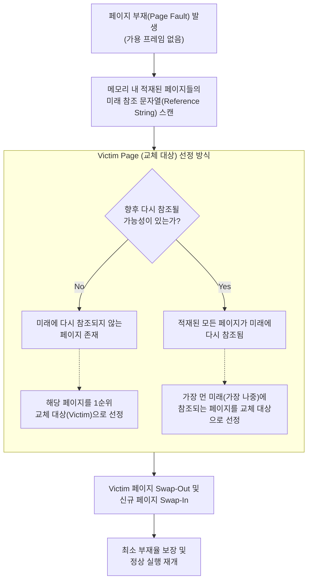

# OPT (Optimal Page Replacement)

---

## I. 페이지 부재율 최소화, OPT(Optimal Page Replacement)의 개요

### 가. OPT의 정의

* 페이지 부재(Page Fault) 발생 시, 물리 메모리에 적재된 페이지 중 **미래에 가장 오랫동안 참조되지 않을 페이지**를 찾아 교체 대상으로 선정하는 가상메모리 [[페이지 교체 알고리즘]]
* 이론상 달성 가능한 가장 낮은 페이지 부재율(Page Fault Rate)을 보장하여, 다른 페이지 교체 알고리즘의 성능 평가를 위한 기준(Benchmark)으로 사용되는 최적 [[알고리즘]](MIN, Belady's Algorithm)

### 나. OPT의 필요성 및 특징

* **최소 부재율 보장**: 동일한 페이지 프레임 수가 주어졌을 때 Page Fault 발생 횟수를 수학적으로 최소화함
* **미래 지식(Future Knowledge) 요구**: 프로세스의 향후 참조 문자열(Reference String)을 미리 알아야 작동하므로, 실제 [[OS(운영체제)|운영체제]] 시스템에서는 구현이 불가능함
* **벤치마크(Benchmark) 활용**: [[LRU]], [[LFU]], Clock 등 현실적인 페이지 교체 알고리즘 개발 시 성능 상한선(Upper Bound)을 제공하기 위한 척도로 활용됨

---

## II. OPT의 개념도 및 핵심 기술 요소

### 가. OPT의 교체 알고리즘 개념도 및 동작 원리

* 페이지 부재가 발생했을 때, OS(이론상)는 메모리에 적재된 페이지들의 미래 참조 시점을 모두 미리 탐색하여 가장 늦게 접근될 페이지를 찾아 희생양(Victim)으로 교체함

### 나. OPT의 핵심 기술 및 구성 요소

| 구분 | 요소기술(키워드) | 세부 설명 |
| --- | --- | --- |
| **운영 기반** | **Reference String** | 프로세스가 실행되면서 참조하게 될 메모리 페이지 번호의 시간적 순서 나열 (미래 참조 정보) |
| **운영 기반** | **Future Knowledge** | 프로세스의 페이지 참조 순서를 사전에 모두 알고 있다는 비현실적인 가정 (선험적 지식) |
| **선정 기법** | **Victim Selection** | 메모리에 있는 페이지 중 미래 참조 시점이 가장 먼 페이지를 탐색하여 Swap-Out 시킴 |
| **알고리즘 특성** | **[[Stack]] Algorithm** | 할당된 페이지 프레임 수가 증가할 때 부재율이 감소함을 수학적으로 보장하여 Belady의 모순을 방지함 |
| **알고리즘 특성** | **Upper Bound** | 현실 세계의 어떠한 페이지 교체 알고리즘도 OPT보다 낮은 부재율을 가질 수 없음을 증명하는 지표 |
| **근사 모델** | **LRU / LFU** | 미래 정보를 알 수 없으므로 과거 참조 이력(시간성, 빈도수)을 기반으로 OPT 알고리즘에 근사화하는 기법 |
| **평가 기준** | **Page Fault Rate** | 전체 참조 횟수 중 메모리에 페이지가 없어 디스크 I/O가 발생한 비율 (성능 평가의 핵심 척도) |

---

## III. OPT와 주요 페이지 교체 알고리즘(LRU, FIFO) 비교 및 향후 동향

### 가. 페이지 교체 알고리즘 3종 비교

| 비교 항목 | OPT (Optimal) | LRU (Least Recently Used) | [[FIFO]] (First In First Out) |
| --- | --- | --- | --- |
| **교체 기준** | **가장 먼 미래에** 참조될 페이지 | **가장 오래 전에** 참조된 페이지 | 메모리에 **가장 먼저 적재된** 페이지 |
| **구현 가능성** | **불가능** (미래 참조 예측 불가) | 가능 (과거 참조 기록 활용) | 가능 (단순 선입선출 큐 구조) |
| **시스템 오버헤드** | 없음 (이론적 모델) | **높음** (시간 기록표 또는 스택/연결 리스트) | 낮음 (포인터만 갱신) |
| **성능 (부재율)** | **가장 낮음 (최고 성능)** | 비교적 낮음 (OPT에 근접함) | 높음 |
| **Belady의 모순** | 발생하지 않음 | 발생하지 않음 | **발생 가능성 존재** (프레임 증가 시 성능 저하) |
| **주요 활용처** | **타 알고리즘의 성능 벤치마크** | 상용 운영체제 가상메모리 교체 기법 | 단순 임베디드, 특수 목적 라우팅 캐시 |

### 나. 실무 적용의 한계점 및 향후 발전 방향 (시사점)

* **과거 데이터를 통한 미래 추론**: 범용 OS에서는 미래 참조 열을 파악하는 OPT의 완벽한 구현이 불가능하므로, 시간적 [[지역성]](Temporal Locality) 원칙에 기반하여 과거 데이터(LRU)로 미래(OPT)를 근사 추론함.
* **하드웨어 제약 극복**: LRU 역시 시간 스탬프를 관리하는 소프트웨어적 오버헤드가 발생하므로, 현대의 운영체제(Linux, Windows)는 하드웨어 [[MMU(Memory Management Unit)|MMU]]의 참조 비트(Reference Bit)를 활용한 **Clock 알고리즘 ([[NUR]], Not Used Recently)** 을 주력으로 채택하여 OPT 알고리즘의 성능에 최대한 수렴하도록 최적화하고 있음.

---

### 🔗 연관 토픽

- **소속 도메인**: [[00_운영체제_MOC|⚙️ 운영체제]]
- **세부 분류**: `5. 가상 메모리 관리 & 페이지 교체 알고리즘`
- **핵심 연관 토픽**:
  - [[LRU]]
  - [[NUR]]
  - [[페이지 교체 알고리즘|페이지 교체 알고리즘 (Paging Replacement Algorithm)]]
  - [[LFU]]
  - [[지역성|지역성(Locality)]]
