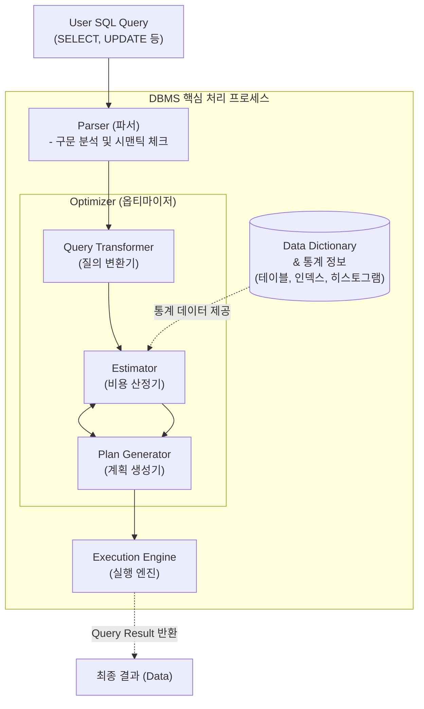

# OPTIMIZER (데이터베이스 옵티마이저)

---

## I. 최적의 실행 경로 탐색기, 데이터베이스 OPTIMIZER의 개요

### 가. OPTIMIZER의 정의

* 사용자가 작성한 [[SQL(Structured Query Language)|SQL]](구조화 질의어)을 가장 빠르고 효율적으로 처리하기 위해 시스템 자원(I/O, [[CPU]]) 사용량이 최소인 최적의 **실행 계획(Execution Plan)** 을 생성하는 [[DBMS]] 내부 핵심 엔진
* 데이터 딕셔너리(Data Dictionary)의 통계 정보를 바탕으로 다수의 가능한 쿼리 수행 경로 중 최소 비용(Cost) 경로를 논리적, 물리적으로 선택하는 최적화 프로세서

### 나. OPTIMIZER의 등장 배경 및 주요 특징

* **선언적 언어의 한계 극복**: SQL은 '무엇(What)'을 추출할지만 선언할 뿐 '어떻게(How)' 추출할지는 명시하지 않으므로, 이를 절차적 알고리즘으로 변환하는 지능형 모듈 필요
* **처리 성능 극대화**: [[조인]] 순서(Join Order), 접근 경로(Access Path) 선택에 따라 응답 시간(Latency)이 기하급수적으로 차이남
* **지속적 진화**: 규칙 기반(Rule-Based, RBO)에서 비용 기반(Cost-Based, CBO)으로 발전하였으며, 최근에는 AI/ML 기반 자율 최적화(Learned Optimizer)로 진화 중

---

## II. OPTIMIZER의 아키텍처 개념도 및 핵심 기술 요소

### 가. OPTIMIZER의 동작 원리 및 개념도

* 파서를 거친 SQL은 옵티마이저의 질의 변환기에서 표준화(View Merging 등)된 후, 통계 정보를 활용해 비용 산정기와 계획 생성기를 반복 순회하며 최저 비용의 실행 계획을 확정함

### 나. OPTIMIZER의 핵심 기술 및 구성 요소

| 구분 | 요소기술(키워드) | 세부 설명 |
| --- | --- | --- |
| **세부 모듈** | **Query Transformer** | 비효율적인 SQL 문장을 동일한 결과를 반환하면서 최적화하기 쉬운 형태(예: 서브쿼리 Unnesting)로 논리적 변환 |
| **세부 모듈** | **Estimator** | 쿼리의 각 접근 경로에 대해 디스크 I/O, CPU 소요 시간, 카디널리티(Cardinality)를 수학적으로 추정(Costing) |
| **세부 모듈** | **Plan Generator** | 질의 변환기와 비용 산정기를 거쳐 생성된 다수의 대안 트리 중 가장 최저 비용을 가진 최종 실행 계획을 결정 |
| **기준 데이터** | **통계 정보 (Statistics)** | 테이블 크기, 로우(Row) 수, 블록 수, 인덱스 높이, 데이터 분포(Histogram) 등 CBO가 참조하는 핵심 메타데이터 |
| **물리적 결정** | **Access Path** | 테이블의 데이터를 추출하는 물리적 방법 (Full Table Scan, [[RDBMS 인덱스(index)|Index]] Range Scan, Index Unique Scan 등) |
| **조인 기법** | **Join Method** | 여러 테이블 연쇄 시의 [[알고리즘]] 선택 (Nested Loop Join, Hash Join, Sort Merge Join) |
| **튜닝 도구** | **Hint (힌트)** | 개발자가 SQL 내에 주석 형태로 특정 인덱스 사용이나 조인 방식을 옵티마이저에게 강제 지시하는 명령어 |
| **결과물** | **Execution Plan** | 옵티마이저가 최종적으로 선택한 작업 절차 명세서 (Explain Plan 등을 통해 조회 및 성능 튜닝에 활용) |

---

## III. OPTIMIZER 아키텍처 비교 및 최신 발전 동향

### 가. 전통적 옵티마이저 세대별 비교 (RBO vs CBO)

| 비교 항목 | RBO (Rule-Based Optimizer) | CBO (Cost-Based Optimizer) |
| --- | --- | --- |
| **최적화 기준** | 사전 정의된 15개의 우선순위 **규칙 (Rule)** | 통계 정보 기반의 시스템 연산 **비용 (Cost)** |
| **데이터 분포** | 고려하지 않음 (항상 동일한 규칙 적용) | 실제 테이블의 로우 수, 인덱스, 히스토그램 반영 |
| **장점** | 실행 계획 예측이 매우 용이함 | 데이터 볼륨 변화에 따른 가장 현실적인 최적화 보장 |
| **단점** | 대용량 데이터 및 복잡한 환경에 비효율적 | 주기적인 통계 정보 수집(Analyze, Runstats) 부하 발생 |
| **활용 동향** | 현대 DBMS에서는 폐기(Deprecated)됨 | 현재 상용 및 오픈소스 RDBMS의 **표준 [[옵티마이저]]** |

### 나. OPTIMIZER의 최신 동향 및 AI 기반 패러다임 전환 (Learned Optimizer)

* **AI/ML 기반 카디널리티 추정**: 전통적인 CBO가 다중 조인(Multi-join) 환경에서 통계적 추정 한계(비용 오류)를 보이는 현상을 극복하기 위해, 머신러닝(ML) 모델(신경망 등)을 도입하여 실제 데이터 간의 숨겨진 상관관계 및 카디널리티를 매우 정밀하게 예측하는 기술 확대
* **[[강화학습]](RL) 기반 자율 튜닝(Autonomous DB)**: 과거 쿼리 실행 이력 및 시스템 리소스(버퍼 풀, 인덱스) 사용 패턴을 학습하여 실시간으로 실행 계획을 자가 수정하고 동적 힌트를 부여하는 AI-Driven Database(예: Oracle Autonomous, IBM Db2 AI Query Optimizer) 환경으로 빠르게 진화 중

---

### 🔗 연관 토픽

- **소속 도메인**: [[00_데이터베이스_MOC|🗄️ 데이터베이스]]
- **세부 분류**: `6. SQL 표준 문법 & 쿼리 성능 튜닝`
- **핵심 연관 토픽**:
  - [[옵티마이저|옵티마이저 (Optimizer)]]
  - [[DBMS]]
  - [[SQL(Structured Query Language)]]
  - [[관계대수|관계대수(Relational Algebra)]]
  - [[DML]]
