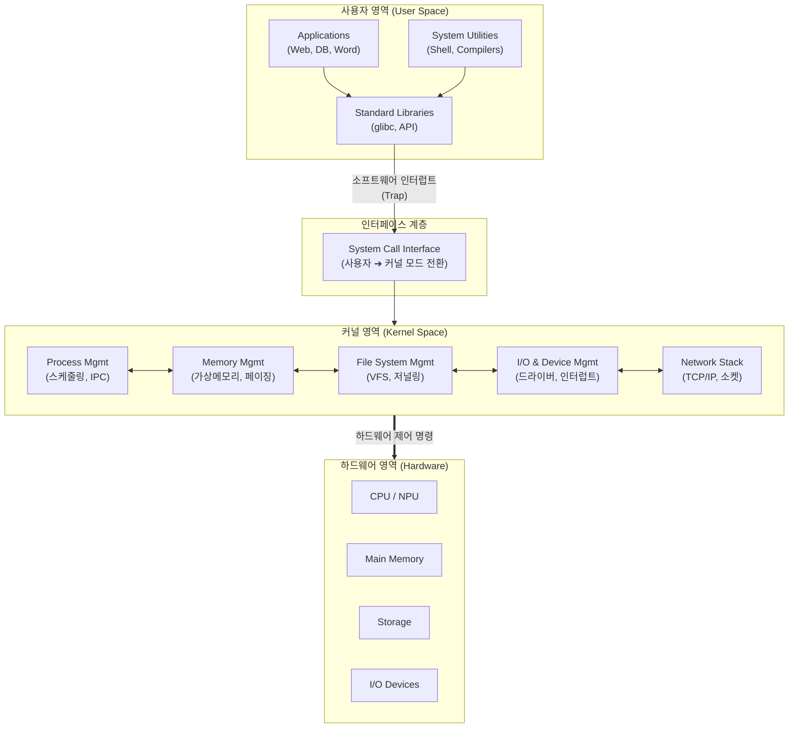

# OS (운영체제)

---

## I. 하드웨어와 사용자 간의 중재자, OS(운영체제)의 개요

### 가. OS(Operating System)의 정의

* 사용자와 컴퓨터 하드웨어 간의 인터페이스를 제공하여 시스템 자원을 효율적으로 관리하고 응용 프로그램 실행 환경을 제공하는 핵심 시스템 소프트웨어
* 제한된 컴퓨터 자원([[CPU]], 메모리, 디스크 등)을 다수의 프로세스가 공평하고 효율적으로 사용할 수 있도록 [[스케줄링]] 및 제어 기능 수행

### 나. OS의 필요성 및 핵심 특징

* **자원 추상화([[추상화|Abstraction]])**: 복잡한 하드웨어 제어 방식을 숨기고 파일, [[프로세스]] 등의 논리적 단위 제공
* **다중 프로그래밍(Multi-programming)**: 다수의 프로세스를 동시에 실행하여 CPU 활용률 극대화
* **안정성 및 보안**: 커널 모드([[커널|Kernel]] Mode)와 사용자 모드(User Mode) 분리를 통한 시스템 보호 및 자원 격리

---

## II. OS의 아키텍처 개념도 및 핵심 기술 요소

### 가. OS의 개념도 및 계층 아키텍처

* 사용자 응용 프로그램은 직접 하드웨어에 접근할 수 없으며, 반드시 **시스템 콜(System Call)** 을 통해 커널 모드로 전환한 후 자원을 요청함
* 커널은 프로세스, 메모리, 파일, I/O 등 4대 핵심 서브시스템을 통해 하드웨어를 추상화하고 스케줄링함

### 나. OS의 핵심 구성 요소 및 기술

| 분류 | 요소기술(키워드) | 세부 설명 |
| --- | --- | --- |
| **[[프로세스 관리]]** | **[[CPU Scheduling]]** | 다중 프로세스 환경에서 CPU 할당 순서 결정 (FCFS, RR, SJF, MLFQ 등) |
| **프로세스 관리** | **IPC / Deadlock** | 프로세스 간 통신(공유 메모리, 메시지 패싱) 및 교착 상태(예방, 회피, 탐지, 복구) 관리 |
| **[[메모리 관리]]** | **[[가상 메모리]] (Virtual Memory)** | 물리적 메모리 크기 한계를 극복하기 위해 디스크 일부를 메모리처럼 사용하는 추상화 기법 |
| **메모리 관리** | **Paging / Segmentation** | 연속 메모리 할당의 단점([[단편화]])을 해결하기 위한 고정 크기(페이징) 및 가변 크기(세그먼테이션) 분할 기법 |
| **파일 시스템** | **VFS (Virtual File System)** | EXT4, NTFS 등 다양한 이기종 파일 시스템을 일관된 인터페이스로 접근하도록 지원하는 계층 |
| **I/O 관리** | **Interrupt / [[DMA(Direct Memory Access)|DMA]]** | CPU 개입 없이 주변장치와 메모리가 직접 데이터를 교환(DMA)하고 완료 시 CPU에 통보(Interrupt) |
| **보안 및 제어** | **Dual Mode Operation** | 시스템 보호를 위해 일반 명령은 사용자 모드, 특권 명령은 커널 모드에서만 실행하도록 분리 |
| **커널 구조** | **Monolithic / Micro Kernel** | 성능 중심의 일체형 커널(Linux)과 핵심 기능만 커널에 남긴 안정성 중심의 마이크로 커널(QNX, Mach) |

---

## III. OS 커널 아키텍처 비교 및 최신 기술 동향

### 가. 커널(Kernel) 아키텍처 기반 OS 구조 비교

| 비교 항목 | Monolithic Kernel (일체형 커널) | Micro Kernel (마이크로 커널) |
| --- | --- | --- |
| **설계 구조** | OS의 모든 핵심 기능을 하나의 거대한 커널 영역에 통합 | 스케줄링, 메모리 등 최소 기능만 커널에 두고 나머지는 사용자 영역(서버 프로세스)으로 분리 |
| **성능 / 속도** | 모드 전환 및 통신 오버헤드가 적어 **매우 빠름** | 서비스 간 IPC(메시지 패싱)로 인해 오버헤드 발생 (비교적 느림) |
| **안정성 / 확장성** | 커널 내 특정 드라이버 오류가 시스템 전체 장애로 직결 | 특정 서비스 오류가 전체 시스템에 영향을 주지 않아 **안정성 높음** |
| **대표 OS 사례** | Linux, UNIX, Windows, Android | QNX, Mach, L4, Minix |

### 나. OS의 최신 발전 동향 및 산업 시사점

* **안전성과 가시성(Observability) 강화**: 커널 소스코드에 메모리 안정성이 뛰어난 **Rust 언어 공식 도입(Linux 6.1+)**, 커널 수정 없이 고성능 네트워크 및 보안 추적을 지원하는 **eBPF(extended BPF)** 기술의 전면적 확산
* **Cloud-Native 및 [[컨테이너]] 최적화 OS**: 불필요한 패키지를 제거하고 읽기 전용(Immutable) 파일 시스템을 적용하여 보안과 부팅 속도를 극대화한 컨테이너 전용 OS(Bottlerocket, Talos Linux, Flatcar)의 클라우드 인프라 표준화
* **AI-PC 및 이기종 컴퓨팅 [[스케줄러]]**: [[온디바이스 AI]] 시대에 발맞춰 CPU, [[GPU]], [[NPU]] 등 이기종 가속기 자원 간의 전력 효율적 통합 스케줄링 및 메모리 공유 모델 지원 (Windows Copilot+, Apple macOS 등)

---

### 🔗 연관 토픽

- **소속 도메인**: [[00_운영체제_MOC|⚙️ 운영체제]]
- **세부 분류**: `1. 프로세스 & 스레드 관리`
- **핵심 연관 토픽**:
  - [[프로세스]]
  - [[커널|커널(Kernel)]]
  - [[스케줄링]]
  - [[스케줄러|스케줄러 (Scheduler)]]
  - [[프로세스 관리]]
