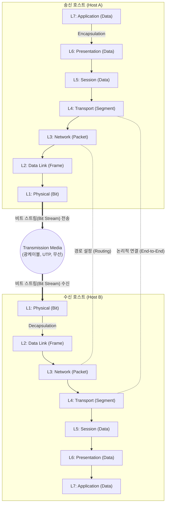

# OSI 7 Layer (ISO 7498)

---

## I. [이기종 시스템 간 통신 표준], OSI 7 Layer의 개요

### 가. OSI 7 Layer의 정의

* 국제표준화기구(ISO)에서 제정(ISO 7498)한 규격으로, 이기종 네트워크 시스템 간의 통신 과정을 7개의 계층(Layer)으로 분할한 개념적 표준 참조 모델
* 데이터 송수신 과정을 [[캡슐화]](Encapsulation)와 역캡슐화(Decapsulation)를 통해 계층별로 독립성을 보장하고 네트워크 동작 원리를 표준화함

### 나. OSI 7 Layer의 등장배경 및 핵심 특징

* **등장배경**: 초기 벤더별(IBM, DEC 등) 독자적 네트워크 아키텍처 사용에 따른 호환성 결여 극복 및 상호 연결성(Interoperability) 확보 필요성 대두
* **핵심 특징**:
* **[[모듈화]] 및 독립성**: 특정 계층의 변경이 다른 계층에 영향을 주지 않는 구조적 유연성
* **트러블슈팅의 기준**: 네트워크 장애 발생 시 원인 파악을 위한 논리적 접근 방식 제공
* **PDU(Protocol Data Unit) 제어**: 각 계층마다 고유의 헤더(Header)를 추가하여 데이터 통신 제어

---

## II. OSI 7 Layer의 아키텍처 및 핵심 구성요소

### 가. OSI 7 Layer의 개념도 및 동작 원리

* 송신측은 상위 계층에서 하위 계층으로 헤더를 추가(Encapsulation)하며 PDU를 생성하고, 수신측은 하위에서 상위로 헤더를 제거(Decapsulation)하며 데이터를 복원함

### 나. OSI 7 Layer의 핵심 구성 요소 (계층별 역할)

|**구분**|**계층명 / PDU**|**주요 역할 및 세부 설명**|**대표 [[프로토콜]] 및 장비**|
|---|---|---|---|
|**상위 계층** (User Support)|**L7. Application**      (Data)|사용자와 네트워크 간 응용 서비스 인터페이스 제공|HTTP, FTP, SMTP      L7 Switch, WAF|
|**상위 계층** (User Support)|**L6. Presentation**      (Data)|데이터 표현 방식 변환, 압축, 암복호화 수행|JPEG, MPEG, SSL/TLS      (소프트웨어/OS 레벨)|
|**상위 계층** (User Support)|**L5. [[Session Layer|Session]]**      (Data)|통신 [[세션]] 수립, 유지, 동기화 및 논리적 연결 관리|RPC, NetBIOS, SSH      (소프트웨어/OS 레벨)|
|**[[전송 계층]]** ([[End-to-End]])|**L4. Transport**      (Segment)|종단 간(End-to-End) [[신뢰성]] 있는 데이터 전송 보장, 오류 제어 및 흐름 제어, 포트(Port) 할당|[[TCP]], UDP      L4 Switch|
|**하위 계층** (Network Support)|**L3. Network**      (Packet)|논리적 주소(IP) 기반 최적의 경로 설정(Routing) 및 패킷 전달|IP, [[ICMP]], [[IGMP]]      Router, L3 Switch|
|**하위 계층** (Network Support)|**L2. Data Link**      (Frame)|인접 노드 간 물리적 주소([[MAC]]) 기반 신뢰성 있는 프레임 전송, 오류/흐름 제어([[CSMA CD|CSMA/CD]] 등)|Ethernet, MAC, PPP      L2 Switch, Bridge|
|**하위 계층** (Network Support)|**L1. Physical**      (Bit)|전기적, 기계적 특성을 이용하여 통신 케이블로 비트 스트림 전송|RS-232C, 100BASE-T      Hub, Repeater, 케이블|

---

## III. OSI 7 Layer와 TCP/IP 비교 및 향후 전망

### 가. OSI 7 Layer와 TCP/IP(DoD 모델) 비교

| 비교 항목 | OSI 7 Layer | TCP/IP (DoD Model) |
| --- | --- | --- |
| **개발 주체 및 목적** | ISO / 학술적, 개념적 참조 표준 모델 | DoD (미 국방성) / 실무적, 인터넷 표준 구현 모델 |
| **계층 구조** | 7개 계층 (논리적 분리 강조) | 4개 계층 (실제 구현 중심 병합) |
| **상위 계층 매핑** | L7(응용), L6(표현), L5(세션) 분리 | **Application (응용 계층)** 하나로 통합 |
| **전송 계층 매핑** | L4 (전송 계층) | **Transport (전송 계층)** (동일) |
| **[[네트워크 계층]] 매핑** | L3 (네트워크 계층) | **Internet (인터넷 계층)** |
| **하위 계층 매핑** | L2(데이터링크), L1(물리) 분리 | **Network Access (네트워크 접속 계층)** 하나로 통합 |
| **신뢰성 보장** | 각 계층별 엄격한 에러 제어 수행 | 주로 L4(TCP)에서 종단 간 신뢰성 보장 전담 |

### 나. 활용 사례 및 최신 산업 적용 동향

* **트러블슈팅의 표준 [[프레임워크]]**: 현대 인터넷은 TCP/IP 기반으로 동작하나, 네트워크 아키텍처 설계 및 장애 대응 시(예: "Ping은 가는데(L3) 웹 접속이 안됨(L7)") 여전히 OSI 7계층이 글로벌 표준 소통 기준으로 활용됨
* **[[클라우드 네이티브]] 및 보안 모델 적용**: AWS, Azure 등 클라우드 환경에서 VPC 서브넷 제어(L3), Security Group/NACL(L3/L4), ALB(L7) 등 네트워크 서비스 티어링(Tiering) 설계의 근간으로 작용
* **제로 트러스트([[제로 트러스트 보안모델|Zero Trust]])와 L7 세분화**: 마이크로세그멘테이션(Micro-segmentation) 및 API 보안 강화 트렌드에 따라, 기존 L3/L4 중심의 [[방화벽]] 통제에서 벗어나 L7(Application) 계층 중심의 컨텍스트 기반 접근 통제 솔루션([[WAAP]], L7 NGFW)이 주류로 부상 중임

---

### 🔗 연관 토픽

- **소속 도메인**: [[00_네트워크_MOC|🌐 네트워크]]
- **세부 분류**: `1. OSI 7계층 & 데이터링크 계층 (L1/L2)`
- **핵심 연관 토픽**:
  - [[프로토콜]]
  - [[TCP]]
  - [[네트워크 계층|네트워크 계층 (Network Layer)]]
  - [[전송 계층|전송 계층 (Transport Layer)]]
  - [[Session Layer|Session]]
