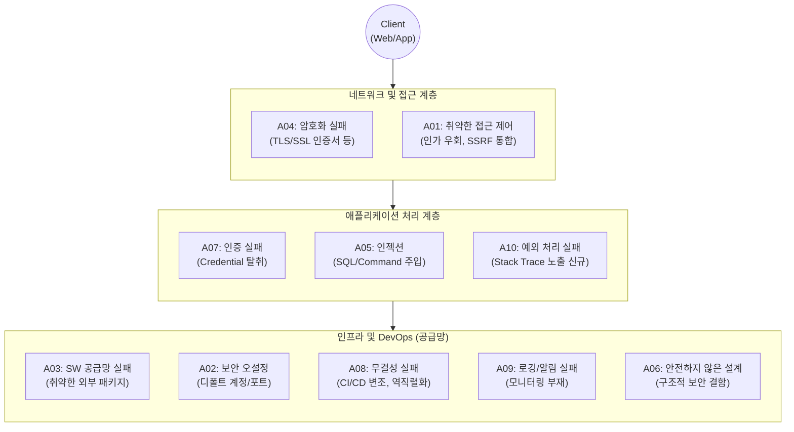

# OWASP Top 10 2025

---

## I. [글로벌 웹 애플리케이션 보안 표준], OWASP Top 10 2025의 개요

### 가. OWASP Top 10 2025의 정의

* 웹 애플리케이션 보안 위협 중 가장 치명적이고 발생 빈도가 높은 10대 취약점을 선정하여, 예방 및 대응 가이드를 제공하는 글로벌 보안 표준 문서
* 애플리케이션 개발 수명주기([[SDLC]]) 전반에 걸친 보안 내재화(Security by Design)를 구축하기 위한 핵심 참조 [[프레임워크]]

### 나. OWASP Top 10 2025의 등장배경 및 주요 특징

* **소프트웨어 [[공급망 공격]] 심화**: 단순 라이브러리 취약점을 넘어 CI/CD 파이프라인 전체를 포괄하는 공급망 보안(A03) 전면 강조
* **예외 처리의 중요성 대두**: 민감 정보 노출 및 비정상 상태([[DoS (Denial of Service)|DoS]])를 유발하는 에러 핸들링 취약점(A10) 신규 반영
* **[[클라우드 네이티브]] 위협 반영**: 단일 취약점이었던 SSRF를 접근 제어(A01)로 병합하고, 보안 오설정(A02)의 순위를 대폭 상향

---

## II. OWASP Top 10 2025의 아키텍처 및 핵심 구성요소

### 가. OWASP Top 10 2025의 위협 발생 영역 개념도

* 클라이언트 요청부터 백엔드 인프라, CI/CD 파이프라인에 이르기까지 애플리케이션 전 영역에 걸친 다층적인 방어(Defense in Depth) 구조 설계 필수

### 나. OWASP Top 10 2025 핵심 취약점 및 대응 방안

|**분류**|**취약점 (위협 요소)**|**세부 설명 및 핵심 대응 방안 (Prevention)**|
|---|---|---|
|**A01**|**취약한 접근 제어**      (Broken Access Control)|- 권한 우회, 타 사용자 데이터 무단 접근 (SSRF 통합)      - 대응: Default Deny 적용, 최소 권한 원칙(PoLP) 및 중앙집중식 인가 통제|
|**A02**|**보안 오설정**      (Security Misconfiguration)|- 불필요한 서비스 활성화, 디폴트 계정, 클라우드 권한 오설정      - 대응: IaC 기반 [[형상 관리]], 자동화된 취약점 및 설정 스캐닝 주기적 적용|
|**A03**|**SW 공급망 실패**      (Supply Chain Failures)|- 신뢰할 수 없는 패키지, 변조된 의존성 모듈을 통한 백도어 유입      - 대응: [[SBOM]](자재명세서) 작성, 사설 저장소 사용, [[무결성]] 서명 검증|
|**A04**|**[[암호화]] 실패**      (Cryptographic Failures)|- 중요 데이터 평문 전송, 취약한 암호(MD5, SHA-1) [[알고리즘]] 사용      - 대응: 민감 데이터 라벨링, 최신 TLS(1.3) 적용, 강력한 키 관리 체계 구축|
|**A05**|**인젝션**      (Injection)|- 악의적 쿼리([[SQL(Structured Query Language)|SQL]], OS Command)를 주입하여 시스템 제어권 탈취      - 대응: 입력값 화이트리스트 필터링, 안전한 API(Prepared Statement) 사용|
|**A06**|**안전하지 않은 설계**      (Insecure Design)|- 구현 이전 기획/설계 단계에서부터 발생하는 아키텍처적 보안 결함      - 대응: 프로젝트 초기 단계부터 [[위협 모델링]](Threat Modeling) 적용 (Shift-Left)|
|**A07**|**인증 실패**      (Authentication Failures)|- 자격 증명(비밀번호, [[세션]]) 탈취 및 무차별 대입 공격(Brute Force) 허용      - 대응: 다중 인증(MFA), [[패스키]](Passkeys) 도입, 안전한 세션 타임아웃 관리|
|**A08**|**무결성 실패**      (Integrity Failures)|- 서명되지 않은 자동 업데이트, 안전하지 않은 역직렬화, CI/CD 파이프라인 변조      - 대응: 디지털 서명 체계화, 빌드/배포 파이프라인 접근 통제 강화|
|**A09**|**로깅 및 알림 실패**      (Logging & Alerting Failures)|- 보안 이벤트 누락, 로그 내 민감 정보 포함, 이상 징후 알람 체계 부재      - 대응: [[트랜잭션]] 전수 로깅, 중앙 로그 관리([[SIEM]]) 연동, 로그 위변조 보호|
|**A10**|**예외 조건 부적절 처리**      (Mishandling Exceptional)|- **[신규]** 시스템 에러 시 [[Stack]] Trace 노출, 무한 루프, 애플리케이션 충돌(Crash)      - 대응: 중앙 집중식 예외 핸들러 구현, 에러 발생 시 Fail-Closed 원칙 적용|

---

## III. OWASP Top 10 2021 대비 주요 변경사항 및 향후 전망

### 가. OWASP Top 10 2021 vs 2025 주요 변경사항 비교

| 비교 항목 | 2021 버전 | 2025 버전 | 핵심 변경 사유 및 시사점 |
| --- | --- | --- | --- |
| **SSRF 위협** | A10. [[SSRF(Server-Side Request Forgery)|Server-Side Request Forgery]] | **A01에 통합** (접근 제어) | 클라우드 인프라(AWS 메타데이터 등) 환경에서 SSRF가 접근 권한(Authorization) 우회 수단으로 활용됨에 따라 포괄 통제 |
| **공급망 보안** | A06. 취약하고 낡은 요소 | **A03. SW Supply Chain Failures** | 단순 라이브러리 패치 누락을 넘어, 빌드 파이프라인 및 서드파티 벤더 툴을 매개로 한 생태계 전체의 복합적 공격(공급망 공격) 증가 방어 |
| **신규 위협** | - | **A10. 예외 조건 부적절 처리** | 마이크로서비스([[MSA (Micro Service Architecture)|MSA]]) 환경에서 시스템 간 통신 실패나 예외 처리 누락이 민감 데이터 유출 및 서비스 장애(DoS)로 직결됨을 적극 반영 |

### 나. 기업의 웹 애플리케이션 보안 강화 전망 및 동향

* **[[DevSecOps]] 및 Shift-Left 내재화**: 코드 완성 후 수행하는 [[DAST]](동적 분석)에서 벗어나, 개발자의 IDE 환경([[SAST]]) 및 설계 단계의 위협 모델링부터 보안 결함을 사전 차단하는 파이프라인 통합 의무화
* **SBOM 기반 컴플라이언스 대응**: A03 위협(공급망 실패)을 방어하기 위해 미국 행정명령(EO 14028) 등 글로벌 사이버보안 규제에 맞춘 SBOM 자동 추출 및 지속적인 형상 관리 시스템 연동 가속화

---

### 🔗 연관 토픽

- **소속 도메인**: [[00_보안_MOC|🛡️ 보안]]
- **세부 분류**: `2. 현대 암호학 & 키 관리 · 전자서명`
- **핵심 연관 토픽**:
  - [[SSRF(Server-Side Request Forgery)]]
  - [[패스키|패스키(Passkey)]]
  - [[DevSecOps]]
  - [[DAST]]
  - [[공급망 공격|공급망 공격(Supply Chain Attack)]]
