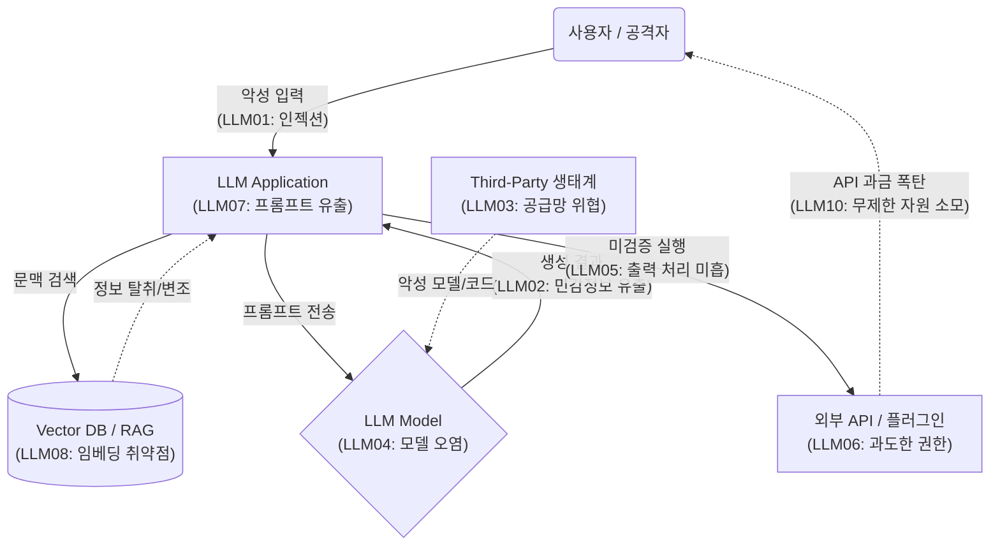

# OWASP Top 10 for LLM Application 2025

---

## I. LLM 애플리케이션 보안 표준, OWASP Top 10 for LLM Application 2025의 개요

### 가. OWASP Top 10 for LLM 2025의 정의

* 거대 언어 모델([[초거대 언어 모델|LLM]]) 및 생성형 AI 애플리케이션 환경에서 가장 치명적이고 빈번하게 발생하는 10대 보안 위협과 취약점을 정의한 글로벌 보안 표준 가이드라인
* 챗봇 중심의 초기 AI 환경에서 벗어나 멀티모달(Multimodal), RAG, 자율 에이전트(Agentic AI) 구조로 진화한 최신 AI 아키텍처의 리스크를 반영한 핵심 참조 [[프레임워크]]

### 나. 등장배경 및 핵심 특징

* **RAG 및 에이전트 위협 대두**: RAG 아키텍처의 임베딩 데이터 탈취 및 에이전트의 과도한 자율성에 의한 시스템 침해 사고 급증
* **비용 고갈 및 간접 공격 증가**: 멀티모달 기반의 간접 [[프롬프트 인젝션]](Indirect Prompt Injection) 및 API 호출 과금을 노리는 리소스 고갈(Unbounded Consumption) 공격의 본격화

---

## II. OWASP Top 10 for LLM 2025의 개념도 및 10대 핵심 취약점

### 가. LLM 애플리케이션 보안 위협 발생 개념도

* 프롬프트 입력부(LLM01)부터 RAG 검색(LLM08), 모델 추론(LLM04), 서드파티 API 연동(LLM06)에 이르는 엔드투엔드([[End-to-End]]) 공격 표면 형상화
* 모델의 환각을 이용한 가짜 정보 유포(LLM09) 및 미검증된 출력 결과물(LLM05)이 직접적인 시스템 침해로 이어지는 보안 흐름 식별

### 나. OWASP Top 10 for LLM 2025 핵심 위협 리스트

| 분류 | 취약점 (요소기술) | 세부 설명 및 주요 위험 |
| --- | --- | --- |
| **입력 통제** | **LLM01: Prompt Injection** | 사용자의 악의적 입력이나 이미지 등 멀티모달 데이터를 통해 모델의 행동을 의도적으로 조작 (직접/간접 인젝션) |
| **정보 유출** | **LLM02: Sensitive Info. Disclosure** | PII, API 크리덴셜, 비공개 비즈니스 데이터 등 민감 정보가 모델의 훈련 데이터나 출력물에 노출 |
| **공급망/데이터** | **LLM03: Supply Chain** | 취약한 서드파티 오픈소스 모델, 라이브러리, 데이터셋, 플러그인을 통해 백도어 및 악성코드 유입 |
| **공급망/데이터** | **LLM04: Data & Model Poisoning** | 학습, 파인튜닝, 임베딩 데이터를 오염시켜 모델의 편향성, 오작동 및 보안 우회 백도어 생성 |
| **출력/실행** | **LLM05: Improper Output Handling** | LLM의 출력값을 적절한 검증/필터링 없이 다운스트림 시스템으로 전달하여 [[XSS]], [[SSRF(Server-Side Request Forgery)|SSRF]], RCE 등 유발 |
| **출력/실행** | **LLM06: Excessive Agency** | 에이전트에 불필요하게 광범위한 기능, 권한, 자율성을 부여하여 의도치 않은 파괴적 [[트랜잭션]] 수행 허용 |
| **시스템/구조** | **LLM07: System Prompt Leakage** | 시스템 역할, 보안 지침, 백엔드 로직이 담긴 '시스템 프롬프트'를 탈취하여 애플리케이션의 방어 체계 우회 |
| **시스템/구조** | **LLM08: Vector & Embedding Weaknesses** | RAG 아키텍처에서 벡터 검색을 우회하거나 임베딩 역전(Inversion) 공격을 통해 기밀 원본 데이터 대량 유출 |
| **품질/[[HA(High Availability)|가용성]]** | **LLM09: Misinformation** | 모델이 생성한 거짓/편향된 정보([[할루시네이션]])를 사용자가 과도하게 신뢰하여 발생하는 기업 평판 및 법적 피해 |
| **품질/가용성** | **LLM10: Unbounded Consumption** | 모델 API의 무제한 자원 소모를 유발해 서비스 거부([[DoS (Denial of Service)|DoS]]) 및 막대한 클라우드 요금(Denial of Wallet) 발생 |

---

## III. 이전 버전(2023)과의 주요 차이점 및 보안 대응 전략

### 가. 2023 버전 대비 2025 버전 주요 트렌드 변경사항

| 비교 항목 | 2023 버전 (v1.1) | 2025 버전 (v2.0) | 핵심 변경 사유 및 의미 |
| --- | --- | --- | --- |
| **시스템 설정 탈취** | LLM01에 일부 포함 | **LLM07: 시스템 프롬프트 유출** | 시스템 통제 지침(System Prompt) 자체가 공격 대상의 핵심 자산으로 격상됨 |
| **데이터 연동망** | 없음 (미분류) | **LLM08: 벡터/임베딩 취약점** | RAG 기술의 보편화로 인해 [[벡터 데이터베이스]] 및 검색 품질 조작 등 공격 표면 세분화 |
| **자원 고갈 공격** | LLM04: Model DoS | **LLM10: 무제한 자원 소모** | 컴퓨팅 과부하(DoS) 뿐만 아니라, API 요금 폭탄을 노리는 경제적 타격(FinOps 리스크) 관점 통합 |

### 나. 안전한 LLM 서비스 구축을 위한 향후 대응 동향

* **RAG 및 임베딩 보안 내재화**: RAG는 환각 방지를 위한 도구일 뿐 보안의 만능키가 아님을 인지하고, 벡터 DB 접근 제어([[RBAC]]) 및 프라이버시 노이즈(Differential Privacy) 추가를 통한 인버전 공격 방어 필수
* **Human-in-the-loop 기반 에이전트 통제**: 자율 행동 AI(Excessive Agency)의 위험을 통제하기 위해, 결제나 이메일 발송 등 중요 트랜잭션 전 반드시 인간의 승인(Approval) 단계를 거치는 최소 권한 원칙(PoLP) 아키텍처 구현

---

### 🔗 연관 토픽

- **소속 도메인**: [[00_보안_MOC|🛡️ 보안]]
- **세부 분류**: `4. 웹 & 애플리케이션 보안 · 취약점 점검`
- **핵심 연관 토픽**:
  - [[DoS (Denial of Service)]]
  - [[벡터 데이터베이스|벡터 데이터베이스(Vector Database)]]
  - [[위협 모델링|위협 모델링(Threat Modeling) - Secure SDLC]]
  - [[End-to-End]]
  - [[할루시네이션|할루시네이션(Hallucination)]]
