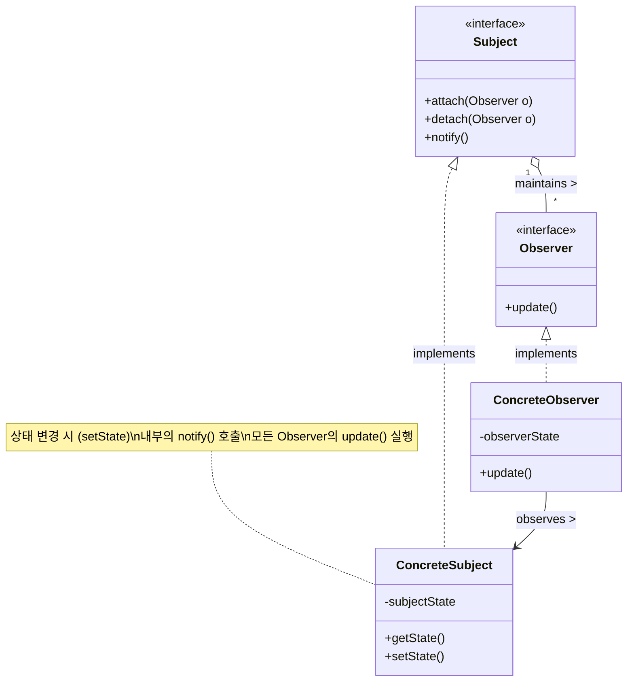

# Observer (상태 변화 통지)

---

## I. 상태 변화 자동 통지, Observer 패턴의 개요

### 가. Observer 패턴의 정의

* 특정 객체(Subject)의 상태가 변화했을 때, 이에 의존하는 다수의 객체(Observer)들에게 자동으로 알림(Notification)을 보내고 상태를 갱신하는 1:N(일대다) 의존성 기반의 행동형(Behavioral) [[디자인 패턴]]
* MVC(Model-View-Controller) 아키텍처에서 모델(Model)의 변경을 뷰(View)에 반영하기 위한 핵심 메커니즘으로 활용됨

### 나. Observer 패턴의 필요성 및 특징

* **느슨한 결합(Loose Coupling)**: 통지 대상 객체의 구체적 클래스를 알 필요 없이 인터페이스 기반으로 상호작용하여 시스템 유연성 확보
* **폴링(Polling) 오버헤드 제거**: 상태 변화를 주기적으로 확인하는 방식 대신, 이벤트 발생 시 능동적으로 통지(Push)하여 리소스 낭비 방지
* **OCP(개방-폐쇄 원칙) 준수**: 새로운 Observer를 추가하더라도 기존 Subject 코드를 수정할 필요 없이 확장에 열려있는 구조 제공

---

## II. Observer 패턴의 개념도 및 핵심 구성 요소

### 가. Observer 패턴의 클래스 구조도 및 동작 원리

* **동작 흐름**: `ConcreteSubject`의 상태 변경 발생 ➔ 상속받은 `notify()` 메서드 실행 ➔ 등록된(attach) 모든 `Observer` 객체를 순회하며 `update()` 메서드 호출을 통한 동기화

### 나. Observer 패턴의 핵심 구성 요소

| 구분 | 구성 요소 (키워드) | 세부 설명 |
| --- | --- | --- |
| **인터페이스** | **Subject (주체)** | Observer들을 관리하기 위한 등록(attach), 해제(detach), 통지(notify) 인터페이스 정의 |
| **인터페이스** | **Observer (관찰자)** | Subject의 상태 변화 통지를 수신했을 때 호출될 갱신(update) 메서드 인터페이스 정의 |
| **구현체** | **ConcreteSubject** | 실제 상태(State)를 저장하고 관리하며, 상태 변경 시 자신의 등록된 모든 Observer에게 알림 전송 |
| **구현체** | **ConcreteObserver** | `ConcreteSubject`에 대한 참조를 유지하며, 통지 수신 시 자신의 상태를 주체의 상태와 동기화 |
| **핵심 오퍼레이션** | **attach() / detach()** | 런타임에 동적으로 Observer 객체를 구독(Subscribe) 리스트에 추가하거나 제거(Unsubscribe) |
| **핵심 오퍼레이션** | **notify()** | 상태 변경 이벤트 발생 시 등록된 모든 Observer를 순회하며 통지 수행 (보통 동기적 호출) |
| **핵심 오퍼레이션** | **update()** | 통지를 받은 Observer가 자신의 상태를 갱신하거나 필요한 후속 비즈니스 로직을 처리하는 메서드 |
| **데이터 전달** | **Push / Pull 모델** | 주체가 변경된 데이터를 함께 보내는 방식(Push)과, Observer가 통지 후 데이터를 직접 조회(Pull)하는 방식으로 구분 |

---

## III. Observer 패턴과 Pub/Sub 패턴 비교 및 발전 동향

### 가. Observer 패턴과 Publish-Subscribe 패턴 비교

| 비교 항목 | Observer (옵서버 패턴) | Pub/Sub (발행-구독 패턴) |
| --- | --- | --- |
| **[[결합도]]** | **낮음 (Low)**: 인터페이스에 의존하나, Subject와 Observer가 서로를 인지함 | **매우 낮음 (Decoupled)**: Publisher와 Subscriber가 서로의 존재를 전혀 모름 |
| **통신 매개체** | 객체 간 **직접 통신** (Direct Call) | 중간에 **이벤트 버스/메시지 브로커** 존재 |
| **동기성** | 주로 **동기적(Synchronous)**으로 실행됨 | 주로 **비동기적(Asynchronous)**으로 실행됨 |
| **적용 범위** | 단일 애플리케이션 내 객체 간 통신 (GUI, MVC) | 분산 시스템, [[MSA (Micro Service Architecture)|MSA]], 대규모 데이터 스트리밍 처리 |

### 나. 실무 적용 시 유의사항 및 최신 기술 동향

* **메모리 누수 방지 (Lapsed Listener Problem)**: 수명이 다한 Observer를 `detach()` 하지 않으면 참조가 유지되어 가비지 컬렉션(GC)의 대상이 되지 않는 문제 발생. 이를 방지하기 위해 **약한 참조(Weak Reference)** 기반의 리스트 관리 기법 적용 필수.
* **반응형 프로그래밍(Reactive Programming)으로의 진화**: 단순한 GoF의 Observer 패턴을 넘어, 데이터 스트림의 비동기 처리와 백프레셔(Backpressure) 제어를 결합한 RxJava, Project Reactor(Spring WebFlux) 등 모던 리액티브 아키텍처의 근간 기술로 발전 및 활발히 활용 중.

---

### 🔗 연관 토픽

- **소속 도메인**: [[00_소프트웨어공학_MOC|🏗️ 소프트웨어공학]]
- **세부 분류**: `4. 아키텍처 스타일 & 객체지향 설계 원리`
- **핵심 연관 토픽**:
  - [[디자인 패턴|디자인 패턴 (Design Pattern)]]
  - [[Design Pattern (23개 패턴)]]
  - [[MSA (Micro Service Architecture)]]
  - [[결합도]]
  - [[MVC 패턴 (Model-View-Controller Pattern)]]
