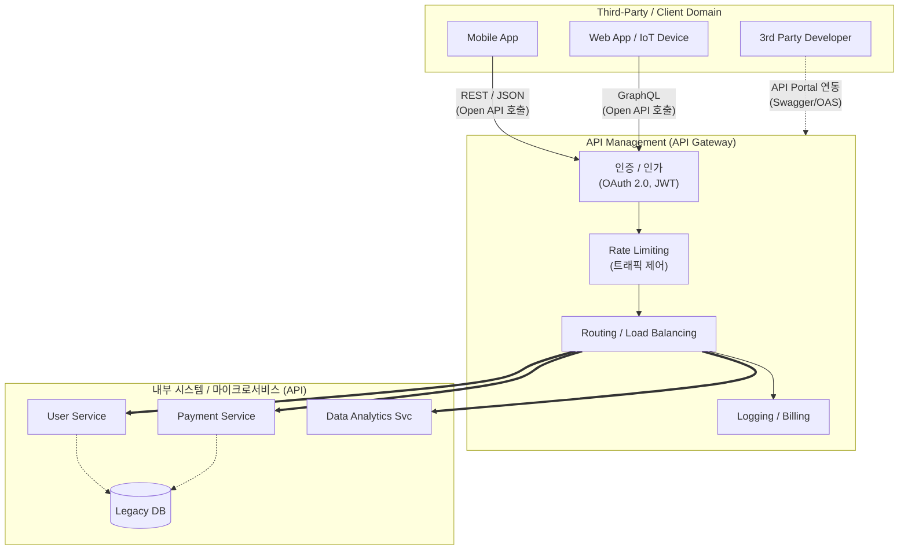

# API 및 Open API

---

## I. 초연결 데이터 생태계의 기반, API 및 Open API의 개요

### 가. API 및 Open API의 정의

* **API (Application Programming Interface)**: [[OS(운영체제)|운영체제]], 시스템, 또는 애플리케이션 간에 데이터와 기능을 상호 교환하기 위한 소프트웨어 통신 규격 및 인터페이스
* **Open API (Public API)**: 기업이 보유한 데이터와 서비스를 제3자(Third-party) 개발자, 파트너, 외부 기관이 자유롭게 활용하여 새로운 가치를 창출할 수 있도록 외부에 개방한 API

### 나. 등장배경 및 특징

* **등장배경**: 마이크로서비스 아키텍처([[MSA (Micro Service Architecture)|MSA]])로의 패러다임 전환, 플랫폼 비즈니스 확대 및 API 경제(API Economy)의 대두, [[마이데이터]] 및 오픈뱅킹 정책 활성화
* **핵심 특징**: 상호운용성(Interoperability) 보장, 플랫폼의 기능 확장성 제공, 개발 생산성 향상, 표준화된 통신 규격(HTTP, REST, [[JSON]] 등) 기반 동작

---

## II. Open API의 개념도 및 핵심 기술 요소

### 가. Open API 생태계 개념도 및 동작 원리

* 외부 클라이언트가 표준 프로토콜로 Open API를 호출하면, [[API Gateway]]가 보안(인증/인가) 및 트래픽 제어를 수행한 후 내부 MSA 환경의 백엔드 API로 라우팅함

### 나. API 및 Open API 핵심 기술 요소

| 구분 | 요소기술(키워드) | 세부 설명 |
| --- | --- | --- |
| **아키텍처 스타일** | **RESTful API** | HTTP URI를 통해 자원(Resource)을 명시하고, HTTP Method(GET, POST 등)로 행위를 정의하는 아키텍처 |
| **데이터 포맷** | **JSON / [[XML]]** | 이기종 시스템 간 플랫폼 독립적으로 데이터를 교환하기 위한 경량화된 텍스트 기반 데이터 포맷 |
| **보안 및 인증** | **OAuth 2.0** | 서드파티 앱이 사용자의 비밀번호 없이도 보호된 자원에 접근할 수 있도록 권한을 위임(Authorization)하는 표준 [[프레임워크]] |
| **보안 및 인증** | **JWT (JSON Web Token)** | 클레임(Claim) 기반의 정보를 JSON 형태로 안전하게 전달하기 위한 자체 내장형(Self-contained) 서명 토큰 |
| **명세 및 문서화** | **OAS (OpenAPI Spec)** | RESTful API의 설계, 명세, 문서화를 기계와 사람이 모두 이해할 수 있도록 정의한 개방형 표준 (구 Swagger) |
| **통합 관리** | **API Gateway** | 수많은 API의 단일 진입점(Single Entry Point)으로 라우팅, 인증, [[프로토콜]] 변환, 과금 처리를 전담 |
| **라이프사이클** | **API Lifecycle Mgmt** | API의 기획, 설계, 개발, 테스트, 배포, 버전 관리, 모니터링, 폐기에 이르는 전 과정을 통합 관리하는 체계 |
| **수익화** | **API Monetization** | 개방된 API의 호출 횟수, 트래픽량, 구독 모델 등을 기반으로 수익을 창출하는 비즈니스 모델 |

---

## III. 차세대 API 아키텍처 비교 및 향후 전망

### 가. 차세대 API 아키텍처 비교 (REST vs GraphQL vs gRPC)

| 비교 항목 | REST API | GraphQL | gRPC |
| --- | --- | --- | --- |
| **핵심 철학** | **자원(Resource)** 중심 | **데이터(Data) 질의** 중심 | **행위(Action)** 중심 |
| **통신 프로토콜** | HTTP 1.1 / HTTP 2 | HTTP 1.1 | **HTTP 2 (멀티플렉싱)** |
| **페이로드(포맷)** | JSON, XML | JSON | **Protocol Buffers (바이너리)** |
| **장점** | 범용성, 캐싱 용이, 학습 곡선 낮음 | **Over/Under-fetching 방지** (클라이언트 맞춤형 응답) | **초고속 통신**, 직렬화 용이, 양방향 스트리밍 |
| **주요 활용처** | 외부 공개용 **Open API**, 범용 웹 서비스 | 클라이언트의 요구사항이 복잡하고 빈번히 변하는 UI | **MSA 내부 시스템 간** 초고속 백엔드 통신 |

### 나. API/Open API 최신 동향 및 산업 적용 방향

* **보안 위협 대응 (API Security 강화)**: API가 사이버 공격의 주요 타겟으로 부상함에 따라, 단순히 WAF(웹 [[방화벽]])를 넘어 **[[WAAP]](Web App & API Protection)** 및 제로 트러스트([[제로 트러스트 보안모델|Zero Trust]]) 기반의 API 보안 솔루션 도입 필수화
* **AI-Agent 친화적 API 설계**: [[초거대 언어 모델|LLM]](대형 언어 모델) 기반의 AI 에이전트가 외부 서비스와 상호작용하기 위해 기계가 쉽게 읽고 호출할 수 있는 함수 호출(Function Calling) 최적화 API 설계 동향 확산
* **산업별 개방형 생태계 가속화**: 금융권 오픈뱅킹, 마이데이터, 공공데이터포털 등 정보 주체의 권리 강화와 산업 간 융합 서비스 창출을 위한 API 이코노미 생태계 지속 확장

---

### 🔗 연관 토픽

- **소속 도메인**: [[00_디지털서비스_MOC|🚀 디지털서비스]]
- **세부 분류**: `4. 데이터 플랫폼 & 개방형 API 생태계`
- **핵심 연관 토픽**:
  - [[마이데이터]]
  - [[API Gateway]]
  - [[WAAP|WAAP(Web Application and API Protection)]]
  - [[프레임워크]]
  - [[MSA (Micro Service Architecture)]]
